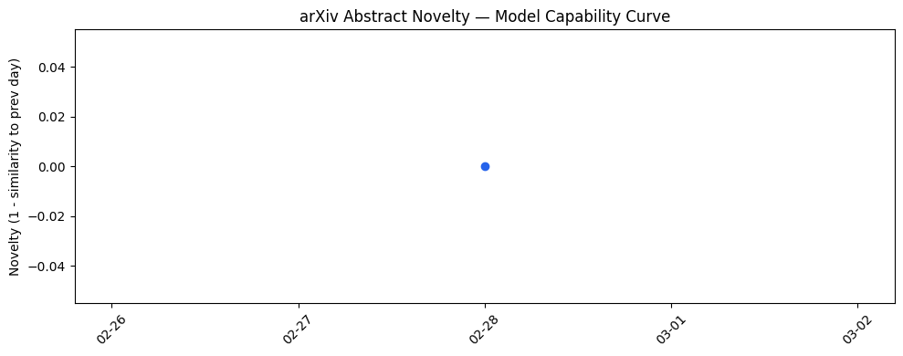
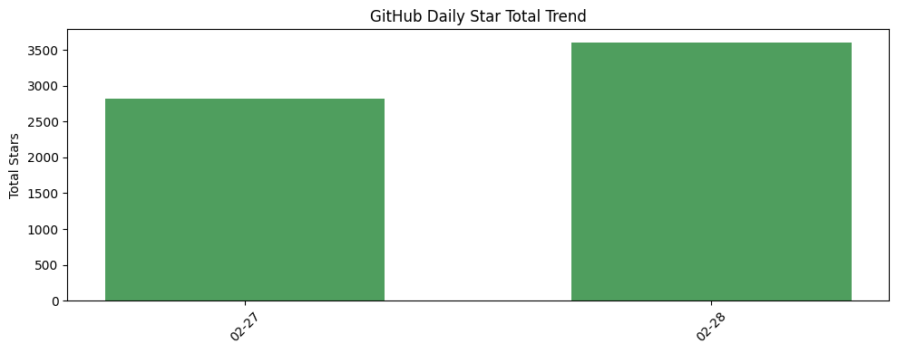
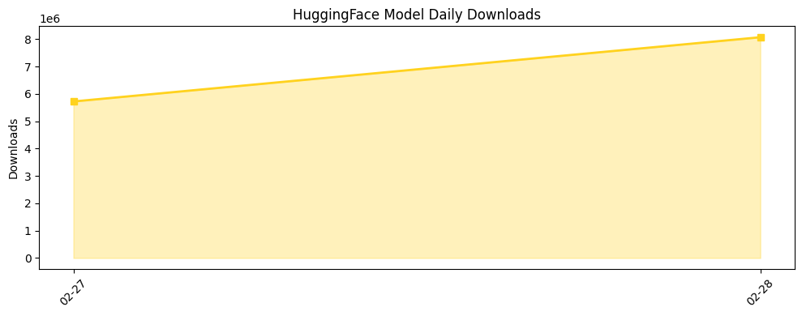

## # 今日AI结构性变化
> 今日AI行业结构性变化的核心在于军事合作、基础设施投资和开源生态的发展，这些变化将对AI的应用和发展产生深远影响。
今日最值得注意的结构性变化是军事合作的加深、基础设施投资的增加和开源生态的发展。这些变化表明AI技术正在被更广泛地应用于各个领域，并且基础设施的建设将为AI的发展提供坚实的基础。
- 📈 **持续趋势**：基础设施投资的增加
- 🆕 **新兴方向**：军事和国防行业的应用
- 🔺 **突然升温**：开源生态的发展
- 🔑 **新关键词**：LLM、RAG、sequential attention、smart sampling
- 📉 **消退关键词**：传统解决方案

## # 技术层信号
🟡 渐进改善
模型能力边界正在被推进，特别是在LLM和RAG的应用和发展方面。新的范式如sequential attention和smart sampling也正在被探索和应用。例如，Google AI的研究人员提出了sequential attention的概念，旨在使AI模型更快更高效。同时，GIST的提出也标志着smart sampling领域的重大突破。
参考文献：
- [Sequential Attention: Making AI models leaner and faster without sacrificing accuracy](https://research.google/blog/sequential-attention-making-ai-models-leaner-and-faster-without-sacrificing-accuracy/)
- [Introducing GIST: The next stage in smart sampling](https://research.google/blog/introducing-gist-the-next-stage-in-smart-sampling/)

## # 产业资本信号
🔴 强信号
基础设施投资的增加、军事合作的加深和开源生态的发展都表明资本正在向AI行业流动。基础设施的建设将为AI的发展提供坚实的基础，军事合作的加深将推动AI技术在国防领域的应用，开源生态的发展将促进AI技术的共享和创新。
参考文献：
- [The billion-dollar infrastructure deals powering the AI boom](https://techcrunch.com/2026/02/28/billion-dollar-infrastructure-deals-ai-boom-data-centers-openai-oracle-nvidia-microsoft-google-meta/)
- [Our agreement with the Department of War](https://openai.com/index/our-agreement-with-the-department-of-war)

## # 潜在拐点判断
今日信号和历史趋势都表明，AI行业可能正在经历一个潜在的拐点。军事合作的加深和基础设施投资的增加都可能推动AI技术在各个领域的应用和发展。同时，开源生态的发展也可能促进AI技术的共享和创新。如果这一拐点被确认，AI行业可能将经历一波新的发展浪潮。

## # 明日观察点
1. AI技术在军事和国防领域的应用将如何发展？
2. 基础设施投资的增加将如何影响AI行业的发展？
3. 开源生态的发展将如何促进AI技术的共享和创新？

## # 长期趋势坐标
今日观察放入更大的时间框架中，AI行业的发展趋势可以被总结为：军事合作、基础设施投资和开源生态的发展将成为AI行业发展的重要驱动力。这些变化将对AI的应用和发展产生深远影响，并可能推动AI行业经历一波新的发展浪潮。

## # 数据洞察
### arXiv 摘要对比 — 模型能力提升曲线
今日无 arXiv 摘要数据，因此无法分析模型能力提升曲线。

### GitHub Star 增速分析
GitHub 上的仓库星数增速分析显示，alibaba/OpenSandbox、anthropics/skills 和 muratcankoylan/Agent-Skills-for-Context-Engineering 是增速最快的三个仓库。同时，今日新晋热门项目包括 Shubhamsaboo/awesome-llm-apps、NousResearch/hermes-agent 等。

### HuggingFace 模型下载量变化
HuggingFace 模型下载量分析显示，moonshotai/Kimi-K2.5、Qwen/Qwen3-TTS-12Hz-1.7B-CustomVoice 和 deepseek-ai/DeepSeek-R1 是下载量最高的三个模型。同时，Qwen/Qwen3.5-122B-A10B、Qwen/Qwen3.5-27B 和 LiquidAI/LFM2-24B-A2B 是增速最快的三个模型。

### 趋势图
参考趋势图：

## # 参考来源
- [Sequential Attention: Making AI models leaner and faster without sacrificing accuracy](https://research.google/blog/sequential-attention-making-ai-models-leaner-and-faster-without-sacrificing-accuracy/) — Google AI Blog
- [Introducing GIST: The next stage in smart sampling](https://research.google/blog/introducing-gist-the-next-stage-in-smart-sampling/) — Google AI Blog
- [The billion-dollar infrastructure deals powering the AI boom](https://techcrunch.com/2026/02/28/billion-dollar-infrastructure-deals-ai-boom-data-centers-openai-oracle-nvidia-microsoft-google-meta/) — TechCrunch AI
- [Our agreement with the Department of War](https://openai.com/index/our-agreement-with-the-department-of-war) — OpenAI Blog
- [Statement on the comments from Secretary of War Pete Hegseth](https://www.anthropic.com/news/statement-comments-secretary-war) — Anthropic Blog