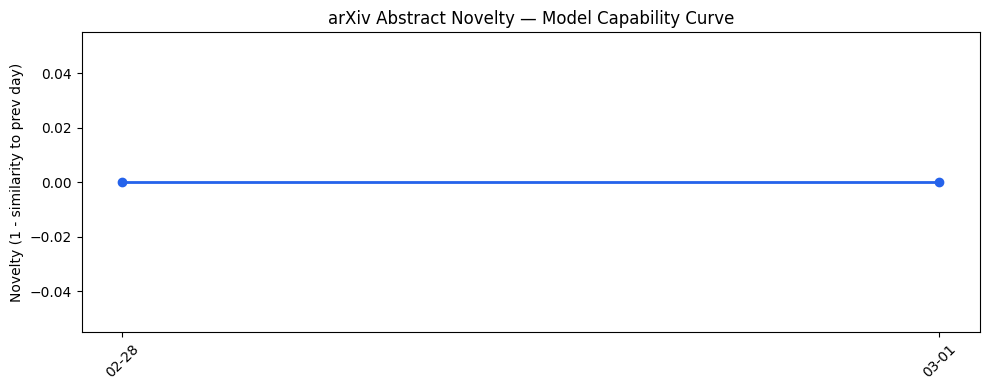
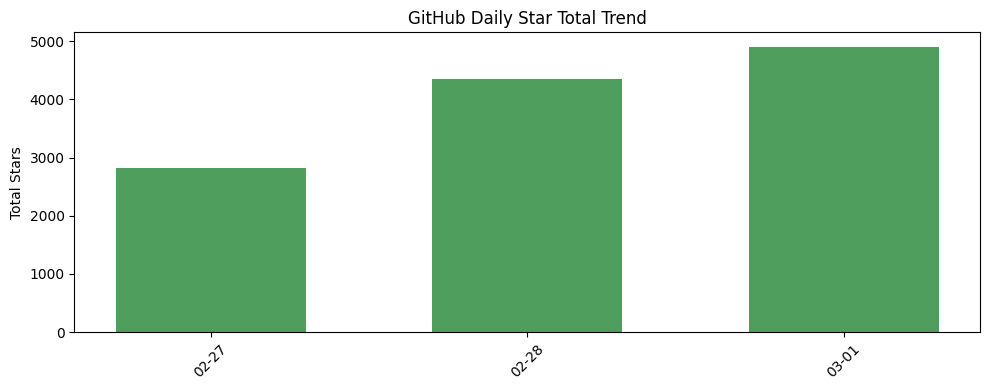
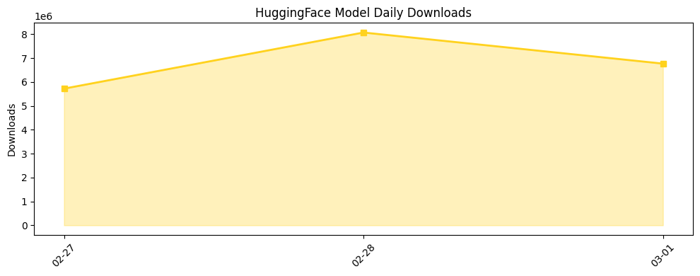

# 今日AI结构性变化
> 今日AI领域出现多项技术和应用层面的进展，包括小模型的优化、医疗图像解读和智能代理的开发，同时资本和行业方面也出现了多项重要动态。
今天最值得注意的结构性变化是小模型的优化和应用，这意味着AI技术在精度和效率方面的进一步突破。同时，医疗图像解读和智能代理的发展也表明AI在各个行业的渗透和应用日益加深。
- 📈 **持续趋势**：小模型优化和应用的持续推进
- 🆕 **新兴方向**：智能代理和多Agent系统的发展
- 🔺 **突然升温**：Anthropic和OpenAI的战略动向

# 技术层信号
🟡 渐进改善
模型能力边界是否被推进？怎么推进的？今日的技术进展主要集中在小模型的优化和应用，这意味着AI技术在精度和效率方面的进一步突破。例如，Google AI的研究表明，小模型可以通过分解来实现更好的意图提取效果（[Small models, big results: Achieving superior intent extraction through decomposition](https://research.google/blog/small-models-big-results-achieving-superior-intent-extraction-through-decomposition/)）。
是否出现新范式？为什么它重要？智能代理和多Agent系统的发展代表了AI技术的一个新范式，这可能会带来更多的应用和创新。例如，deer-flow项目（[deer-flow](https://github.com/bytedance/deer-flow)）就是一个智能代理系统的例子。

# 产业资本信号
🟡 中等信号
基础设施变化：推理成本、芯片/算力趋势今日无明显变化。
应用层变化：新行业渗透、替代旧方案今日有重要进展，例如医疗和健康领域的应用（[Unlocking health insights: Estimating advanced walking metrics with smartwatches](https://research.google/blog/unlocking-health-insights-estimating-advanced-walking-metrics-with-smartwatches/)）。
资本流向：融资集中方向、估值变化、大厂战略投资/收购今日有重要动向，例如Anthropic和OpenAI的战略动向（[OpenAI reveals more details about its agreement with the Pentagon](https://techcrunch.com/2026/03/01/openai-shares-more-details-about-its-agreement-with-the-pentagon/)）。

# 潜在拐点判断
今日的信号和历史趋势综合考虑，可能存在潜在拐点。是 gì？智能代理和多Agent系统的发展可能会带来更多的应用和创新。依据是什么？今日的技术进展和资本动向。影响是什么？可能会带来AI技术在各个行业的更深入的渗透和应用。

# 明日观察点
1. 关注智能代理和多Agent系统的进一步发展。
2. 观察小模型优化和应用的持续推进。
3. 关注Anthropic和OpenAI的战略动向和资本流向。

# 长期趋势坐标
今日的信号在AI产业演进的大图中处于什么位置？今日的技术进展和资本动向表明AI技术在精度和效率方面的进一步突破和在各个行业的渗透和应用日益加深。

# 数据洞察
## arXiv 摘要对比 — 模型能力提升曲线
今日无 arXiv 摘要数据。

## GitHub Star 增速分析
今日 GitHub Star 增速最快的仓库是 X-PLUG/MobileAgent，增速为 4.818。

## HuggingFace 模型下载量变化
今日 HuggingFace 模型下载量最高的模型是 moonshotai/Kimi-K2.5，下载量为 1712826。

## 趋势图

# 参考来源
- [Small models, big results: Achieving superior intent extraction through decomposition](https://research.google/blog/small-models-big-results-achieving-superior-intent-extraction-through-decomposition/) — Google AI Blog
- [deer-flow](https://github.com/bytedance/deer-flow) — GitHub Trending
- [Unlocking health insights: Estimating advanced walking metrics with smartwatches](https://research.google/blog/unlocking-health-insights-estimating-advanced-walking-metrics-with-smartwatches/) — Google AI Blog
- [SaaS in, SaaS out: Here’s what’s driving the SaaSpocalypse](https://techcrunch.com/2026/03/01/saas-in-saas-out-heres-whats-driving-the-saaspocalypse/) — TechCrunch AI
- [OpenAI reveals more details about its agreement with the Pentagon](https://techcrunch.com/2026/03/01/openai-shares-more-details-about-its-agreement-with-the-pentagon/) — TechCrunch AI
- [Anthropic’s Claude rises to No. 1 in the App Store following Pentagon dispute](https://techcrunch.com/2026/03/01/anthropics-claude-rises-to-no-2-in-the-app-store-following-pentagon-dispute/) — TechCrunch AI
- [The trap Anthropic built for itself](https://techcrunch.com/2026/02/28/the-trap-anthropic-built-for-itself/) — TechCrunch AI