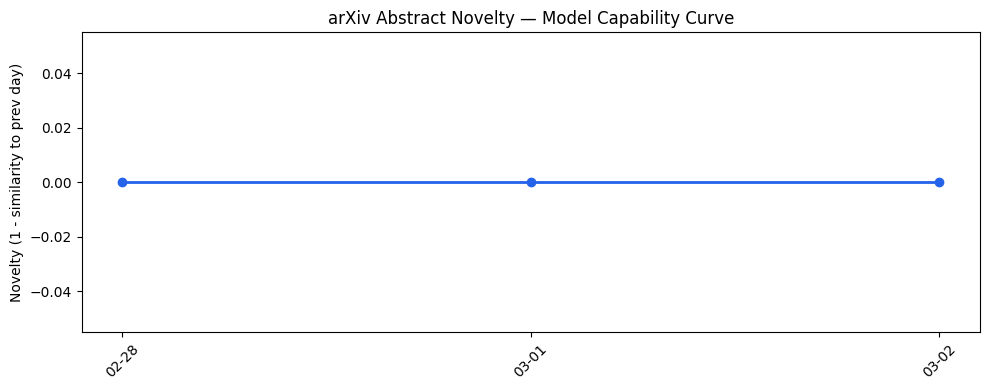
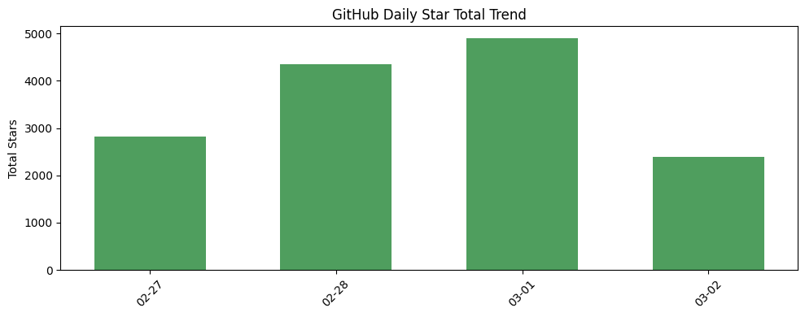
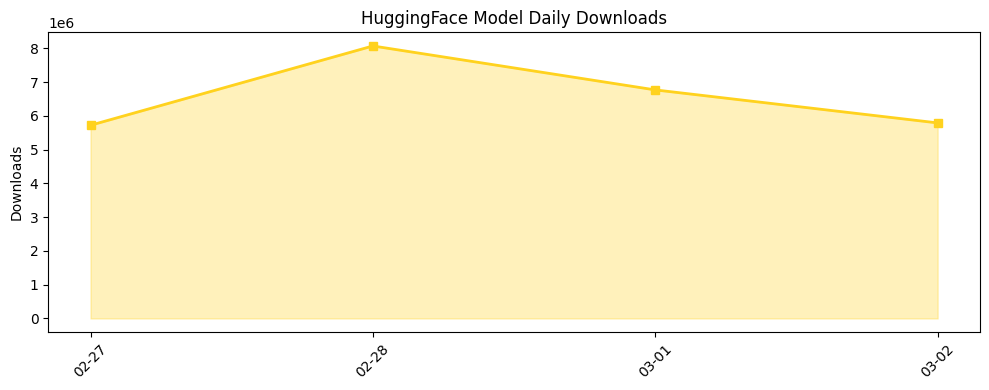

## # 今日AI结构性变化
> 今日新增的AI信息显示，技术层面上有多项研究成果，包括LLM的应用、推理能力的提升和新范式的提出。
今日最值得注意的结构性变化是技术层面上的重大突破，包括LLM的能力边界被进一步推进，提出了一些新的范式，例如使用LLM进行自动化推理和决策。这些变化表明AI技术的快速发展和创新。
- 📈 **持续趋势**：技术层话题已连续多天增强
- 🆕 **新兴方向**：基础设施和风险信号为30天内首次出现
- 🔺 **突然升温**：基础设施和风险信号近3天突然集中出现
- 🔑 **新关键词**：Anthropic, ChatGPT, Claude, SaaS, 云服务, 安全, 监管
- 📉 **消退关键词**：无

## # 技术层信号
🔴 重大突破
模型能力边界被进一步推进，包括LLM的能力边界被推进，提出了一些新的范式，例如使用LLM进行自动化推理和决策。这些变化表明AI技术的快速发展和创新。
例如，[HumanMCP: A Human-Like Query Dataset for Evaluating MCP Tool Retrieval Performance](https://arxiv.org/abs/2602.23367) 和 [An Agentic LLM Framework for Adverse Media Screening in AML Compliance](https://arxiv.org/abs/2602.23373) 等论文展示了LLM在不同领域的应用和推理能力的提升。
趋势报告显示，技术层面上有全新话题出现，可能是一个新兴方向的早期信号。

## # 产业资本信号
🔴 强信号
基础设施层面上，开源生态和云服务平台的发展为AI应用提供了更加便捷的环境。应用层面上，AI在多个领域的应用取得了进展，包括医疗、金融和教育等。资本信号方面，投资者对AI SaaS公司的看法发生了变化，更加注重实际应用和盈利能力。
例如，[Polymarket / agents](https://github.com/Polymarket/agents) 和 [khoj-ai / khoj](https://github.com/khoj-ai/khoj) 等开源项目展示了开源生态的发展。
[Users are ditching ChatGPT for Claude — here’s how to make the switch](https://techcrunch.com/2026/03/02/users-are-ditching-chatgpt-for-claude-heres-how-to-make-the-switch/) 和 [A married founder duo’s company, 14.ai, is replacing customer support teams at startups](https://techcrunch.com/2026/03/02/a-married-founder-duos-company-14-ai-is-replacing-customer-support-teams-at-startups/) 等文章展示了AI在不同领域的应用和替代传统解决方案的趋势。
[Investors spill what they aren’t looking for anymore in AI SaaS companies](https://techcrunch.com/2026/03/01/investors-spill-what-they-arent-looking-for-anymore-in-ai-saas-companies/) 和 [Over $50B Went To Boom-Era Software Companies That Haven’t Raised In 4+ Years](https://news.crunchbase.com/saas/boom-era-software-startups-stalled-unicorns/) 等文章展示了资本信号的变化。

## # 潜在拐点判断
今日新增的AI信息显示，技术层面上有多项研究成果，包括LLM的应用、推理能力的提升和新范式的提出。这些变化可能标志着AI技术的重大突破和新兴方向的早期信号。
如果这些变化持续发展，可能会导致AI技术的进一步应用和普及，进而推动整个产业的发展和变革。

## # 明日观察点
1. 关注技术层面上的新兴方向和LLM的应用。
2. 观察开源生态和云服务平台的发展。
3. 密切关注资本信号的变化和AI SaaS公司的发展。

## # 长期趋势坐标
今日的信号在AI产业演进的大图中处于技术层面上的重大突破和新兴方向的早期信号。这些变化可能标志着AI技术的快速发展和创新，进而推动整个产业的发展和变革。
根据趋势报告，今日的信号具有较高的新颖性，可能是一个新兴方向的早期信号。

## # 数据洞察
### arXiv 摘要对比 — 模型能力提升曲线
今日的arXiv摘要对比数据暂无足够的历史数据（需至少 3 天），无法对模型能力提升曲线进行分析。

### GitHub Star 增速分析
GitHub Star 增速分析显示，今日有多个仓库的Star数增长迅速，例如 [K-Dense-AI/claude-scientific-skills](https://github.com/K-Dense-AI/claude-scientific-skills) 和 [X-PLUG/MobileAgent](https://github.com/X-PLUG/MobileAgent) 等。

### HuggingFace 模型下载量变化
HuggingFace 模型下载量变化显示，今日有多个模型的下载量增长迅速，例如 [moonshotai/Kimi-K2.5](https://huggingface.co/moonshotai/Kimi-K2.5) 和 [Qwen/Qwen3.5-397B-A17B](https://huggingface.co/Qwen/Qwen3.5-397B-A17B) 等。

### 趋势图

## # 参考来源
- [HumanMCP: A Human-Like Query Dataset for Evaluating MCP Tool Retrieval Performance](https://arxiv.org/abs/2602.23367) — arXiv
- [An Agentic LLM Framework for Adverse Media Screening in AML Compliance](https://arxiv.org/abs/2602.23373) — arXiv
- [Polymarket / agents](https://github.com/Polymarket/agents) — GitHub
- [khoj-ai / khoj](https://github.com/khoj-ai/khoj) — GitHub
- [Users are ditching ChatGPT for Claude — here’s how to make the switch](https://techcrunch.com/2026/03/02/users-are-ditching-chatgpt-for-claude-heres-how-to-make-the-switch/) — TechCrunch
- [A married founder duo’s company, 14.ai, is replacing customer support teams at startups](https://techcrunch.com/2026/03/02/a-married-founder-duos-company-14-ai-is-replacing-customer-support-teams-at-startups/) — TechCrunch
- [Investors spill what they aren’t looking for anymore in AI SaaS companies](https://techcrunch.com/2026/03/01/investors-spill-what-they-arent-looking-for-anymore-in-ai-saas-companies/) — TechCrunch
- [Over $50B Went To Boom-Era Software Companies That Haven’t Raised In 4+ Years](https://news.crunchbase.com/saas/boom-era-software-startups-stalled-unicorns/) — Crunchbase News