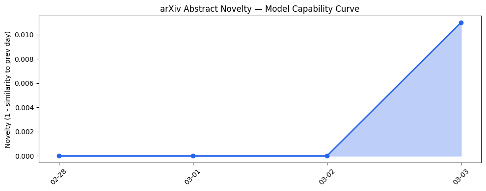
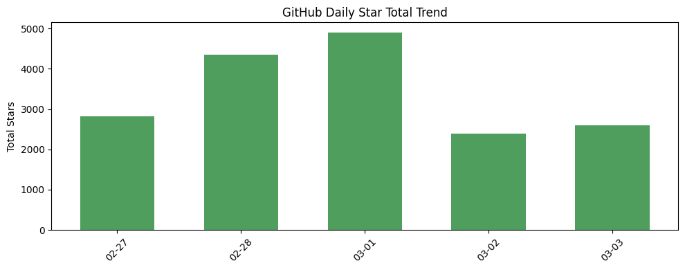
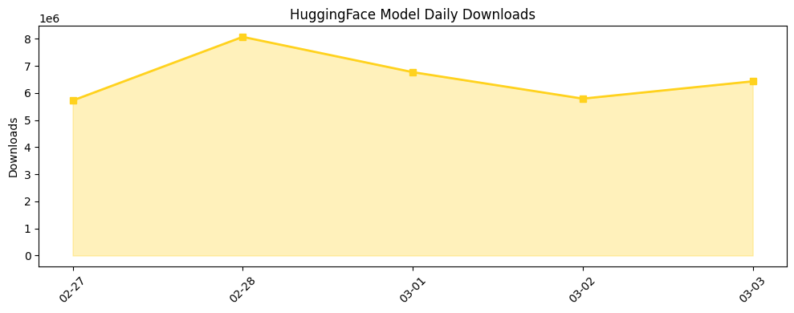

## # 今日AI结构性变化
> 今日AI产业结构分析的核心判断是：AI技术的进步和应用正在推动产业结构的深刻变化，尤其是在技术层、基础设施、应用层和资本流向等方面。
今天最值得注意的结构性变化是AI技术的快速进步和广泛应用，这导致了产业结构的深刻变化。这种变化不仅体现在技术层面的进步，也体现在基础设施的升级、应用层的扩展和资本流向的转变。
- 📈 **持续趋势**：技术层、基础设施、应用层和资本信号等方面的持续增强趋势。
- 🆕 **新兴方向**：技术层出现全新话题，如GPT-5.3和Gemini 3.1，表明新兴方向的早期信号。
- 🔺 **突然升温**：资本信号方面的突然升温，表明投资热潮的加剧。
- 🔑 **新关键词**：AI regulation、Claude Code、Cursor、GPT-5.3、Gemini 3.1、LMCache、Qwen3.5-0.8B、Qwen3.5-4B、ReMe、UltraRAG等。
- 📉 **消退关键词**：暂无显著消退关键词。

## # 技术层信号
🔴 重大突破
模型能力边界正在被推进，新论文和模型的发布，如GPT-5.3和Gemini 3.1，展示了显著的性能提升和新功能。同时，研究人员提出新的范式，如使用图神经网络和注意力机制来提高LLM的性能。
参考证据文章：
- [GPT-5.3 Instant System Card](https://openai.com/index/gpt-5-3-instant-system-card)
- [Gemini 3.1 Flash-Lite: Built for intelligence at scale](https://deepmind.google/blog/gemini-3-1-flash-lite-built-for-intelligence-at-scale/)

## # 产业资本信号
🔴 强信号
融合基础设施变化、应用层变化和资本流向三个子维度进行分析，发现资本信号方面的强烈信号。基础设施的升级，如LMCache，旨在降低推理成本和提高效率。应用层的扩展，如ChatGPT和Claude Code，正在被广泛应用于新的行业和领域。资本流向方面，投资热潮持续，多家公司获得大量资金，估值水平持续上升。
参考证据文章：
- [LMCache](https://github.com/LMCache/LMCache)
- [Massive AI Deals Drive $189B Startup Funding Record In February While Public Software Stocks Reel](https://news.crunchbase.com/venture/record-setting-global-funding-february-2026-openai-anthropic/)

## # 潜在拐点判断
基于今日信号和历史趋势，判断存在潜在拐点。拐点是指某个方向可能即将发生质变的转折点。如果发生，影响将是深远的，包括AI技术的进一步进步和广泛应用，产业结构的深刻变化，以及资本流向的转变。
今日未观察到明显的拐点信号，但技术进步和资本流向的变化可能预示着未来潜在的拐点。

## # 明日观察点
1. 关注技术层的新进展，特别是GPT-5.3和Gemini 3.1的进一步应用和发展。
2. 观察基础设施的升级和应用层的扩展，特别是LMCache和ChatGPT的进一步发展。
3. 关注资本流向的变化，特别是投资热潮的持续和估值水平的变化。

## # 长期趋势坐标
今日观察放入更大的时间框架，发现AI产业结构分析的长期趋势坐标是：技术进步、基础设施升级、应用层扩展和资本流向转变。这些变化预示着AI产业的深刻变革和未来潜在的发展方向。
参考趋势报告中的overall_novelty和keyword_trends数据，今日的信号在AI产业演进的大图中处于重要位置。

## # 数据洞察
### arXiv 摘要对比 — 模型能力提升曲线
今日的arXiv摘要对比数据暂无足够的历史数据（需至少3天），因此无法分析模型能力提升曲线。

### GitHub Star 增速分析
GitHub Star增速分析显示，今日新增仓库包括agentscope-ai/agentscope、agentscope-ai/ReMe、LMCache/LMCache和OpenBMB/UltraRAG等。增速最快的仓库包括bytedance/deer-flow、K-Dense-AI/claude-scientific-skills和alibaba/OpenSandbox等。

### HuggingFace 模型下载量变化
HuggingFace模型下载量变化显示，今日下载量最高的模型包括moonshotai/Kimi-K2.5、Qwen/Qwen3.5-397B-A17B和Qwen/Qwen3.5-35B-A3B等。增速最快的模型包括Qwen/Qwen3.5-9B、Qwen/Qwen3.5-0.8B和Qwen/Qwen3.5-4B等。

### 趋势图

## # 参考来源
- [GPT-5.3 Instant System Card](https://openai.com/index/gpt-5-3-instant-system-card) — OpenAI Blog
- [Gemini 3.1 Flash-Lite: Built for intelligence at scale](https://deepmind.google/blog/gemini-3-1-flash-lite-built-for-intelligence-at-scale/) — Google DeepMind Blog
- [LMCache](https://github.com/LMCache/LMCache) — GitHub Trending
- [Massive AI Deals Drive $189B Startup Funding Record In February While Public Software Stocks Reel](https://news.crunchbase.com/venture/record-setting-global-funding-february-2026-openai-anthropic/) — Crunchbase News
- [ChatGPT’s new GPT-5.3 Instant model will stop telling you to calm down](https://techcrunch.com/2026/03/03/chatgpts-new-gpt-5-3-instant-model-will-stop-telling-you-to-calm-down/) — TechCrunch AI
- [No one has a good plan for how AI companies should work with the government](https://techcrunch.com/2026/03/02/openai-anthropic-department-of-defense-war-hegseth-ai-companies-work-with-us-government/) — TechCrunch AI