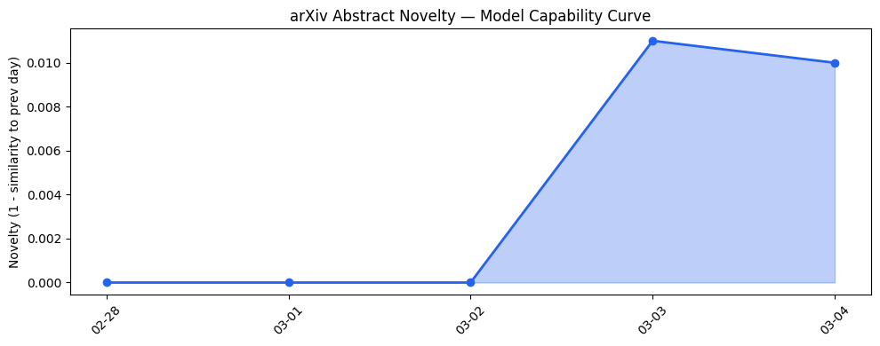
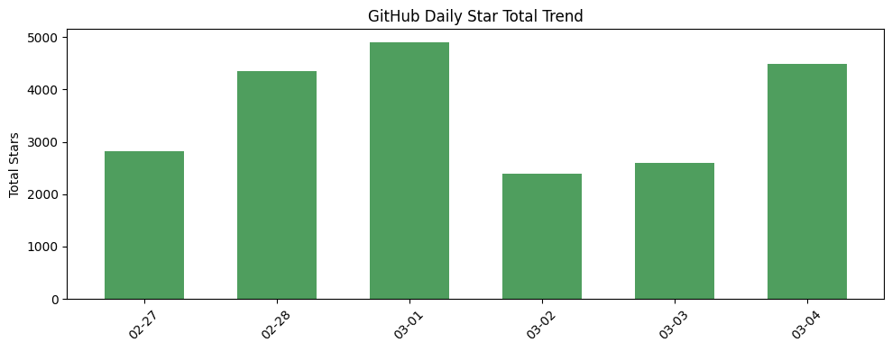
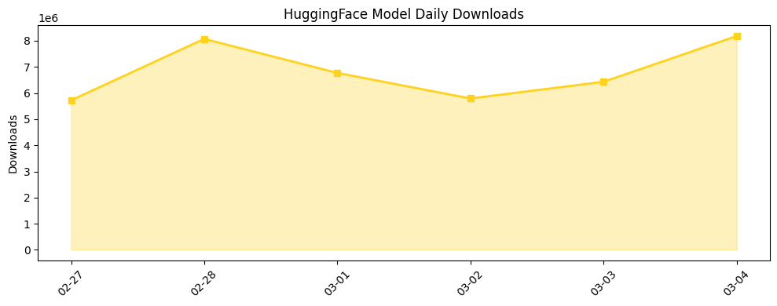

## # 今日AI结构性变化
> 今日新增的AI信息显示，技术层面上有多项创新，基础设施方面有新进展，应用层面上有新场景的探索，资本信号显示融资方向趋于集中，风险信号则提示监管和伦理问题日益受到关注。
今日最值得注意的结构性变化是技术层面的创新，如Federated Inference、ERI Benchmark、SuperLocalMemory等，以及应用层面的新场景探索。这意味着AI行业正在不断推进技术边界和应用范围。
信号列表：
- 📈 **持续趋势**：基础设施、应用层、资本信号和风险信号都呈现持续增强趋势。
- 🆕 **新兴方向**：技术层面出现全新话题，如Diffusion Language Models。
- 🔺 **突然升温**：资本信号和风险信号近期突然集中出现。
- 🔑 **新关键词**：AI Ethics、AI-Driven Health、Biosecurity等。
- 📉 **消退关键词**：无。

## # 技术层信号
🔴 重大突破
模型能力边界被推进，新论文提出多项技术创新，如Federated Inference、ERI Benchmark、SuperLocalMemory等。Diffusion Language Models显示出强大的潜力，可能是一个新范式的开始。
引用证据文章：
- [Federated Inference: Toward Privacy-Preserving Collaborative and Incentivized Model Serving](https://arxiv.org/abs/2603.02214)
- [ERI Benchmark](https://arxiv.org/abs/2603.02239)

## # 产业资本信号
🔴 强信号
融资方向趋于集中，尤其是在AI和生物安全领域。基础设施方面，新硬件和优化算法降低了推理成本。应用层面上，传统解决方案被AI-native产品所替代。
资本流向：大厂战略投资和收购活动频繁。
引用证据文章：
- [Decagon completes first tender offer at $4.5B valuation](https://techcrunch.com/2026/03/04/decagon-completes-first-tender-offer-at-4-5b-valuation/)

## # 潜在拐点判断
今日信号和历史趋势表明，AI行业可能正在走向一个潜在拐点。技术层面的创新和应用层面的新场景探索可能会带来新的商业机会和社会影响。监管和伦理问题的日益受到关注，也可能成为一个拐点。
如果发生，影响将是深远的，可能会改变AI行业的发展轨迹。

## # 明日观察点
1. 技术层面的新进展：是否会有新的技术创新被提出？
2. 应用层面的新场景探索：是否会有新的应用场景被开发？
3. 资本信号的变化：是否会有新的融资方向或战略投资被公布？

## # 长期趋势坐标
今日观察放入更大的时间框架，AI行业的发展呈现出明显的结构性变化。技术层面的创新和应用层面的新场景探索将继续推进AI行业的发展。资本信号的变化和风险信号的日益受到关注，将成为AI行业发展的重要因素。
overall_novelty为0.748，表明今日的信号在历史上有一定的新颖性。

## # 数据洞察
### arXiv 摘要对比 — 模型能力提升曲线
今日arxiv_capability显示capability_score为0.01，mean_similarity为0.99，trend为“延续”。这意味着今日的论文话题与历史的延续/跃迁情况基本一致。
### GitHub Star 增速分析
github_stars显示top_growth为agentscope-ai/ReMe，growth_pct为11.815。新晋热门项目包括unslothai/unsloth、Aider-AI/aider等。
### HuggingFace 模型下载量变化
huggingface_downloads显示top_downloads为moonshotai/Kimi-K2.5，downloads为1899549。top_growth为Qwen/Qwen3.5-9B，growth_pct为3.482。
### 趋势图

## # 参考来源
- [Federated Inference: Toward Privacy-Preserving Collaborative and Incentivized Model Serving](https://arxiv.org/abs/2603.02214) — arXiv
- [ERI Benchmark](https://arxiv.org/abs/2603.02239) — arXiv
- [Decagon completes first tender offer at $4.5B valuation](https://techcrunch.com/2026/03/04/decagon-completes-first-tender-offer-at-4-5b-valuation/) — TechCrunch
- [Eight Sleep Raises $50M At $1.5B Valuation To Expand Into ‘Predictive, AI-Driven Health’](https://news.crunchbase.com/venture/unicorn-eight-sleep-funding-ai-driven-health/) — Crunchbase News
- [Father sues Google, claiming Gemini chatbot drove son into fatal delusion](https://techcrunch.com/2026/03/04/father-sues-google-claiming-gemini-chatbot-drove-son-into-fatal-delusion/) — TechCrunch