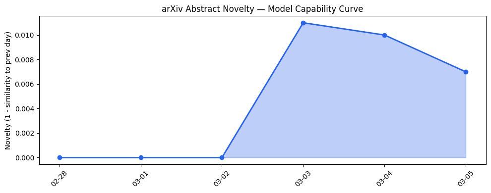

## # 今日AI结构性变化
> 今日AI产业结构分析显示，LLM Agents、AI安全和资本投资领域出现了显著的发展和变化。
今日最值得注意的结构性变化是LLM Agents的快速发展和AI安全的日益重要性。这些变化是由技术进步和资本投资推动的，尤其是在LLM Agents和AI安全领域的重大突破。
- 📈 **持续趋势**：基础设施、应用层和风险信号话题已连续7天增强
- 🆕 **新兴方向**：基础设施和风险信号出现全新话题，可能是新兴方向的早期信号
- 🔺 **突然升温**：LLM Agents和AI安全领域近3天突然集中出现
- 🔑 **新关键词**：AI Agents、AI Safety、Agentic Coding、Denki、Financial Audits、GPT-5.4、Luma、Neuralink、Science Corp.
- 📉 **消退关键词**：无

## # 技术层信号
🔴 重大突破
模型能力边界正在被推进，尤其是在LLM Agents和AI安全领域。新的LLM模型，如GPT-5.4，和AI-powered financial audits的发展正在改变AI产业的范式。
参考证据文章：[GPT-5.4 Thinking System Card](https://openai.com/index/gpt-5-4-thinking-system-card) 和 [Introducing GPT-5.4](https://openai.com/index/introducing-gpt-5-4)

## # 产业资本信号
🔴 强信号
资本流向LLM Agents和AI安全领域，基础设施和应用层变化正在推动AI产业的发展。基础设施变化，如推理成本的降低和芯片/算力的趋势转变，正在支持AI应用的扩展。应用层变化，如新行业的渗透和旧方案的替代，正在推动AI的广泛应用。
参考证据文章：[AWS launches a new AI agent platform specifically for healthcare](https://techcrunch.com/2026/03/05/aws-amazon-connect-health-ai-agent-platform-health-care-providers/)

## # 潜在拐点判断
今日信号和历史趋势表明，AI产业可能正在经历一个潜在的拐点。LLM Agents和AI安全领域的重大突破可能会带来AI产业的范式转变。
依据今日信号和历史趋势，判断AI产业可能正在经历一个潜在的拐点。如果发生，这将对AI产业产生深远的影响，包括LLM Agents和AI安全领域的快速发展和广泛应用。

## # 明日观察点
1. LLM Agents和AI安全领域的进一步发展和应用
2. 资本投资对AI产业的影响和推动作用
3. 基础设施和应用层变化对AI产业的影响

## # 长期趋势坐标
今日观察放入更大的时间框架，AI产业结构分析显示，LLM Agents、AI安全和资本投资领域的发展和变化是AI产业演进的重要组成部分。
参考趋势报告数据，今日信号在AI产业演进的大图中处于重要位置，尤其是在LLM Agents和AI安全领域的重大突破和资本投资的推动作用。

## # 数据洞察
### arXiv 摘要对比 — 模型能力提升曲线
今日arXiv摘要对比数据显示，模型能力提升曲线呈现延续趋势，表明LLM Agents和AI安全领域的重大突破是基于既有方向的深化和扩展。
### GitHub Star 增速分析
今日GitHub Star增速分析数据显示，LLM Agents和AI安全领域的仓库增速最快，表明这些领域的快速发展和广泛应用。
### HuggingFace 模型下载量变化
今日HuggingFace模型下载量变化数据显示，LLM Agents和AI安全领域的模型下载量最高，表明这些领域的重要性和广泛应用。
### 趋势图

## # 参考来源
- [GPT-5.4 Thinking System Card](https://openai.com/index/gpt-5-4-thinking-system-card) — OpenAI Blog
- [Introducing GPT-5.4](https://openai.com/index/introducing-gpt-5-4) — OpenAI Blog
- [AWS launches a new AI agent platform specifically for healthcare](https://techcrunch.com/2026/03/05/aws-amazon-connect-health-ai-agent-platform-health-care-providers/) — TechCrunch AI
- [EXCLUSIVE: Luma launches creative AI agents powered by its new ‘Unified Intelligence’ models](https://techcrunch.com/2026/03/05/exclusive-luma-launches-creative-ai-agents-powered-by-its-new-unified-intelligence-models/) — TechCrunch AI
- [Active Investors Spent More On Fewer Deals In February](https://news.crunchbase.com/venture/active-investors-big-deals-february-2026-yc-a16z-nvidia/) — Crunchbase News
- [US reportedly considering sweeping new chip export controls](https://techcrunch.com/2026/03/05/us-reportedly-considering-sweeping-new-chip-export-controls/) — TechCrunch AI