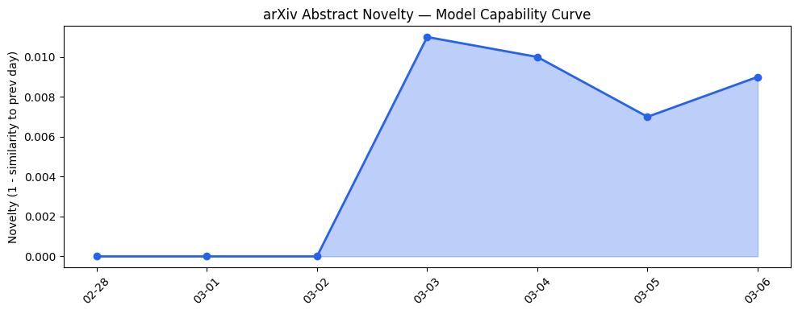

## # 今日AI结构性变化
> 今日新增的AI信息显示，技术层面上有多项创新，如SkillNet、ECG-MoE等，基础设施层面上推理成本和芯片/算力趋势有所变化，应用层面上AI进入了新行业和新场景，资本信号上融资方向和估值水平有所变化，风险信号上监管/立法和伦理/安全领域有新动向。
今日最值得注意的结构性变化是技术层面的创新和基础设施层面的变化，这些变化将对AI产业产生深远影响。同时，应用层面的新行业和新场景的出现，也将为AI产业带来新的发展机会。
- 📈 **持续趋势**：风险信号和基础设施层面的话题向量在最近8天内呈现持续增强趋势。
- 🆕 **新兴方向**：技术层面、基础设施层面、应用层面、资本信号和风险信号都出现了新兴话题。
- 🔺 **突然升温**：无。
- 🔑 **新关键词**：AI Hedge Fund、Anthropic Claude、Codex Security、ECG-MoE、Luma Agents、Microsoft、SkillNet、Unified Intelligence。
- 📉 **消退关键词**：无。

## # 技术层信号
🔴 重大突破
技术层面的创新，如SkillNet和ECG-MoE等新技术的出现，推动了模型能力边界的突破。这些新技术的出现，也带来了新范式的产生，如检索增强生成和多模态学习的新范式。
参考证据文章：
- [SkillNet: Create, Evaluate, and Connect AI Skills](https://arxiv.org/abs/2603.04448)
- [ECG-MoE: Mixture-of-Expert Electrocardiogram Foundation Model](https://arxiv.org/abs/2603.04589)

## # 产业资本信号
🔴 强信号
基础设施层面的变化，如推理成本和芯片/算力趋势的变化，表明了产业资本的流向。应用层面的新行业和新场景的出现，也表明了资本的流向。同时，融资方向和估值水平的变化，也反映了资本信号的变化。
参考证据文章：
- [The Week’s 10 Biggest Funding Rounds: Space Tech, AI Infrastructure Lead Fundraises](https://news.crunchbase.com/venture/biggest-funding-rounds-space-tech-sierra-ai-ayar/)
- [City Detect, which uses AI to help cities stay safe and clean, raises $13M Series A](https://techcrunch.com/2026/03/06/city-detect-uses-ai-to-help-cities-stay-safe-and-clean/)

## # 潜在拐点判断
今日的信号和历史趋势结合，判断是否存在潜在拐点。由于技术层面的创新和基础设施层面的变化，可能会带来AI产业的拐点。同时，应用层面的新行业和新场景的出现，也可能会带来新的发展机会。如果这些变化能够持续发展，可能会带来AI产业的重大突破。
如果发生，影响将是深远的，可能会改变AI产业的发展方向和格局。

## # 明日观察点
1. 技术层面的创新是否能够持续发展。
2. 基础设施层面的变化是否能够带来应用层面的新行业和新场景的出现。
3. 资本信号的变化是否能够反映出AI产业的发展方向和格局的变化。

## # 长期趋势坐标
今日的信号和历史趋势结合，判断AI产业的发展方向和格局。由于技术层面的创新和基础设施层面的变化，可能会带来AI产业的拐点。同时，应用层面的新行业和新场景的出现，也可能会带来新的发展机会。如果这些变化能够持续发展，可能会带来AI产业的重大突破。
参考趋势对比报告中的overall_novelty和keyword_trends数据，可以看到今日的信号在AI产业演进的大图中处于什么位置。

## # 数据洞察
### arXiv 摘要对比 — 模型能力提升曲线
今日的arXiv摘要对比数据显示，模型能力提升曲线呈现延续趋势，capability_score为0.01，mean_similarity为0.99。
### GitHub Star 增速分析
今日的GitHub Star增速分析数据显示，top_growth中的仓库为inclusionAI/AReaL，stars为348，prev_stars为161，growth_pct为1.161。
### HuggingFace 模型下载量变化
今日的HuggingFace模型下载量变化数据显示，top_downloads中的模型为Qwen/Qwen3.5-397B-A17B，downloads为1376334。
### 趋势图

## # 参考来源
- [SkillNet: Create, Evaluate, and Connect AI Skills](https://arxiv.org/abs/2603.04448) — arXiv
- [ECG-MoE: Mixture-of-Expert Electrocardiogram Foundation Model](https://arxiv.org/abs/2603.04589) — arXiv
- [The Week’s 10 Biggest Funding Rounds: Space Tech, AI Infrastructure Lead Fundraises](https://news.crunchbase.com/venture/biggest-funding-rounds-space-tech-sierra-ai-ayar/) — Crunchbase News
- [City Detect, which uses AI to help cities stay safe and clean, raises $13M Series A](https://techcrunch.com/2026/03/06/city-detect-uses-ai-to-help-cities-stay-safe-and-clean/) — TechCrunch
- [Anthropic to challenge DOD’s supply-chain label in court](https://techcrunch.com/2026/03/05/anthropic-to-challenge-dods-supply-chain-label-in-court/) — TechCrunch