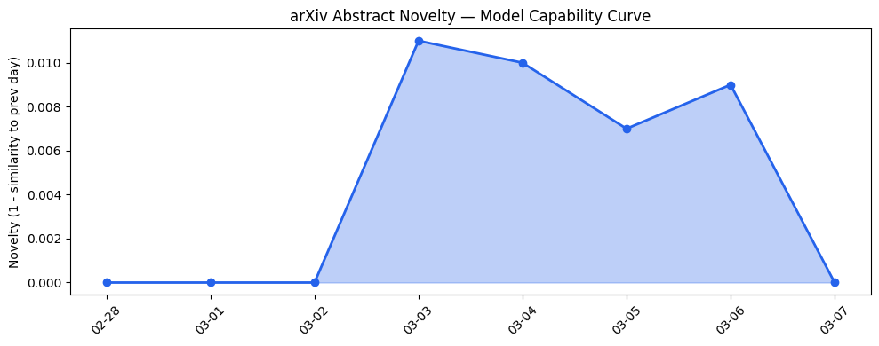
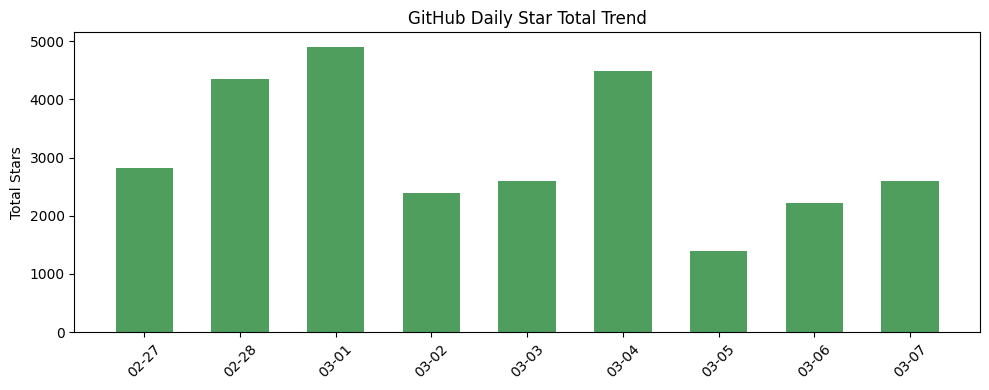
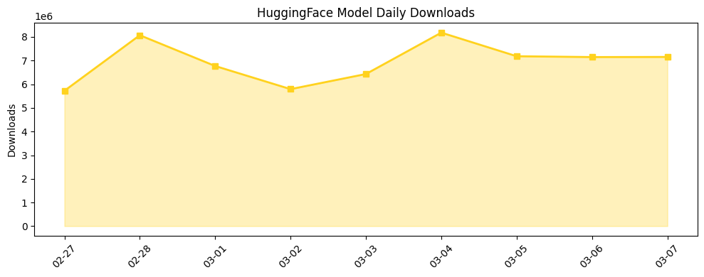

## # 今日AI结构性变化
> 今日开源生态中出现多个新项目，资本动向方面OpenAI面临人员流失和产品延迟。
今日最值得注意的结构性变化是开源生态的蓬勃发展，新项目如Pixelle-Video和GLiNER2推动AI能力边界。同时，OpenAI面临人员流失和产品延迟，这可能对其业务产生影响。
- 📈 **持续趋势**：技术层话题已连续8天增强
- 🆕 **新兴方向**：应用层话题出现全新方向（与历史最大相似度仅0.18）
- 🔺 **突然升温**：基础设施的话题向量在最近8天内呈现持续增强趋势
- 🔑 **新关键词**：GitHub, HuggingFace, 机器人技术, 资本动向
- 📉 **消退关键词**：无

## # 技术层信号
🟡 渐进改善
模型能力边界的推进主要体现在新项目的出现，如Pixelle-Video和GLiNER2，这些项目推动了AI能力的边界。同时，开源项目如pgmpy和sarvam-105b探索新范式，这可能会带来新的技术突破。
[pgmpy / pgmpy](https://github.com/pgmpy/pgmpy)
[AIDC-AI / Pixelle-Video](https://github.com/AIDC-AI/Pixelle-Video)

## # 产业资本信号
🟡 中等信号
今日无显著融资动向，但OpenAI面临人员流失和产品延迟，这可能对其业务产生影响。基础设施方面无显著变化，应用层方面AI技术应用于新场景如短视频引擎。
[OpenAI robotics lead Caitlin Kalinowski quits in response to Pentagon deal](https://techcrunch.com/2026/03/07/openai-robotics-lead-caitlin-kalinowski-quits-in-response-to-pentagon-deal/)

## # 潜在拐点判断
今日观察到OpenAI面临人员流失和产品延迟，这可能是OpenAI业务的潜在拐点。同时，开源生态的蓬勃发展可能会带来新的技术突破和产业变革。

## # 明日观察点
1. 关注OpenAI的人员流失和产品延迟对其业务的影响。
2. 观察开源生态的发展，特别是新项目的推出和现有项目的更新。
3. 关注基础设施和应用层的变化，特别是AI技术在新场景中的应用。

## # 长期趋势坐标
今日的信号在AI产业演进的大图中处于开源生态蓬勃发展和资本动向变化的阶段。开源生态的发展可能会带来新的技术突破和产业变革，而资本动向的变化可能会影响AI产业的发展方向。

## # 数据洞察
### arXiv 摘要对比 — 模型能力提升曲线
今日无 arXiv 摘要数据，因此无法分析模型能力的提升曲线。

### GitHub Star 增速分析
GitHub 上的仓库星数增长迅速，今日新增仓库包括pgmpy/pgmpy、AIDC-AI/Pixelle-Video和fastino-ai/GLiNER2。增长最快的仓库包括666ghj/BettaFish、lingfengQAQ/webnovel-writer和virattt/ai-hedge-fund。

### HuggingFace 模型下载量变化
HuggingFace 模型下载量今日达到7151779，下载量最高的模型包括Qwen/Qwen3.5-397B-A17B、Qwen/Qwen3.5-35B-A3B和unsloth/Qwen3.5-35B-A3B-GGUF。增速最快的模型包括Lightricks/LTX-2.3、HauhauCS/Qwen3.5-9B-Uncensored-HauhauCS-Aggressive和Qwen/Qwen3.5-2B。

### 趋势图

## # 参考来源
- [pgmpy / pgmpy](https://github.com/pgmpy/pgmpy) — GitHub
- [AIDC-AI / Pixelle-Video](https://github.com/AIDC-AI/Pixelle-Video) — GitHub
- [OpenAI robotics lead Caitlin Kalinowski quits in response to Pentagon deal](https://techcrunch.com/2026/03/07/openai-robotics-lead-caitlin-kalinowski-quits-in-response-to-pentagon-deal/) — TechCrunch