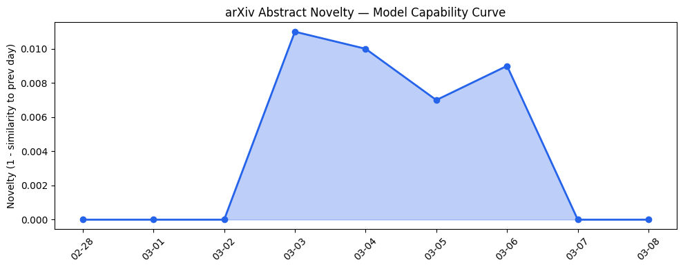
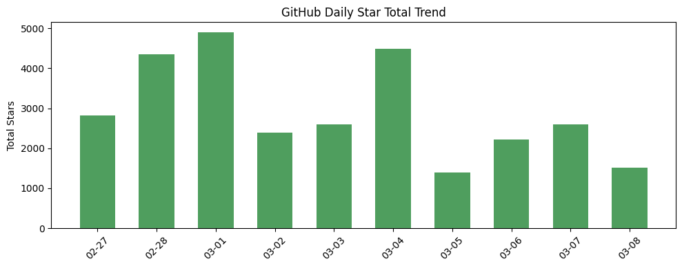
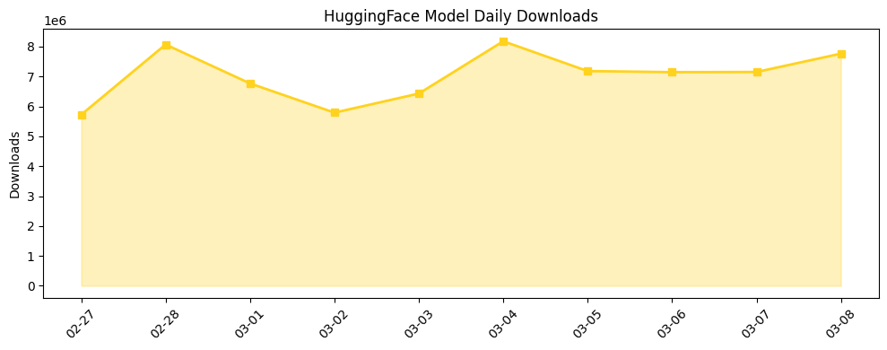

## 今日AI结构性变化
> 今日AI领域开源生态与资本热点并存，开源平台和模型发布引起关注，同时资本市场和行业动态如Pentagon与Anthropic的争议也引人注目。
今天最值得注意的结构性变化是开源生态和资本市场的并存，这意味着AI领域的发展不仅依赖于技术进步，还依赖于资本的支持和行业的应用。同时，监管争议的出现也表明AI领域的发展需要更加注重伦理和安全问题。
- 📈 **持续趋势**：技术层话题已连续8天增强
- 🆕 **新兴方向**：技术层、基础设施、应用层、资本信号和风险信号等多个维度出现新兴话题
- 🔺 **突然升温**：Pentagon与Anthropic的争议突然升温
- 🔑 **新关键词**：Google、Grammarly、Pentagon、Waymo、Wing、资本市场等
- 📉 **消退关键词**：无

## 技术层信号
🟡 渐进改善
模型能力边界正在被推进，新模型如Qwen3.5-27B-Claude-4.6-Opus-Reasoning-Distilled-GGUF和sarvam-30b的发布表明技术层面的进步。同时，技术层面的新兴话题也在不断出现，表明该领域的发展仍然具有很强的活力。
[Qwen3.5-27B-Claude-4.6-Opus-Reasoning-Distilled-GGUF](https://huggingface.co/Jackrong/Qwen3.5-27B-Claude-4.6-Opus-Reasoning-Distilled-GGUF)
[sarvam-30b](https://huggingface.co/sarvamai/sarvam-30b)

## 产业资本信号
🔴 强信号
资本市场对AI领域的关注度增高，Google就给Sundar Pichai一个巨额薪酬包，表明资本市场对AI领域的重视。同时，Pentagon与Anthropic的争议也引发了人们对AI领域监管问题的关注。
[Google就给Sundar Pichai一个巨额薪酬包](https://techcrunch.com/2026/03/07/google-just-gave-sundar-pichai-a-692m-pay-package/)

## 潜在拐点判断
今日观察到多个维度的新兴话题和趋势，这可能意味着AI领域的发展即将进入一个新的阶段。同时，监管争议的出现也可能成为一个拐点，促使AI领域更加注重伦理和安全问题。
是的，今日的信号和趋势可能意味着AI领域的发展即将进入一个新的阶段。

## 明日观察点
1. 关注技术层面的新兴话题和趋势，是否会继续推进模型能力边界。
2. 关注资本市场对AI领域的关注度，是否会继续增高。
3. 关注监管争议的发展，是否会成为一个拐点，促使AI领域更加注重伦理和安全问题。

## 长期趋势坐标
今日的信号和趋势在AI产业演进的大图中处于一个新的阶段，开源生态和资本市场的并存，技术层面的进步和监管争议的出现，都意味着AI领域的发展将更加多元化和复杂化。

## 数据洞察
### arXiv 摘要对比 — 模型能力提升曲线
今日无 arXiv 摘要数据。

### GitHub Star 增速分析
GitHub Star 增速最快的 2-3 个仓库是：
- virattt/ai-hedge-fund
- openai/skills
- p-e-w/heretic

### HuggingFace 模型下载量变化
HuggingFace 模型下载量最高的模型是 Qwen/Qwen3.5-397B-A17B，下载量为 1444887。
HuggingFace 模型下载量增速最快的模型是 sarvamai/sarvam-105b，下载量增速为 4.802。

### 趋势图

## 参考来源
- [Qwen3.5-27B-Claude-4.6-Opus-Reasoning-Distilled-GGUF](https://huggingface.co/Jackrong/Qwen3.5-27B-Claude-4.6-Opus-Reasoning-Distilled-GGUF) — HuggingFace
- [sarvam-30b](https://huggingface.co/sarvamai/sarvam-30b) — HuggingFace
- [Owner of ICE detention facility sees big opportunity in AI man camps](https://techcrunch.com/2026/03/08/owner-of-ice-detention-facility-sees-big-opportunity-in-ai-man-camps/) — TechCrunch AI
- [Grammarly’s ‘expert review’ is just missing the actual experts](https://techcrunch.com/2026/03/07/grammarlys-expert-review-is-just-missing-the-actual-experts/) — TechCrunch AI
- [Google just gave Sundar Pichai a $692M pay package](https://techcrunch.com/2026/03/07/google-just-gave-sundar-pichai-a-692m-pay-package/) — TechCrunch AI
- [Will the Pentagon’s Anthropic controversy scare startups away from defense work?](https://techcrunch.com/2026/03/08/will-the-pentagons-anthropic-controversy-scare-startups-away-from-defense-work/) — TechCrunch AI