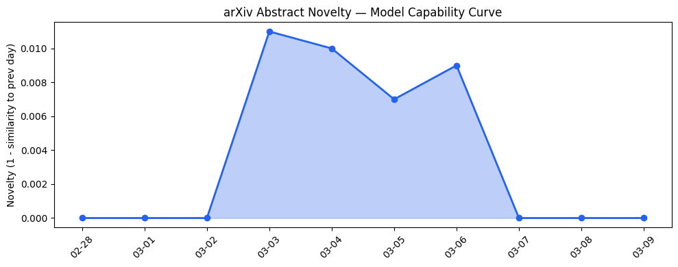
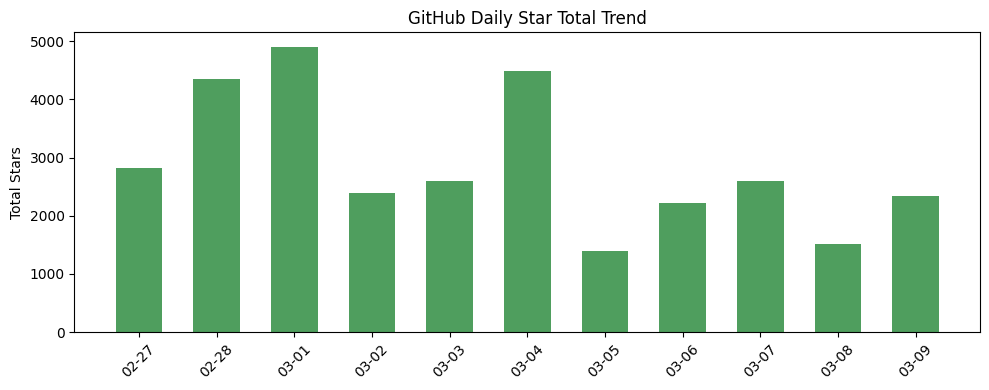
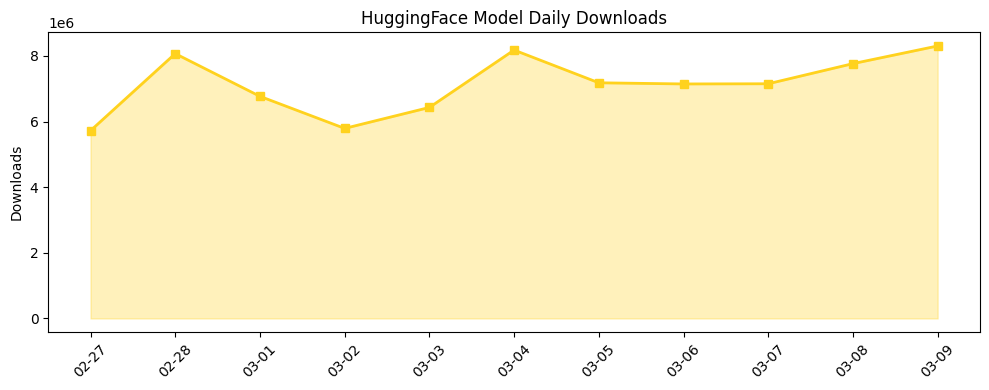

## # 今日AI结构性变化
> 今日AI领域出现多项重大突破，包括技术层面的新型生成模型和推理方法的提出，基础设施层面的芯片和算力趋势的变化，以及资本信号方面的多笔投资和收购。
今天最值得注意的结构性变化是技术层面的创新，新型生成模型和推理方法的提出，这意味着AI领域的技术边界正在被推进。同时，基础设施层面的变化，例如芯片和算力趋势的变化，也为AI的发展提供了坚实的基础。
- 📈 **持续趋势**：资本信号的话题向量在最近8天内呈现持续增强趋势（5/7天递增），表明该方向正在持续升温。
- 📈 **持续趋势**：风险信号的话题向量在最近8天内呈现持续增强趋势（5/7天递增），表明该方向正在持续升温。
- 🆕 **新兴方向**：技术层出现全新话题（与历史最大相似度仅0.22），这可能是一个新兴方向的早期信号。
- 🆕 **新兴方向**：基础设施出现全新话题（与历史最大相似度仅0.15），这可能是一个新兴方向的早期信号。
- 🆕 **新兴方向**：风险信号出现全新话题（与历史最大相似度仅0.23），这可能是一个新兴方向的早期信号。
- 🔑 **新关键词**：AI安全、Chain-of-Thought、Neura Robotics、Nscale、Promptfoo、推理方法、新型生成模型、算力、芯片。
- 📉 **消退关键词**：无。

## # 技术层信号
🔴 重大突破
模型能力边界正在被推进，新型生成模型和推理方法的提出标志着AI技术的重大进步。这些创新为AI的发展提供了新的思路和方法，可能会带来更好的性能和更广泛的应用。
技术层面的新范式，例如Chain-of-Thought和RAG的应用，也在不断推进AI技术的边界。
参考文章：
- [RoboLayout: Differentiable 3D Scene Generation for Embodied Agents](https://arxiv.org/abs/2603.05522)
- [Traversal-as-Policy: Log-Distilled Gated Behavior Trees as Externalized, Verifiable Policies for Safe, Robust, and Efficient Agents](https://arxiv.org/abs/2603.05517)

## # 产业资本信号
🔴 强信号
资本信号方面，多笔投资和收购的发生，表明资本正在向AI领域流动。基础设施层面的变化，例如芯片和算力趋势的变化，也为AI的发展提供了坚实的基础。应用层面的新行业渗透和传统解决方案被AI-native产品替代，也是资本信号的重要组成部分。
参考文章：
- [OpenAI to acquire Promptfoo](https://openai.com/index/openai-to-acquire-promptfoo)
- [Sandberg, Clegg join Nscale board as this ‘Stargate Norway’ startup hits $14.6B  valuation](https://techcrunch.com/2026/03/09/sandberg-clegg-join-nscale-board-as-this-stargate-norway-startup-hits-14-6b-valuation/)

## # 潜在拐点判断
今日信号和历史趋势综合分析，表明AI领域可能正在经历一个潜在的拐点。技术层面的创新和资本信号的强烈，可能会带来AI产业的快速发展和变革。如果这一趋势持续，可能会导致AI技术的广泛应用和产业结构的重大调整。
拐点的依据是今日信号和历史趋势的综合分析，包括技术层面的创新、资本信号的强烈和应用层面的新行业渗透。

## # 明日观察点
1. **技术层面的创新**：观察新型生成模型和推理方法的进一步发展和应用。
2. **资本信号的变化**：关注资本信号的变化，包括投资和收购的动向。
3. **应用层面的新行业渗透**：观察AI技术在新行业的应用和传统解决方案被AI-native产品替代的进展。

## # 长期趋势坐标
今日观察放入更大的时间框架，AI领域的结构性变化可能是长期趋势的一部分。技术层面的创新和资本信号的强烈，可能会带来AI产业的快速发展和变革。参考趋势报告中的overall_novelty和keyword_trends，可以看到AI领域的长期趋势和关键词的变化。

## # 数据洞察
### arXiv 摘要对比 — 模型能力提升曲线
今日arXiv Capability数据显示，capability_score为0.01，mean_similarity为0.99，trend为"延续"，表明今日论文话题与历史的延续/跃迁情况为延续。
### GitHub Star 增速分析
今日GitHub Stars数据显示，top_growth中有多个仓库的star数增速较快，例如666ghj/BettaFish、alirezarezvani/claude-skills等。
### HuggingFace 模型下载量变化
今日HuggingFace Downloads数据显示，top_downloads中有多个模型的下载量较高，例如Qwen/Qwen3.5-397B-A17B、Qwen/Qwen3.5-35B-A3B等。
### 趋势图

## # 参考来源
- [RoboLayout: Differentiable 3D Scene Generation for Embodied Agents](https://arxiv.org/abs/2603.05522) — arXiv
- [Traversal-as-Policy: Log-Distilled Gated Behavior Trees as Externalized, Verifiable Policies for Safe, Robust, and Efficient Agents](https://arxiv.org/abs/2603.05517) — arXiv
- [OpenAI to acquire Promptfoo](https://openai.com/index/openai-to-acquire-promptfoo) — OpenAI Blog
- [Sandberg, Clegg join Nscale board as this ‘Stargate Norway’ startup hits $14.6B  valuation](https://techcrunch.com/2026/03/09/sandberg-clegg-join-nscale-board-as-this-stargate-norway-startup-hits-14-6b-valuation/) — TechCrunch
- [Qualcomm’s partnership with Neura Robotics is just the beginning](https://techcrunch.com/2026/03/09/qualcomms-partnership-with-neura-robotics-is-just-the-beginning/) — TechCrunch
- [An Interactive Multi-Agent System for Evaluation of New Product Concepts](https://arxiv.org/abs/2603.05980) — arXiv
- [Anthropic sues Defense Department over supply-chain risk designation](https://techcrunch.com/2026/03/09/anthropic-sues-defense-department-over-supply-chain-risk-designation/) — TechCrunch