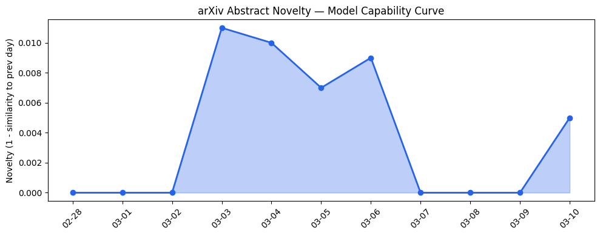
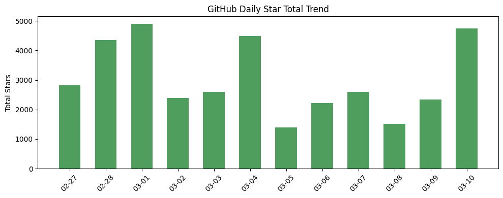
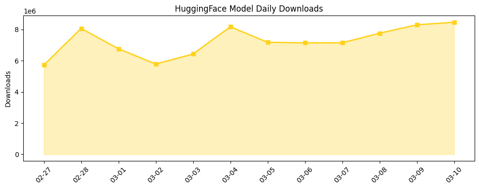

## # 今日AI结构性变化
> 今日AI领域出现多个结构性变化信号，包括技术层面的重大突破、基础设施的渐进改善、应用层的新行业和新场景、资本信号的强烈以及风险信号的增强。
今日最值得注意的结构性变化是技术层面的重大突破，包括新论文介绍了Conversational Demand Response、Artificial Intelligence for Climate Adaptation等新技术，这些突破意味着AI技术的边界正在被推进。同时，基础设施的渐进改善、应用层的新行业和新场景、资本信号的强烈以及风险信号的增强也表明AI产业正在经历快速的发展和变化。
- 📈 **持续趋势**：技术层话题已连续8天增强
- 🆕 **新兴方向**：基础设施、应用层、资本信号和风险信号出现全新话题
- 🔺 **突然升温**：今日多个维度出现结构性变化信号
- 🔑 **新关键词**：Adobe, GPT, Google DeepMind, Legora, Meta AI, Nvidia, Rebar
- 📉 **消退关键词**：无

## # 技术层信号
🔴 重大突破
今日技术层面出现重大突破，包括新论文介绍了Conversational Demand Response、Artificial Intelligence for Climate Adaptation等新技术，这些突破意味着AI技术的边界正在被推进。新范式包括SAHOO、Talk Freely、Execute Strictly等，这些新范式可能会带来新的应用场景和商业机会。
参考证据文章：
- [Conversational Demand Response: Bidirectional Aggregator-Prosumer Coordination through Agentic AI](https://arxiv.org/abs/2603.06217)
- [Artificial Intelligence for Climate Adaptation: Reinforcement Learning for Climate Change-Resilient Transport](https://arxiv.org/abs/2603.06278)

## # 产业资本信号
🔴 强信号
今日资本信号出现强烈信号，包括Legora获得55.5亿美元估值，Meta收购Moltbook等，这些信号意味着资本市场正在对AI产业进行大量投资。基础设施的渐进改善、应用层的新行业和新场景也表明AI产业正在经历快速的发展和变化。
参考证据文章：
- [Legora获得55.5亿美元估值](https://techcrunch.com/2026/03/10/legora-reaches-5-55-billion-valuation-as-ai-legaltech-boom-endures/)
- [Meta收购Moltbook](https://techcrunch.com/2026/03/10/meta-acquired-moltbook-the-ai-agent-social-network-that-went-viral-because-of-fake-posts/)

## # 潜在拐点判断
今日信号 + 历史趋势表明，AI产业可能正在经历一个潜在的拐点。技术层面的重大突破、基础设施的渐进改善、应用层的新行业和新场景、资本信号的强烈以及风险信号的增强都表明AI产业正在快速发展和变化。如果这一趋势持续，可能会带来新的商业机会和应用场景。

## # 明日观察点
1. 技术层面：观察新论文和新技术的发布，判断是否会带来新的应用场景和商业机会。
2. 基础设施：观察基础设施的渐进改善，判断是否会带来新的应用场景和商业机会。
3. 应用层：观察应用层的新行业和新场景，判断是否会带来新的商业机会。

## # 长期趋势坐标
今日观察放入更大的时间框架（月度/季度级别）中，AI产业的结构性变化信号表明，技术层面的重大突破、基础设施的渐进改善、应用层的新行业和新场景、资本信号的强烈以及风险信号的增强都将带来新的商业机会和应用场景。参考趋势报告中的overall_novelty和keyword_trends数据，今日的信号在AI产业演进的大图中处于一个重要的位置。

## # 数据洞察
### arXiv 摘要对比 — 模型能力提升曲线
今日arXiv摘要对比数据表明，模型能力提升曲线呈现延续趋势，新论文介绍了Conversational Demand Response、Artificial Intelligence for Climate Adaptation等新技术，这些突破意味着AI技术的边界正在被推进。
### GitHub Star 增速分析
今日GitHub Star增速分析数据表明，top_growth仓库包括bytedance/deer-flow、NousResearch/hermes-agent、karpathy/nanochat等，这些仓库的Star数增长迅速，可能意味着新的应用场景和商业机会。
### HuggingFace 模型下载量变化
今日HuggingFace模型下载量变化数据表明，top_downloads模型包括Qwen/Qwen3.5-397B-A17B、Qwen/Qwen3.5-35B-A3B、Qwen/Qwen3.5-9B等，这些模型的下载量增长迅速，可能意味着新的应用场景和商业机会。
### 趋势图

## # 参考来源
- [Conversational Demand Response: Bidirectional Aggregator-Prosumer Coordination through Agentic AI](https://arxiv.org/abs/2603.06217) — arXiv
- [Artificial Intelligence for Climate Adaptation: Reinforcement Learning for Climate Change-Resilient Transport](https://arxiv.org/abs/2603.06278) — arXiv
- [Nvidia与Thinking Machines Lab签署大型计算协议](https://techcrunch.com/2026/03/10/thinking-machines-lab-inks-massive-compute-deal-with-nvidia/) — TechCrunch
- [Amazon推出医疗AI助手](https://techcrunch.com/2026/03/10/amazon-launches-its-healthcare-ai-assistant-on-its-website-and-app/) — TechCrunch
- [Legora获得55.5亿美元估值](https://techcrunch.com/2026/03/10/legora-reaches-5-55-billion-valuation-as-ai-legaltech-boom-endures/) — TechCrunch
- [Meta收购Moltbook](https://techcrunch.com/2026/03/10/meta-acquired-moltbook-the-ai-agent-social-network-that-went-viral-because-of-fake-posts/) — TechCrunch
- [YouTube扩展AI深度伪造检测](https://techcrunch.com/2026/03/10/youtube-expands-ai-deepfake-detection-to-politicians-government-officials-and-journalists/) — TechCrunch