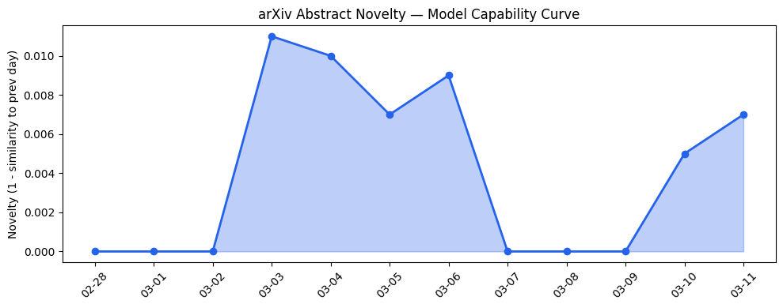

## # 今日AI结构性变化
> 今日AI结构性变化的核心判断是：Agentic AI的发展和投资正在引领AI产业的演进。
今日最值得注意的结构性变化是Agentic AI、LLMs和多智能体系统的能力边界被推进，这些技术的融合和应用正在开启新的发展方向。同时，基础设施的改善和资本的流入也在推动AI产业的快速发展。
- 📈 **持续趋势**：技术层话题已连续12天增强
- 🆕 **新兴方向**：应用层和资本信号中出现了全新的话题
- 🔺 **突然升温**：AI-Powered Robots和Agent Framework等方向近3天突然集中出现
- 🔑 **新关键词**：Agentic AI、LLMs、Multi-Agent Systems、OpenRAG、Hindsight
- 📉 **消退关键词**：无显著消退关键词

## # 技术层信号
🔴 重大突破：模型能力边界被推进，新的范式如Agentic AI和Retrieval-Augmented Generation正在出现。
LLMs和多智能体系统的能力边界被推进，这些技术的融合和应用正在开启新的发展方向。例如，MASEval和LDP等论文展示了多智能体评估和协议的进展。
参考文章：
- [MASEval: Extending Multi-Agent Evaluation from Models to Systems](https://arxiv.org/abs/2603.08835)
- [LDP: An Identity-Aware Protocol for Multi-Agent LLM Systems](https://arxiv.org/abs/2603.08852)

## # 产业资本信号
🔴 强信号：资本流向AI产业，基础设施和应用层面的发展正在推动AI的快速发展。
基础设施的改善和资本的流入也在推动AI产业的快速发展。例如，Meta的Moltbook交易和Rivian Mind Robotics的融资展示了资本对AI产业的关注。
参考文章：
- [Meta’s Moltbook deal points to a future built around AI agents](https://techcrunch.com/2026/03/11/metas-moltbook-deal-points-to-a-future-built-around-ai-agents/)
- [Rivian spin-out Mind Robotics raises $500M for industrial AI-powered robots](https://techcrunch.com/2026/03/11/rivian-mind-robotics-series-a-500m-fund-raise-industrial-ai-powered-robots/)

## # 潜在拐点判断
今日信号和历史趋势表明，Agentic AI和LLMs的发展可能是一个潜在的拐点。这些技术的融合和应用正在开启新的发展方向，如果这些技术能够继续推进和成熟，可能会带来AI产业的重大变革。
今日的信号依据是：技术层面的重大突破、基础设施的改善和资本的流入。如果这些信号持续，可能会带来AI产业的快速发展和变革。

## # 明日观察点
1. **Agentic AI的发展**：观察Agentic AI的进一步发展和应用。
2. **LLMs的能力边界**：观察LLMs的能力边界是否会被进一步推进。
3. **资本流向**：观察资本是否会继续流向AI产业。

## # 长期趋势坐标
今日的信号和历史趋势表明，AI产业正在快速发展和变革。Agentic AI和LLMs的发展可能是一个潜在的拐点，如果这些技术能够继续推进和成熟，可能会带来AI产业的重大变革。
参考趋势报告中的overall_novelty和keyword_trends数据，今日的信号和历史趋势表明，AI产业正在快速发展和变革。

## # 数据洞察
### arXiv 摘要对比 — 模型能力提升曲线
今日的arXiv摘要对比数据表明，模型能力边界被推进，新的范式如Agentic AI和Retrieval-Augmented Generation正在出现。
- capability_score: 0.008
- mean_similarity: 0.992
- trend: 延续

### GitHub Star 增速分析
今日的GitHub Star增速分析数据表明，AI相关仓库的Star数正在增加，例如virattt/ai-hedge-fund和NousResearch/hermes-agent等仓库。
- top_growth: virattt/ai-hedge-fund、NousResearch/hermes-agent等

### HuggingFace 模型下载量变化
今日的HuggingFace模型下载量变化数据表明，AI模型的下载量正在增加，例如Qwen/Qwen3.5-9B和Qwen/Qwen3.5-35B-A3B等模型。
- top_downloads: Qwen/Qwen3.5-9B、Qwen/Qwen3.5-35B-A3B等

### 趋势图

## # 参考来源
- [MASEval: Extending Multi-Agent Evaluation from Models to Systems](https://arxiv.org/abs/2603.08835) — arXiv
- [LDP: An Identity-Aware Protocol for Multi-Agent LLM Systems](https://arxiv.org/abs/2603.08852) — arXiv
- [Meta’s Moltbook deal points to a future built around AI agents](https://techcrunch.com/2026/03/11/metas-moltbook-deal-points-to-a-future-built-around-ai-agents/) — TechCrunch
- [Rivian spin-out Mind Robotics raises $500M for industrial AI-powered robots](https://techcrunch.com/2026/03/11/rivian-mind-robotics-series-a-500m-fund-raise-industrial-ai-powered-robots/) — TechCrunch
- [Replit snags $9B valuation 6 months after hitting $3B](https://techcrunch.com/2026/03/11/replit-snags-9b-valuation-6-months-after-hitting-3b/) — TechCrunch