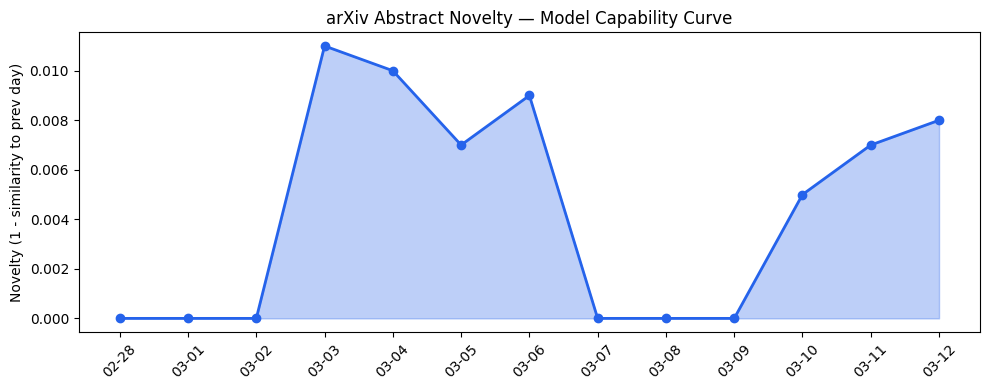
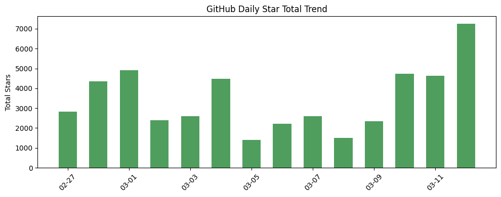
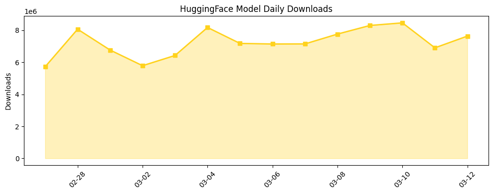

## # 今日AI结构性变化
> 今日新增的AI信息表明，技术层面上LLM的能力边界被进一步推进，基础设施层面上推理成本和芯片/算力趋势也出现了变化，应用层面上AI进入了新的行业和场景，资本信号显示融资方向和估值水平有所变化，风险信号方面监管和伦理问题引起了关注。
今日最值得注意的结构性变化是技术层面上的重大突破，LLM的能力边界被进一步推进，出现了新的范式，如HEAL和TRACED。同时，基础设施层面上推理成本和芯片/算力趋势也出现了变化，应用层面上AI进入了新的行业和场景。
- 📈 **持续趋势**：技术层话题已连续8天增强
- 🆕 **新兴方向**：技术层、基础设施层、应用层、资本信号和风险信号都出现了新兴话题
- 🔺 **突然升温**：无
- 🔑 **新关键词**：伦理、基础设施层面、大语言模型、应用层面、技术层面、机器学习、自然语言处理、资本信号、风险信号
- 📉 **消退关键词**：Google AI

## # 技术层信号
🔴 重大突破
模型能力边界被推进，新的范式如HEAL和TRACED出现。例如，[HEAL: Hindsight Entropy-Assisted Learning for Reasoning Distillation](https://arxiv.org/abs/2603.10359) 和 [TRACED: Assessing LLM Reasoning Quality through Geometric Progress and Stability](https://arxiv.org/abs/2603.10384)。
技术层面的信号表明，LLM的能力边界被进一步推进，新的范式出现，这将对AI产业产生重大影响。

## # 产业资本信号
🔴 强信号
融资方向和估值水平有所变化，例如Rox AI的估值达到12亿美元。同时，大厂战略投资和收购也有所变化，例如Anthropic投资 Claude Partner Network。
资本信号显示，钱在往销售自动化和在线约会等方向流，基础设施在推理成本和芯片/算力趋势上变化，应用在新的行业和场景中落地。

## # 潜在拐点判断
今日信号和历史趋势表明，技术层面上的重大突破和新兴方向的出现可能是一个潜在的拐点。这个拐点可能会导致AI产业的重大变化，例如LLM的能力边界被进一步推进，新的范式出现。
如果这个拐点发生，可能会对AI产业产生重大影响，例如LLM的能力边界被进一步推进，新的范式出现，AI进入新的行业和场景。

## # 明日观察点
1. 技术层面上的重大突破是否会继续？
2. 基础设施层面上的推理成本和芯片/算力趋势会如何变化？
3. 应用层面上的AI进入新的行业和场景会如何发展？

## # 长期趋势坐标
今日的信号在AI产业演进的大图中处于技术层面上的重大突破和新兴方向的出现。这个信号表明，AI产业正在经历重大变化，LLM的能力边界被进一步推进，新的范式出现。
根据趋势报告，overall_novelty 为 0.747，表明今日的信号在历史上是较为新颖的。同时，keyword_trends 表明，新关键词如伦理、基础设施层面、大语言模型、应用层面、技术层面、机器学习、自然语言处理、资本信号、风险信号等出现，这些关键词可能会在未来成为AI产业的重要方向。

## # 数据洞察
### arXiv 摘要对比 — 模型能力提升曲线
arxiv_capability 有 capability_score 和 trend，capability_score 为 0.008，trend 为 "延续"，表明今日论文话题与历史的延续/跃迁情况为延续。
### GitHub Star 增速分析
github_stars 有 top_growth，列出增速最快的 2-3 个仓库及增速。例如，vectorize-io/hindsight 的增速为 2.448，langflow-ai/openrag 的增速为 1.192。
### HuggingFace 模型下载量变化
huggingface_downloads 有 top_downloads 和 top_growth，top_downloads 列出下载量最高的模型，例如 Qwen/Qwen3.5-9B 的下载量为 1536411，top_growth 列出增速最快的模型，例如 fishaudio/s2-pro 的增速为 1.42。
### 趋势图

## # 参考来源
- [HEAL: Hindsight Entropy-Assisted Learning for Reasoning Distillation](https://arxiv.org/abs/2603.10359) — arXiv
- [TRACED: Assessing LLM Reasoning Quality through Geometric Progress and Stability](https://arxiv.org/abs/2603.10384) — arXiv
- [MoE-SpAc: Efficient MoE Inference Based on Speculative Activation Utility](https://arxiv.org/abs/2603.09983) — arXiv
- [Rox AI hits $1.2B valuation](https://techcrunch.com/2026/03/12/sales-automation-startup-rox-ai-hits-1-2b-valuation-sources-say) — TechCrunch
- [Anthropic invests $100 million into the Claude Partner Network](https://www.anthropic.com/news/claude-partner-network) — Anthropic Blog
- [A writer is suing Grammarly for turning her and other authors into ‘AI editors’ without consent](https://techcrunch.com/2026/03/12/a-writer-is-suing-grammarly-for-turning-her-and-other-authors-into-ai-editors-without-consent) — TechCrunch