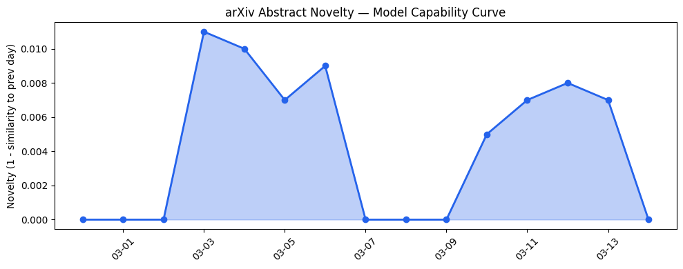
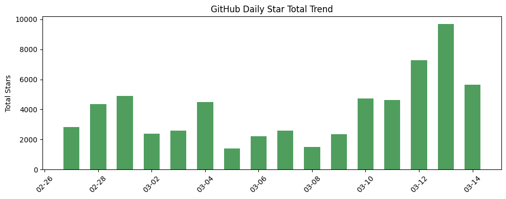
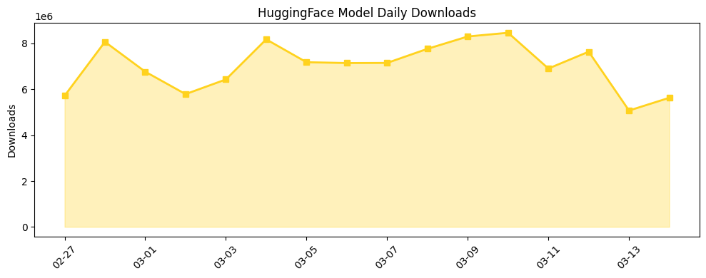

## # 今日AI结构性变化
> 今日AI领域开源生态和资本动向迅速发展，多个开源项目和模型发布，同时资本市场对AI的关注度持续升高。
今日最值得注意的结构性变化是开源生态的蓬勃发展和资本动向的加速。这种变化重要，因为它意味着AI技术的推进和应用的扩展。同时，趋势报告中信号包括：
- 📈 **持续趋势**：基础设施和资本信号话题向量在最近8天内呈现持续增强趋势。
- 🆕 **新兴方向**：技术层、基础设施、资本信号和风险信号出现全新话题，可能是新兴方向的早期信号。
- 🔺 **突然升温**：无明显突然升温信号。
- 🔑 **新关键词**：Anduril、Meta、xAI。
- 📉 **消退关键词**：Google AI。

## # 技术层信号
🟡 渐进改善
模型能力边界被推进，例如新模型和工具的发布，如cognee和LocoTrainer-4B。这些模型和工具的发布推动了AI能力的边界，虽然没有出现明显的新范式，但现有模型和工具的改进和应用扩展仍然值得关注。相关证据包括：
- [cognee](https://github.com/topoteretes/cognee)
- [LocoTrainer-4B](https://huggingface.co/LocoreMind/LocoTrainer-4B)

## # 产业资本信号
🔴 强信号
资本动向迅速发展，Anduril获得高达20亿美元的合同，Meta考虑大规模裁员以平衡AI投资，xAI重启项目，表明资本对AI领域的持续关注。基础设施变化方面，今日无相关信息。应用层变化方面，AI应用在各个行业的扩展，如使用ChatGPT进行app整合，传统解决方案被AI-native产品替代的趋势继续。相关证据包括：
- [US Army announces contract with Anduril worth up to $20B](https://techcrunch.com/2026/03/14/us-army-announces-contract-with-anduril-worth-up-to-20b/)
- [Meta reportedly considering layoffs that could affect 20% of the company](https://techcrunch.com/2026/03/14/meta-reportedly-considering-layoffs-that-could-affect-20-of-the-company/)

## # 潜在拐点判断
今日观察到多个新兴方向的信号，包括技术层、基础设施、资本信号和风险信号的全新话题，这可能是新兴方向的早期信号。如果这些方向持续发展，可能会带来AI领域的质变。影响包括AI技术的进一步推进和应用的扩展。

## # 明日观察点
1. 关注开源生态的进一步发展，特别是新项目和模型的发布。
2. 观察资本动向的变化，特别是Anduril和Meta的后续动向。
3. 关注AI应用在各个行业的扩展，特别是传统解决方案被AI-native产品替代的趋势。

## # 长期趋势坐标
今日的信号在AI产业演进的大图中处于开源生态和资本动向加速的位置。趋势报告中overall_novelty为0.823，表明今日的信号相对历史来说较为新颖。同时，keyword_trends中新关键词包括Anduril、Meta、xAI，表明这些方向的重要性。

## # 数据洞察
### arXiv 摘要对比 — 模型能力提升曲线
今日无 arXiv 摘要数据，无法分析模型能力提升曲线。

### GitHub Star 增速分析
GitHub Star 增速分析显示，今日仓库星数增长最快的包括vectorize-io/hindsight、volcengine/OpenViking、karpathy/nanochat等。同时，今日新晋热门项目包括topoteretes/cognee、hesreallyhim/awesome-claude-code、browser-use/browser-use等。

### HuggingFace 模型下载量变化
HuggingFace 模型下载量变化显示，今日下载量最高的模型包括Qwen/Qwen3.5-9B、Qwen/Qwen3.5-35B-A3B、unsloth/Qwen3.5-9B-GGUF等。同时，今日下载量增长最快的模型包括Tesslate/OmniCoder-9B、nvidia/NVIDIA-Nemotron-3-Super-120B-A12B-FP8等。

### 趋势图

## # 参考来源
- [cognee](https://github.com/topoteretes/cognee) — GitHub
- [LocoTrainer-4B](https://huggingface.co/LocoreMind/LocoTrainer-4B) — HuggingFace
- [US Army announces contract with Anduril worth up to $20B](https://techcrunch.com/2026/03/14/us-army-announces-contract-with-anduril-worth-up-to-20b/) — TechCrunch
- [Meta reportedly considering layoffs that could affect 20% of the company](https://techcrunch.com/2026/03/14/meta-reportedly-considering-layoffs-that-could-affect-20-of-the-company/) — TechCrunch
- [How to use the new ChatGPT app integrations](https://techcrunch.com/2026/03/14/how-to-use-the-new-chatgpt-app-integrations-including-doordash-spotify-uber-and-others/) — TechCrunch
- [Lawyer behind AI psychosis cases warns of mass casualty risks](https://techcrunch.com/2026/03/13/lawyer-behind-ai-psychosis-cases-warns-of-mass-casualty-risks/) — TechCrunch