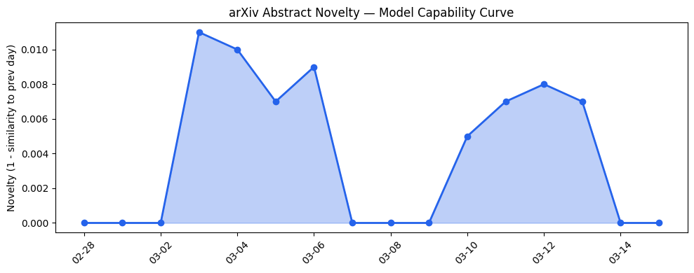
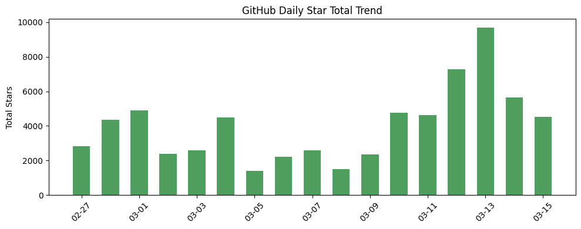
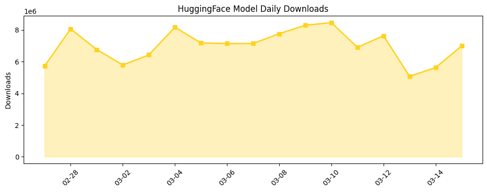

## # 今日AI结构性变化
> 今日开源生态中，多个项目引起关注，包括 Dimensional 和 MetaGPT，资本动向方面，ByteDance 暂停 Seedance 2.0 全球发布，且 AI 相关法律风险日益凸显。
今天最值得注意的结构性变化是开源项目 Dimensional 和 MetaGPT 的出现，这两个项目展示了多agent系统和自然语言处理的潜力。同时，ByteDance 暂停 Seedance 2.0 全球发布，可能与日益凸显的 AI 相关法律风险有关。
- 📈 **持续趋势**：技术层话题已连续8天增强
- 🆕 **新兴方向**：应用层和资本信号出现全新话题
- 🔺 **突然升温**：基础设施近3天内容相似度显著高于更早期均值
- 🔑 **新关键词**：AI 法律风险、ByteDance、Dimensional、MetaGPT、Seedance 2.0、Wiz
- 📉 **消退关键词**：Anthropic、Google AI

## # 技术层信号
🟡 渐进改善
模型能力边界在开源项目 Dimensional 和 MetaGPT 中被推进，这两个项目展示了多agent系统和自然语言处理的潜力。同时，技术层信号中出现了新范式，包括多agent系统和自然语言编程框架的发展。
参考文章：[Dimensional](https://github.com/dimensionalOS/dimos)、[MetaGPT](https://github.com/FoundationAgents/MetaGPT)

## # 产业资本信号
🟡 中等信号
今日资本信号中，Google 的 32 亿美元收购 Wiz 引起关注，基础设施变化方面，今日无相关信息。应用层变化方面，开源项目展示了 AI 在物理空间和多agent系统中的应用潜力。资本流向方面，ByteDance 暂停 Seedance 2.0 全球发布，可能与法律风险有关。
参考文章：[Wiz investor unpacks Google’s $32B acquisition](https://techcrunch.com/2026/03/15/wiz-investor-unpacks-googles-32b-acquisition/)

## # 潜在拐点判断
今日信号 + 历史趋势表明，可能存在潜在拐点。拐点 = 某个方向可能即将发生质变的转折点。今日的信号中，开源项目 Dimensional 和 MetaGPT 的出现，可能标志着多agent系统和自然语言处理的发展方向。如果发生，影响包括 AI 在物理空间和多agent系统中的应用潜力。

## # 明日观察点
1. 关注开源项目 Dimensional 和 MetaGPT 的发展动向。
2. 关注 ByteDance 的 Seedance 2.0 全球发布情况。
3. 关注 AI 相关法律风险的发展。

## # 长期趋势坐标
今日观察放入更大的时间框架（月度/季度级别）中，AI 产业演进的大图中处于技术层和资本信号的交叉点。开源项目 Dimensional 和 MetaGPT 的出现，可能标志着多agent系统和自然语言处理的发展方向。

## # 数据洞察
### arXiv 摘要对比 — 模型能力提升曲线
今日无 arXiv 摘要数据。

### GitHub Star 增速分析
今日 GitHub Star 增速分析中，top_growth 仓库包括：
- langchain-ai/deepagents：346 stars，prev_stars：126，growth_pct：1.746
- topoteretes/cognee：310 stars，prev_stars：145，growth_pct：1.138
新晋热门项目包括：
- dimensionalOS/dimos
- FoundationAgents/MetaGPT

### HuggingFace 模型下载量变化
今日 HuggingFace 模型下载量变化中，top_downloads 模型包括：
- Qwen/Qwen3.5-9B：1964599 downloads
- Qwen/Qwen3.5-35B-A3B：1754185 downloads
增速最快的模型包括：
- Tesslate/OmniCoder-9B：5659 downloads，prev_downloads：2079，growth_pct：1.722
- nvidia/NVIDIA-Nemotron-3-Super-120B-A12B-FP8：64599 downloads，prev_downloads：34937，growth_pct：0.849

### 趋势图

## # 参考来源
- [Dimensional](https://github.com/dimensionalOS/dimos) — GitHub
- [MetaGPT](https://github.com/FoundationAgents/MetaGPT) — GitHub
- [Wiz investor unpacks Google’s $32B acquisition](https://techcrunch.com/2026/03/15/wiz-investor-unpacks-googles-32b-acquisition/) — TechCrunch
- [Lawyer behind AI psychosis cases warns of mass casualty risks](https://techcrunch.com/2026/03/15/lawyer-behind-ai-psychosis-cases-warns-of-mass-casualty-risks/) — TechCrunch