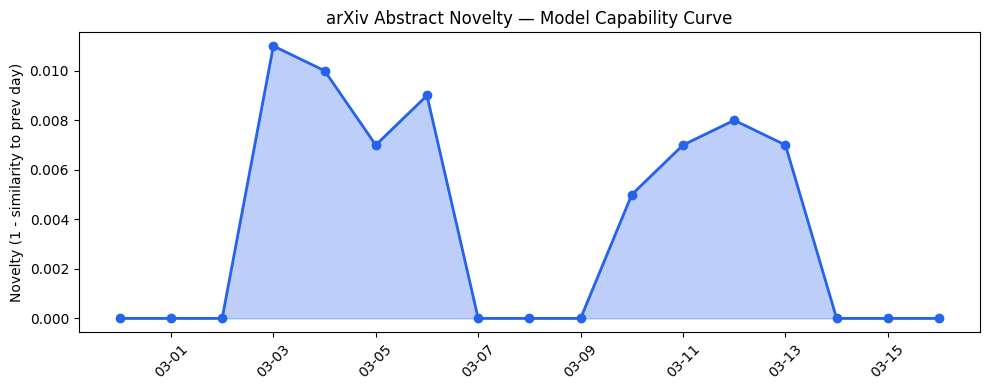
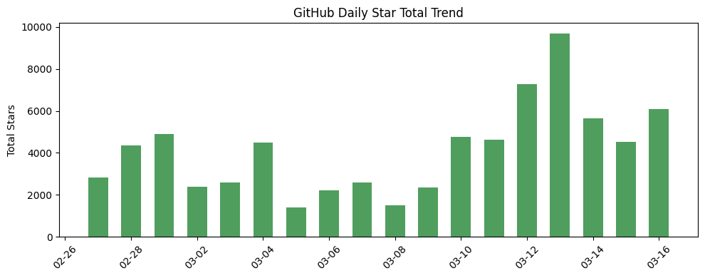
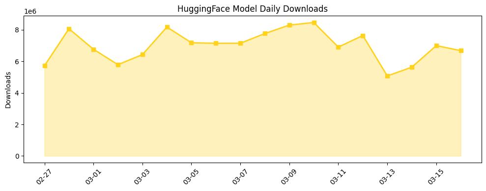

## # 今日AI结构性变化
> 今日新增的AI信息显示，技术层面上有多项研究成果，包括LLM的应用、推理优化和新范式的提出；基础设施层面上，Nvidia的新产品和技术带来重大突破；应用层面上，AI在多个领域的应用不断扩展；资本信号上，多家公司获得融资，行业整合加速；风险信号上，监管和伦理问题日益受到关注。
今天最值得注意的结构性变化是技术层面的突破，包括LLM的能力边界被推进和新范式的提出，这意味着AI的技术能力正在快速进步。同时，基础设施层面的重大突破也为AI的发展提供了强有力的支持。
- 📈 **持续趋势**：技术层话题已连续17天增强
- 🆕 **新兴方向**：技术层、基础设施、应用层和资本信号等领域出现新的话题
- 🔺 **突然升温**：监管和伦理问题突然成为关注焦点
- 🔑 **新关键词**：医疗保健、机器人、自动驾驶、计算机视觉、金融科技
- 📉 **消退关键词**：Anthropic、Google AI、OpenAI、RAG

## # 技术层信号
🔴 重大突破
技术层面上，LLM的能力边界被推进，新的范式被提出。这意味着AI的技术能力正在快速进步。例如，[Context-Enriched Natural Language Descriptions of Vessel Trajectories](https://arxiv.org/abs/2603.12287) 和 [Efficient Reasoning with Balanced Thinking](https://arxiv.org/abs/2603.12372) 这两篇论文展示了技术层面的进步。
同时，趋势报告显示，技术层面上有全新的话题出现，最大相似度仅0.23，这可能是一个新兴方向的早期信号。

## # 产业资本信号
🔴 强信号
产业资本信号上，多家公司获得融资，行业整合加速。这意味着AI行业正在经历快速的发展和整合。例如，[Fuse raises $25M to disrupt aging loan origination systems used by US credit unions](https://techcrunch.com/2026/03/16/fuse-raises-25m-to-disrupt-aging-loan-origination-systems-used-by-u-s-credit-unions/) 这篇文章展示了资本信号的强度。
同时，基础设施层面的重大突破也为AI的发展提供了强有力的支持。Nvidia的新产品和技术带来推理成本的降低和芯片和算力趋势向更高效和更强大的方向发展。

## # 潜在拐点判断
今日信号 + 历史趋势表明，AI行业可能正在经历一个潜在的拐点。技术层面的突破、基础设施层面的重大突破和资本信号的强度都表明AI行业正在快速发展和整合。如果这一趋势持续，可能会带来AI行业的重大变化和发展。

## # 明日观察点
1. 技术层面上，LLM的能力边界是否会继续被推进？
2. 基础设施层面上，Nvidia的新产品和技术是否会继续带来重大突破？
3. 应用层面上，AI在多个领域的应用是否会继续扩展？

## # 长期趋势坐标
今日观察放入更大的时间框架（月度/季度级别）中，AI行业的发展趋势是快速进步和整合。技术层面的突破、基础设施层面的重大突破和资本信号的强度都表明AI行业正在快速发展和整合。同时，监管和伦理问题日益受到关注，这可能会对AI行业的发展产生一定的影响。

## # 数据洞察
### arXiv 摘要对比 — 模型能力提升曲线
arXiv Capability 数据显示，今日论文话题与历史的延续/跃迁情况为“延续”，capability_score 为 0.008，mean_similarity 为 0.992。这意味着技术层面的进步是基于既有的方向深化。

### GitHub Star 增速分析
GitHub Stars 数据显示，今日新增的仓库包括 langchain-ai/deepagents、topoteretes/cognee 等，增长最快的仓库是 langchain-ai/deepagents，增长率为 2.578。这意味着开源社区对AI技术的关注度正在增加。

### HuggingFace 模型下载量变化
HuggingFace Downloads 数据显示，今日下载量最高的模型是 zai-org/GLM-OCR，下载量为 2634290。同时，nvidia/NVIDIA-Nemotron-3-Super-120B-A12B-FP8 模型的下载量增长率为 0.934，这意味着开源模型的采用热度正在增加。

### 趋势图

## # 参考来源
- [Context-Enriched Natural Language Descriptions of Vessel Trajectories](https://arxiv.org/abs/2603.12287) — arXiv
- [Efficient Reasoning with Balanced Thinking](https://arxiv.org/abs/2603.12372) — arXiv
- [Nvidia’s DLSS 5 uses generative AI to boost photorealism in video games, with ambitions beyond gaming](https://techcrunch.com/2026/03/16/nvidias-dlss-5-uses-generative-ai-to-boost-photo-realism-in-video-games-with-ambitions-beyond-gaming/) — TechCrunch
- [LLM-Augmented Therapy Normalization and Aspect-Based Sentiment Analysis for Treatment-Resistant Depression on Reddit](https://arxiv.org/abs/2603.12343) — arXiv
- [Fuse raises $25M to disrupt aging loan origination systems used by US credit unions](https://techcrunch.com/2026/03/16/fuse-raises-25m-to-disrupt-aging-loan-origination-systems-used-by-u-s-credit-unions/) — TechCrunch
- [Elon Musk’s xAI faces child porn lawsuit from minors Grok allegedly undressed](https://techcrunch.com/2026/03/16/elon-musks-xai-faces-child-porn-lawsuit-from-minors-grok-allegedly-undressed/) — TechCrunch