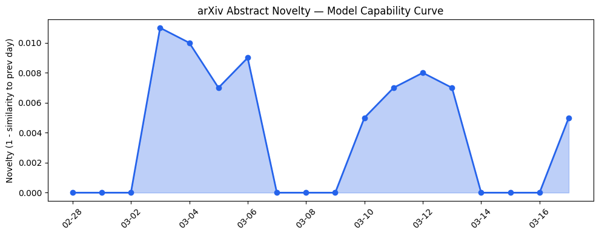

# 今日AI结构性变化
> 今日新增的AI信息表明，技术层面上模型能力边界被推进，基础设施层面上推理成本出现变化，应用层面上AI进入了新行业和新场景，资本信号上融资方向出现集中趋势，风险信号上监管和伦理问题日益突出。
今日最值得注意的结构性变化是技术层面上的重大突破，例如Diffusion Language Model的改进和Graph Transformers的出现，这些变化意味着AI模型的能力边界正在被推进。同时，基础设施层面的变化，如推理成本的降低，也为AI的应用提供了有力的支持。应用层面的新行业和新场景的进入，例如医疗和教育，意味着AI正在逐步渗透到更多的领域。
- 📈 **持续趋势**：技术层话题已连续8天增强
- 🆕 **新兴方向**：基础设施、应用层、资本信号和风险信号为30天内首次出现

# 技术层信号
🔴 重大突破
模型能力边界的推进主要体现在Diffusion Language Model的改进和Graph Transformers的出现，这两个方向的发展为AI模型的能力提供了新的可能性。Graph Transformers的出现代表了一个新的范式，它将图结构和Transformer模型结合起来，能够更好地处理复杂关系和结构化数据。例如，[Think First, Diffuse Fast: Improving Diffusion Language Model Reasoning via Autoregressive Plan Conditioning](https://arxiv.org/abs/2603.13243) 和 [Translational Gaps in Graph Transformers for Longitudinal EHR Prediction: A Critical Appraisal of GT-BEHRT](https://arxiv.org/abs/2603.13231)。

# 产业资本信号
🔴 强信号
基础设施层面的变化，如推理成本的降低，意味着AI的应用成本正在降低，这将促进AI在更多行业和场景中的应用。应用层面的新行业和新场景的进入，例如医疗和教育，意味着AI正在逐步渗透到更多的领域。资本信号上融资方向的集中趋势，例如AI领域的投资热潮，意味着资本正在积极地支持AI的发展。例如，[Mistral bets on ‘build-your-own AI’ as it takes on OpenAI, Anthropic in the enterprise](https://techcrunch.com/2026/03/17/mistral-forge-nvidia-gtc-build-your-own-ai-enterprise/)。

# 潜在拐点判断
今日信号和历史趋势表明，AI领域可能即将发生质变的转折点。技术层面的重大突破和基础设施层面的变化，意味着AI的能力边界正在被推进，应用层面的新行业和新场景的进入，意味着AI正在逐步渗透到更多的领域。资本信号上融资方向的集中趋势，意味着资本正在积极地支持AI的发展。如果这一趋势持续，可能会导致AI在更多行业和场景中的广泛应用和普及。

# 明日观察点
1. 关注技术层面的新突破：是否会有新的模型或算法被提出，进一步推进AI的能力边界。
2. 关注应用层面的新行业和新场景：是否会有更多的行业和场景被AI渗透，AI将如何改变这些领域。
3. 关注资本信号上的变化：是否会有新的融资方向或投资热潮，资本如何支持AI的发展。

# 长期趋势坐标
今日观察放入更大的时间框架中，AI领域的结构性变化信号表明，技术层面的重大突破和基础设施层面的变化，意味着AI的能力边界正在被推进，应用层面的新行业和新场景的进入，意味着AI正在逐步渗透到更多的领域。资本信号上融资方向的集中趋势，意味着资本正在积极地支持AI的发展。这些变化可能会导致AI在更多行业和场景中的广泛应用和普及。

# 数据洞察
## arXiv 摘要对比 — 模型能力提升曲线
arXiv_capability 有 capability_score 和 trend，说明今日论文话题与历史的延续/跃迁情况。capability_score 为 0.008，trend 为 "延续"，表明今日论文话题与历史的延续性较强。

## GitHub Star 增速分析
github_stars 有 top_growth，列出增速最快的 2-3 个仓库及增速。例如，MiroMindAI/MiroThinker 的增速为 2.675，langchain-ai/deepagents 的增速为 0.145。

## HuggingFace 模型下载量变化
huggingface_downloads 有 top_downloads 或 top_growth，说明下载量最高的模型及增速最快的模型。例如，zai-org/GLM-OCR 的下载量为 2743984，HumeAI/tada-1b 的增速为 0.709。

## 趋势图

# 参考来源
- [Think First, Diffuse Fast: Improving Diffusion Language Model Reasoning via Autoregressive Plan Conditioning](https://arxiv.org/abs/2603.13243) — arXiv
- [Translational Gaps in Graph Transformers for Longitudinal EHR Prediction: A Critical Appraisal of GT-BEHRT](https://arxiv.org/abs/2603.13231) — arXiv
- [Niv-AI exits stealth to wring more power performance out of GPUs](https://techcrunch.com/2026/03/17/niv-ai-exits-stealth-to-wring-more-power-performance-out-of-gpus/) — TechCrunch
- [Improving breast cancer screening workflows with machine learning](https://research.google/blog/improving-breast-cancer-screening-workflows-with-machine-learning/) — Google AI Blog
- [Mistral bets on ‘build-your-own AI’ as it takes on OpenAI, Anthropic in the enterprise](https://techcrunch.com/2026/03/17/mistral-forge-nvidia-gtc-build-your-own-ai-enterprise/) — TechCrunch
- [AI’s ‘boys’ club’ could widen the wealth gap for women, says Rana el Kaliouby](https://techcrunch.com/2026/03/17/ais-boys-club-could-widen-the-wealth-gap-for-women-says-rana-el-kaliouby/) — TechCrunch