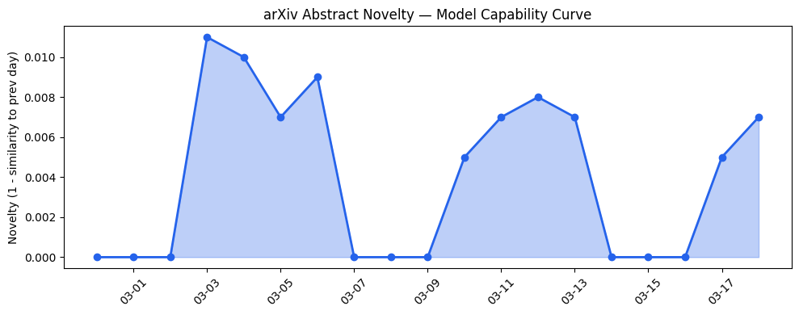

## 今日AI结构性变化
> 今日新增信息显示，AI领域在技术、基础设施、应用、资本和风险信号等多个方面都有显著变化，尤其是LLM和AI安全领域的进展。
今日最值得注意的结构性变化是LLM和AI安全领域的进展，这些进展表明AI技术正在快速发展，并且在各个领域都有广泛的应用。同时，基础设施的变化也表明云计算和边缘计算的发展正在加速。
- 📈 **持续趋势**：技术层话题已连续8天增强
- 🆕 **新兴方向**：LLM和AI安全领域为30天内首次出现
- 🔺 **突然升温**：风险信号方向近3天突然集中出现
- 🔑 **新关键词**：Arena, Patreon, langchain-ai, tokenization
- 📉 **消退关键词**：RAG

## 技术层信号
🔴 重大突破
模型能力边界正在被推进，新的模型和算法正在被提出。例如，Neural-Symbolic Logic Query Answering in Non-Euclidean Space和NextMem: Towards Latent Factual Memory for LLM-based Agents等论文。
这些进展表明AI技术正在快速发展，并且在各个领域都有广泛的应用。
参考文章：[Neural-Symbolic Logic Query Answering in Non-Euclidean Space](https://arxiv.org/abs/2603.15633)和[NextMem: Towards Latent Factual Memory for LLM-based Agents](https://arxiv.org/abs/2603.15634)

## 产业资本信号
🔴 强信号
融资热潮正在持续，AI领域的投资热潮正在加速。例如，Sequen获得1600万美元的投资。
基础设施的变化也表明云计算和边缘计算的发展正在加速。Nvidia的网络业务收入增长也表明了这一趋势。
应用层的变化也表明AI技术正在被广泛应用于各个领域，例如医疗、教育和制造业。
参考文章：[Sequen snags $16M to bring TikTok-style personalization tech to any consumer company](https://techcrunch.com/2026/03/18/sequen-snags-16m-to-bring-tiktok-style-personalization-tech-to-any-consumer-company/)

## 潜在拐点判断
今日新增信息显示，AI领域在技术、基础设施、应用、资本和风险信号等多个方面都有显著变化，这可能是一个潜在的拐点。
如果这些变化能够持续下去，可能会导致AI技术在各个领域的广泛应用，并可能带来新的商业机会和社会变革。
但是，风险信号的突然升温也表明了潜在的风险和挑战，例如AI安全和伦理问题。

## 明日观察点
1. 关注LLM和AI安全领域的进一步进展。
2. 关注基础设施的变化，特别是云计算和边缘计算的发展。
3. 关注应用层的变化，特别是AI技术在各个领域的应用。

## 长期趋势坐标
今日新增信息显示，AI领域在技术、基础设施、应用、资本和风险信号等多个方面都有显著变化，这可能是一个潜在的拐点。
如果这些变化能够持续下去，可能会导致AI技术在各个领域的广泛应用，并可能带来新的商业机会和社会变革。
参考数据：[arXiv能力曲线](charts/2026-03-18_arxiv_capability.png)

## 数据洞察
### arXiv 摘要对比 — 模型能力提升曲线
今日arXiv能力曲线显示，模型能力边界正在被推进，新的模型和算法正在被提出。
### GitHub Star 增速分析
今日GitHub Star增速分析显示，langchain-ai/deepagents和unslothai/unsloth等仓库的Star数正在快速增长。
### HuggingFace 模型下载量变化
今日HuggingFace模型下载量变化显示，zai-org/GLM-OCR和Qwen/Qwen3.5-9B等模型的下载量正在快速增长。
### 趋势图

## 参考来源
- [Neural-Symbolic Logic Query Answering in Non-Euclidean Space](https://arxiv.org/abs/2603.15633) — arXiv
- [NextMem: Towards Latent Factual Memory for LLM-based Agents](https://arxiv.org/abs/2603.15634) — arXiv
- [Sequen snags $16M to bring TikTok-style personalization tech to any consumer company](https://techcrunch.com/2026/03/18/sequen-snags-16m-to-bring-tiktok-style-personalization-tech-to-any-consumer-company/) — TechCrunch
- [Nvidia is quietly building a multibillion-dollar behemoth to rival its chips business](https://techcrunch.com/2026/03/18/nvidia-networking-division-building-a-multibillion-dollar-behemoth-to-rival-its-chips-business/) — TechCrunch
- [Patreon CEO calls AI companies’ fair use argument ‘bogus,’ says creators should be paid](https://techcrunch.com/2026/03/18/patreon-ceo-calls-ai-companies-fair-use-argument-bogus-says-creators-should-be-paid/) — TechCrunch