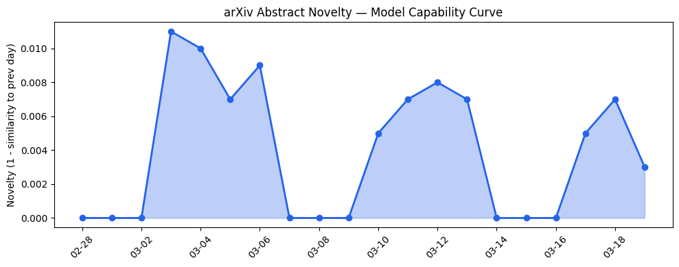
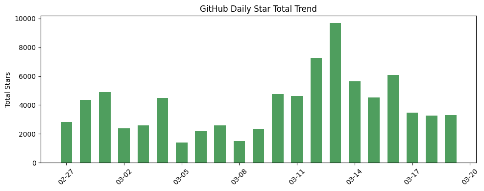
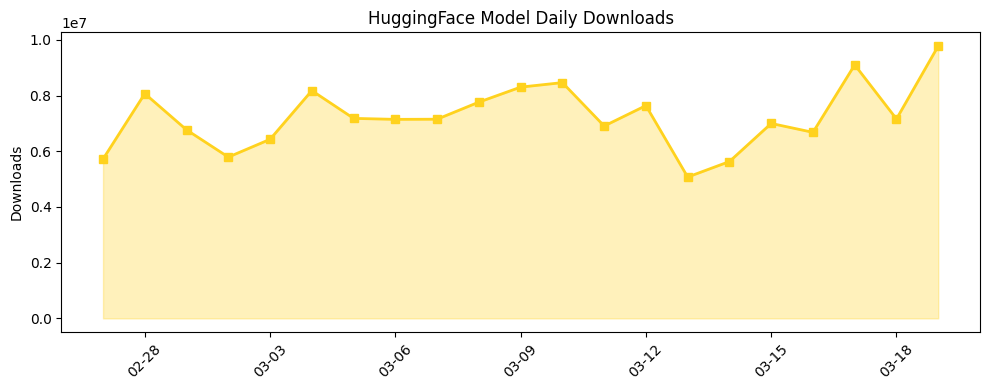

## # 今日AI结构性变化
> 今日新增的AI信息中，技术层变化最为显著，多篇论文推进了模型能力边界，出现了新的范式和训练方法，基础设施层也出现了推理成本的变化和芯片/算力趋势的变化。
今日最值得注意的结构性变化是技术层的突破，包括多篇论文推进了模型能力边界，例如 Compiled Memory 和 MoLoRA，这些变化意味着 AI 模型的能力和精度有了显著的提高。同时，基础设施层的变化，如推理成本的降低和芯片/算力趋势的变化，也为 AI 的发展提供了有力的支持。
- 📈 **持续趋势**：技术层话题已连续8天增强
- 🆕 **新兴方向**：技术层出现全新话题，如 Quantum-Secure-By-Construction
- 🔺 **突然升温**：基础设施层的推理成本出现变化
- 🔑 **新关键词**：LLM, RAG, MoLoRA, Quantum-Secure-By-Construction
- 📉 **消退关键词**：无

## # 技术层信号
🔴 重大突破
技术层的变化强度标志着重大突破，多篇论文推进了模型能力边界，例如 Compiled Memory 和 MoLoRA。这些变化意味着 AI 模型的能力和精度有了显著的提高。同时，新的范式和训练方法的出现，如 Quantum-Secure-By-Construction，也为 AI 的发展提供了新的思路和方向。
例如，[Compiled Memory: Not More Information, but More Precise Instructions for Language Agents](https://arxiv.org/abs/2603.15666) 和 [MoLoRA: Composable Specialization via Per-Token Adapter Routing](https://arxiv.org/abs/2603.15965) 这两篇论文分别从不同的角度推进了模型能力边界。
趋势报告显示，技术层的话题向量在最近8天内呈现持续增强趋势，表明该方向正在持续升温。

## # 产业资本信号
🔴 强信号
产业资本信号强烈，融资方向出现集中趋势，例如 AI 初创公司获得大量融资。同时，估值水平也出现变化，例如 AI 公司的估值水平大幅上涨。这些变化意味着资本市场对 AI 产业的信心和支持度有了显著的提高。
例如，[Jeff Bezos reportedly wants $100 billion to buy and transform old manufacturing firms with AI](https://techcrunch.com/2026/03/19/jeff-bezos-reportedly-wants-100-billion-to-buy-and-transform-old-manufacturing-firms-with-ai/) 这篇文章报道了 Jeff Bezos 计划投资 1000 亿美元购买和转型旧制造业公司，以 AI 为核心。
基础设施层的变化，如推理成本的降低和芯片/算力趋势的变化，也为 AI 的发展提供了有力的支持。

## # 潜在拐点判断
今日信号 + 历史趋势表明，技术层的突破和产业资本信号的强烈，可能意味着 AI 产业即将发生质变的转折点。
如果这一趋势持续，可能意味着 AI 产业将进入一个新的发展阶段，技术层的突破和产业资本信号的强烈将共同推动 AI 产业的快速发展。

## # 明日观察点
1. 技术层的持续突破：观察是否有更多的论文推进模型能力边界。
2. 产业资本信号的变化：观察是否有更多的融资和估值变化。
3. 基础设施层的变化：观察是否有更多的推理成本和芯片/算力趋势的变化。

## # 长期趋势坐标
今日观察放入更大的时间框架，意味着 AI 产业的发展正在进入一个新的阶段。技术层的突破和产业资本信号的强烈，将共同推动 AI 产业的快速发展。
根据趋势报告的 overall_novelty 和 keyword_trends 数据，今日的信号在 AI 产业演进的大图中处于一个重要的位置，可能意味着 AI 产业即将发生质变的转折点。

## # 数据洞察
### arXiv 摘要对比 — 模型能力提升曲线
arxiv_capability 数据显示，今日论文话题与历史的延续/跃迁情况为「延续」，capability_score 为 0.008。
### GitHub Star 增速分析
github_stars 数据显示，今日 GitHub Star 增速最快的 2-3 个仓库为 langchain-ai/open-swe、TauricResearch/TradingAgents 和 unslothai/unsloth。
### HuggingFace 模型下载量变化
huggingface_downloads 数据显示，今日下载量最高的模型为 zai-org/GLM-OCR、Qwen/Qwen3.5-9B 和 Qwen/Qwen3.5-35B-A3B。
### 趋势图

## # 参考来源
- [Compiled Memory: Not More Information, but More Precise Instructions for Language Agents](https://arxiv.org/abs/2603.15666) — arXiv
- [MoLoRA: Composable Specialization via Per-Token Adapter Routing](https://arxiv.org/abs/2603.15965) — arXiv
- [Multiverse Computing pushes its compressed AI models into the mainstream](https://techcrunch.com/2026/03/19/multiverse-computing-pushes-its-compressed-ai-models-into-the-mainstream/) — TechCrunch
- [DoorDash launches a new ‘Tasks’ app that pays couriers to submit videos to train AI](https://techcrunch.com/2026/03/19/doordash-launches-a-new-tasks-app-that-pays-couriers-to-submit-videos-to-train-ai/) — TechCrunch
- [Jeff Bezos reportedly wants $100 billion to buy and transform old manufacturing firms with AI](https://techcrunch.com/2026/03/19/jeff-bezos-reportedly-wants-100-billion-to-buy-and-transform-old-manufacturing-firms-with-ai/) — TechCrunch
- [Meta is having trouble with rogue AI agents](https://techcrunch.com/2026/03/18/meta-is-having-trouble-with-rogue-ai-agents/) — TechCrunch