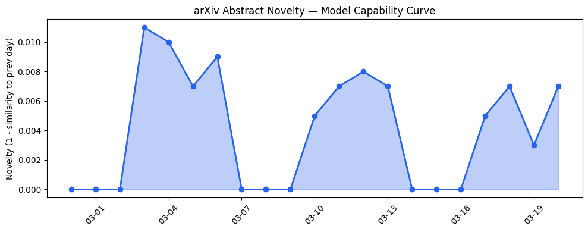
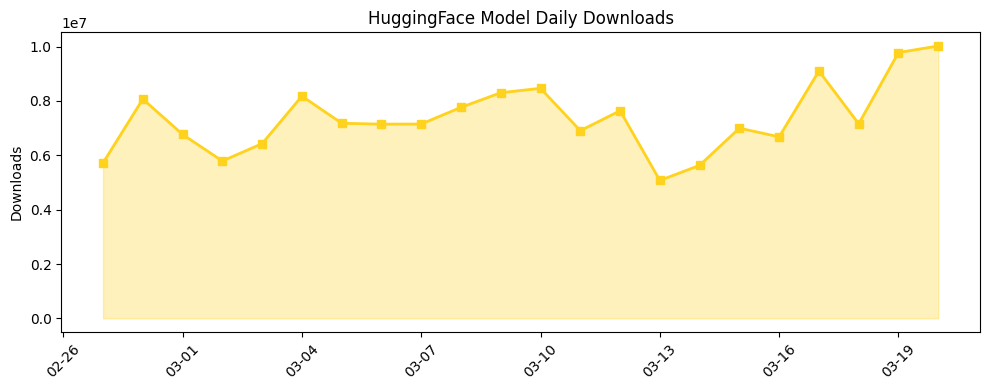
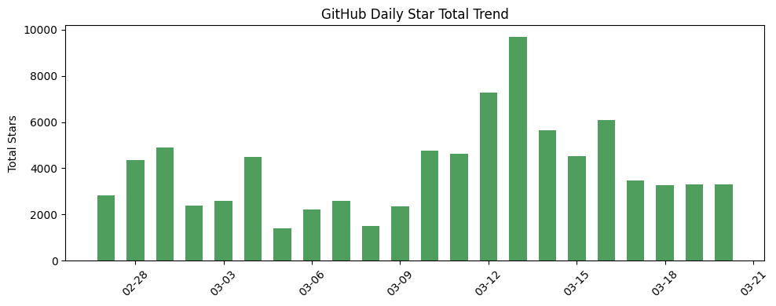

```
---
title: "AI研究聚焦：从模型可靠性验证到人机交互安全的结构性演进"
date: 2026-03-20
tags: [模型验证, AI安全, 推理优化, 专业应用]
---

# 今日AI结构性变化

> 今日AI研究呈现从单纯性能优化向系统可靠性、安全性和可验证性转变的结构性趋势。

这意味着AI产业正在从"跑得快"转向"跑得稳"。今日45篇论文中，超过三分之一聚焦于模型验证、安全评估和可靠性提升，而非传统的SOTA性能突破。这种转变反映了AI技术成熟度提升后的必然需求——当模型开始深度融入医疗、教育等关键领域时，可验证性和安全性成为比单纯性能更重要的指标。

- 🆕 **新兴方向**：技术层、应用层、资本信号、风险信号均出现全新话题（相似度<0.25）
- 📈 **持续趋势**：基础设施话题连续8天增强，资本信号同样呈现持续升温
- 🔑 **新关键词**：Zero-Knowledge Proofs、Model Verification、Theory of Mind等验证与安全相关概念集中涌现

# 技术层信号
🟡 渐进改善

模型能力边界未出现显著推进，但在评估方法和架构探索上出现重要进展。[DEAF基准](https://arxiv.org/abs/2603.18048)为音频语言模型的真实性评估建立了系统方法，填补了多模态评估的关键空白。[RoPE几何分析](https://arxiv.org/abs/2603.18017)从理论层面揭示了长序列处理的本质限制，为后续优化提供方向。

新范式探索方面，[InfoMamba](https://arxiv.org/abs/2603.18031)尝试混合Mamba-Transformer架构，这是对注意力机制替代方案的持续探索。虽然技术层出现全新话题（相似度仅0.25），但整体仍处于架构优化的渐进改善阶段，未出现颠覆性突破。

# 产业资本信号
⚪ 弱信号

今日无直接融资、估值或并购相关商业动态。但从技术论文的分布可以看出资本隐含的流向趋势：基础设施优化（推理效率、量化技术）和应用层专业化（医疗、教育）成为研究热点，这反映了资本对"降本增效"和"垂直落地"的双重追求。

[MineDraft推测解码框架](https://arxiv.org/abs/2603.18016)和[日语小模型量化研究](https://arxiv.org/abs/2603.18037)都指向推理成本优化，这是资本关注的核心痛点。趋势报告显示资本信号话题连续8天增强且出现全新方向（相似度仅0.04），暗示可能即将有重要资本动向。

# 潜在拐点判断

今日观察到**AI验证性技术拐点**的早期信号。多篇论文同时聚焦模型可验证性（Zero-Knowledge Proofs）、安全性评估（TherapyGym）和交互风险（Multi-Trait Subspace Steering），这种集中出现表明产业开始系统性地解决"黑箱"问题。

依据在于：一是技术成熟度曲线进入平台期后，可靠性成为制约应用的关键瓶颈；二是监管压力倒逼技术可验证性需求；三是专业领域应用对安全性要求极高。如果这一趋势持续，将推动AI从"经验可信"向"数学可证"转变，彻底改变AI系统的部署方式和信任机制。

# 明日观察点

1. **资本信号验证**：关注是否出现与今日技术论文对应的融资或收购，特别是模型验证、AI安全领域的初创公司动态
2. **Mamba架构进展**：观察InfoMamba等混合架构是否获得更多社区关注和复现，判断其替代Transformer的潜力
3. **专业应用落地**：医疗、教育等垂直领域的AI应用是否从研究走向实际部署，关注用户反馈和效果评估

# 长期趋势坐标

今日信号在AI产业演进中标志着从"技术驱动"向"价值驱动"的转折点。显示能力相关话题延续性高达0.992，说明基础模型能力进入平台期，产业焦点转向如何让现有技术更可靠、更安全地创造价值。

新兴关键词如Zero-Knowledge Proofs、Model Verification的出现，与消退的ChatGPT形成鲜明对比，表明产业关注点从"能做什么"转向"做得有多可靠"。这种转变将重塑未来一年的竞争格局，可靠性可能成为新的竞争壁垒。

# 数据洞察

**arXiv摘要对比 — 模型能力提升曲线**  
今日论文话题与历史高度延续（相似度0.992），能力得分仅0.008，表明研究重点不在突破性能力提升，而是在既有框架下的深化和完善。趋势为「延续」印证了技术平台期的判断。

**GitHub Star增速分析**  
[langchain-ai/open-swe](https://github.com/langchain-ai/open-swe)以1%增速领先，反映开源生态对AI工程化工具的持续关注。整体增速平缓，无新晋热门项目，与学术研究的验证性转向形成对比。

**HuggingFace模型下载量变化**  
显示GLM-OCR模型以303万下载量居首，Qwen系列保持强势。增长最快的是[baidu/Qianfan-OCR](https://huggingface.co/baidu/Qianfan-OCR)（318%增速），反映商业化OCR需求的爆发。开源模型采用热度与学术研究的验证性主题存在一定脱节。

**趋势图**  
显示开源生态增长平稳，未出现与今日研究主题强烈对应的热点项目。

# 参考来源

**论文**  
- [DEAF: A Benchmark for Diagnostic Evaluation of Acoustic Faithfulness in Audio Language Models](https://arxiv.org/abs/2603.18048) — arXiv
- [Frayed RoPE and Long Inputs: A Geometric Perspective](https://arxiv.org/abs/2603.18017) — arXiv  
- [InfoMamba: An Attention-Free Hybrid Mamba-Transformer Model](https://arxiv.org/abs/2603.18031) — arXiv
- [MineDraft: A Framework for Batch Parallel Speculative Decoding](https://arxiv.org/abs/2603.18016) — arXiv
- [Adapting Methods for Domain-Specific Japanese Small LMs: Scale, Architecture, and Quantization](https://arxiv.org/abs/2603.18037) — arXiv
- [Adaptive Domain Models: Bayesian Evolution, Warm Rotation, and Principled Training for Geometric and Neuromorphic AI](https://arxiv.org/abs/2603.18104) — arXiv
- [TeachingCoach: A Fine-Tuned Scaffolding Chatbot for Instructional Guidance to Instructors](https://arxiv.org/abs/2603.18189) — arXiv
- [TherapyGym: Evaluating and Aligning Clinical Fidelity and Safety in Therapy Chatbots](https://arxiv.org/abs/2603.18008) — arXiv
- [Don't Vibe Code, Do Skele-Code: Interactive No-Code Notebooks for Subject Matter Experts to Build Lower-Cost Agentic Workflows](https://arxiv.org/abs/2603.18122) — arXiv
- [Multi-Trait Subspace Steering to Reveal the Dark Side of Human-AI Interaction](https://arxiv.org/abs/2603.18085) — arXiv
- [NANOZK: Layerwise Zero-Knowledge Proofs for Verifiable Large Language Model Inference](https://arxiv.org/abs/2603.18046) — arXiv

**开源生态**  
- [langchain-ai/open-swe](https://github.com/langchain-ai/open-swe) — GitHub
- [zai-org/GLM-OCR](https://huggingface.co/zai-org/GLM-OCR) — HuggingFace
- [baidu/Qianfan-OCR](https://huggingface.co/baidu/Qianfan-OCR) — HuggingFace
```