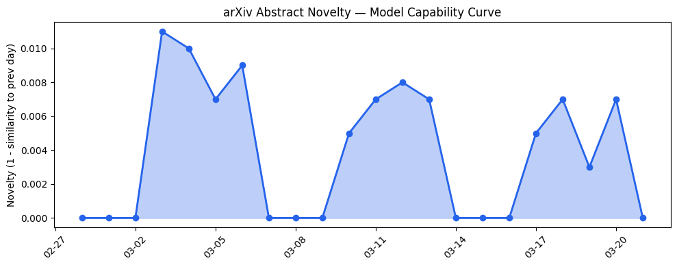
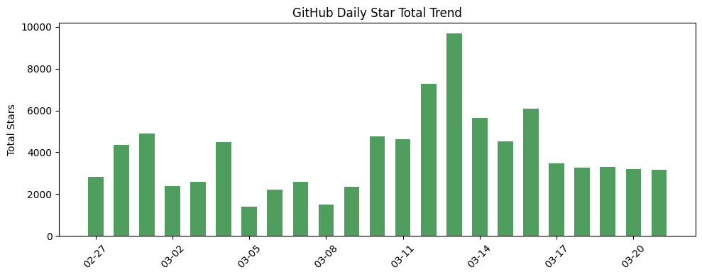
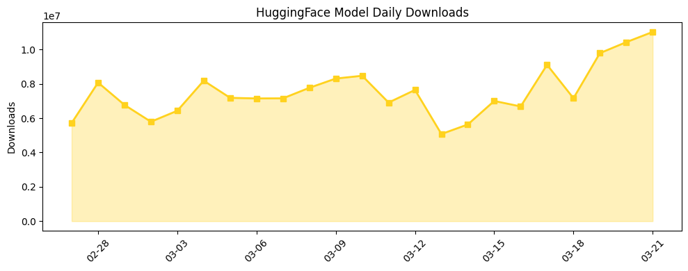

# 今日AI结构性变化

> AI产业的核心矛盾正从纯粹的技术竞争转向治理与合规风险，而开源社区则在智能体框架和计算基础设施上保持稳健迭代。

这意味着监管压力正在重塑行业竞争格局，技术民主化与合规门槛形成新的张力场。开源生态的持续活跃表明技术创新并未因监管而停滞，而是在新的约束条件下寻找突破口。

- 📈 **持续趋势**：技术层、基础设施、应用层、风险信号四个维度已连续8天增强
- 🆕 **新兴方向**：技术层、基础设施、应用层、资本信号均出现全新话题（历史相似度<0.22）
- 🔑 **新关键词**：AI Governance, Agentic Framework, Self-Supervised Learning, Compliance
- 📉 **消退关键词**：ChatGPT, Google, 开源生态, 资本动向

# 技术层信号
🟡 渐进改善

模型能力边界在视频理解领域得到渐进推进，[V-JEPA2](https://github.com/facebookresearch/vjepa2)代表了自监督视频学习的持续深化，但尚未构成颠覆性突破。更重要的是，[Agent-S框架](https://github.com/simular-ai/Agent-S)提出了"像人类一样使用计算机"的新范式，将智能体的工具使用和交互能力作为核心发展方向。

这一进展在连续8天的技术层升温趋势中显得尤为关键，特别是技术层出现了历史相似度仅0.06的全新话题，暗示可能的技术范式转移。开源社区在智能体框架上的集中创新，反映了行业从单纯追求模型规模向实用化、交互化方向的转变。

# 产业资本信号
🟡 中等信号

资本层面呈现理性化趋势，华尔街对[NVIDIA大会的冷淡反应](https://techcrunch.com/2026/03/21/why-wall-street-wasnt-won-over-by-nvidias-big-conference/)表明市场对AI算力投资的回报预期趋于谨慎。同时，[Delve的合规丑闻](https://techcrunch.com/2026/03/21/delve-accused-of-misleading-customers-with-fake-compliance/)可能影响AI合规赛道的短期融资环境。

基础设施层面，[SkyPilot项目](https://github.com/skypilot-org/skypilot)持续优化跨云AI工作负载管理，致力于降低运营复杂度而非直接降价，反映行业进入精细化运营阶段。资本信号维度出现的新兴话题（新颖度0.79）可能预示着投资逻辑正在重构。

# 潜在拐点判断

今日观察到**AI治理合规的信任拐点**信号。依据在于：[Anthropic与国防部的法律冲突](https://techcrunch.com/2026/03/20/new-court-filing-reveals-pentagon-told-anthropic-the-two-sides-were-nearly-aligned-a-week-after-trump-declared-the-relationship-kaput/)暴露了政企合作的监管不确定性，而[Delve的"虚假合规"指控](https://techcrunch.com/2026/03/21/delve-accused-of-misleading-customers-with-fake-compliance/)则动摇了市场对治理工具本身的信任。结合风险信号连续8天的增强趋势，行业可能正从"合规作为竞争优势"转向"合规作为生存门槛"的拐点。

如果这一拐点确认，将导致：1）AI公司合规成本显著上升；2）合规技术供应商面临更严格审查；3）政府合作项目审批周期延长。

# 明日观察点

1. **治理技术真实性验证**：关注是否有更多合规工具被质疑，特别是涉及AI伦理审计、偏见检测等核心治理环节的技术可靠性
2. **开源智能体框架采纳率**：观察Agent-S等新框架的社区反馈和实际应用案例，判断是否形成新的开发范式
3. **华尔街对AI基础设施的重新定价**：关注机构投资者对算力投资的最新态度，是否从狂热转向价值投资

# 长期趋势坐标

今日信号在AI产业演进的大图中处于"监管深化期"的关键节点。技术民主化（开源框架创新）与监管收紧（合规风险凸显）形成双重驱动，行业从野蛮生长进入规范发展新阶段。overall_novelty达到0.763的高分，表明今日话题组合确实代表了显著的结构性变化。

新兴关键词如AI Governance、Compliance的集中出现，与传统关键词ChatGPT、Google的消退形成鲜明对比，标志行业关注点从技术炫技转向可持续发展。开源生态在约束条件下的持续创新，展现了技术发展的韧性。

# 数据洞察

## arXiv 摘要对比 — 模型能力提升曲线
今日无arXiv摘要数据，无法进行论文话题的能力趋势分析。

## GitHub Star 增速分析
今日GitHub生态呈现两极分化：[TauricResearch/TradingAgents](https://github.com/TauricResearch/TradingAgents)实现151.3%的惊人增长（579→1455星），显示AI交易智能体方向获得高度关注。同时，4个新仓库值得注意：[meta-pytorch/OpenEnv](https://github.com/meta-pytorch/OpenEnv)、[simular-ai/Agent-S](https://github.com/simular-ai/Agent-S)、[skypilot-org/skypilot](https://github.com/skypilot-org/skypilot)、[facebookresearch/vjepa2](https://github.com/facebookresearch/vjepa2)，覆盖环境模拟、智能体框架、云基础设施等关键方向。

## HuggingFace 模型下载量变化
模型下载量显示实用化趋势：[zai-org/GLM-OCR](https://huggingface.co/zai-org/GLM-OCR)以311万次下载居首，OCR等垂直应用需求旺盛。增长最快的是[baidu/Qianfan-OCR](https://huggingface.co/baidu/Qianfan-OCR)（46.8%），反映商业化AI服务的加速采纳。Qwen系列模型持续占据下载榜前列，显示开源大模型生态的活跃度。

# 参考来源

**GitHub项目**
- [facebookresearch / vjepa2](https://github.com/facebookresearch/vjepa2) — GitHub
- [simular-ai / Agent-S](https://github.com/simular-ai/Agent-S) — GitHub
- [skypilot-org / skypilot](https://github.com/skypilot-org/skypilot) — GitHub

**公司动态**
- [Why Wall Street wasn’t won over by Nvidia’s big conference](https://techcrunch.com/2026/03/21/why-wall-street-wasnt-won-over-by-nvidias-big-conference/) — TechCrunch
- [Publisher pulls horror novel ‘Shy Girl’ over AI concerns](https://techcrunch.com/2026/03/21/publisher-pulls-horror-novel-shy-girl-over-ai-concerns/) — TechCrunch
- [Delve accused of misleading customers with ‘fake compliance’](https://techcrunch.com/2026/03/21/delve-accused-of-misleading-customers-with-fake-compliance/) — TechCrunch
- [New court filing reveals Pentagon told Anthropic the two sides were nearly aligned](https://techcrunch.com/2026/03/20/new-court-filing-reveals-pentagon-told-anthropic-the-two-sides-were-nearly-aligned-a-week-after-trump-declared-the-relationship-kaput/) — TechCrunch