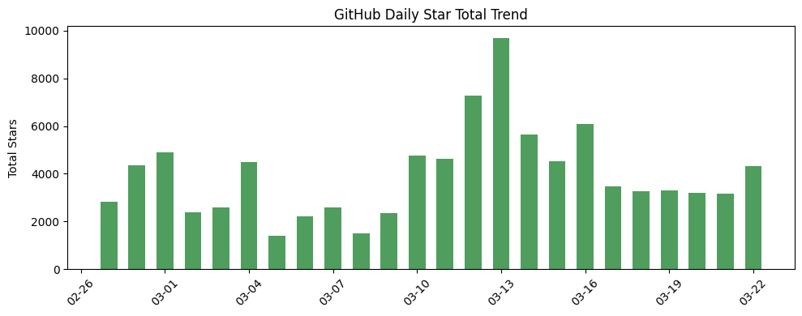
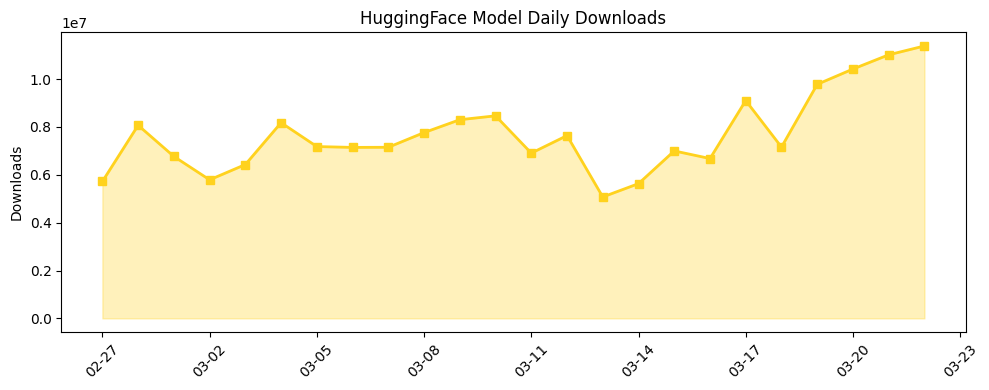

# 今日AI结构性变化
> 开源社区在AI应用层快速迭代，芯片供应链呈现多元化竞争态势，标志着AI产业正从模型竞赛转向应用落地和基础设施自主可控的双重博弈。

开源AI应用在金融交易、内容生成等垂直领域实现深度渗透，而AWS Trainium获得主流厂商认可和Musk布局自主芯片制造，显示算力基础设施竞争格局正在重构。这意味着AI产业从单一的技术领先转向生态构建和供应链安全并重的发展阶段。

- 🆕 **新兴方向**：基础设施、应用层、资本信号均出现全新话题
- 📈 **持续趋势**：基础设施和资本信号话题连续8天增强
- 🔑 **新关键词**：AI Tokens、AWS Trainium、Kimi、Model Distillation
- 📉 **消退关键词**：ChatGPT、Google、开源生态等传统话题

# 技术层信号
🟡 渐进改善

模型能力边界通过知识蒸馏技术得到稳步推进，Qwen3.5-9B通过Claude 4.6 Opus推理能力蒸馏实现性能提升[Qwen3.5-9B-Claude-4.6-Opus-Reasoning-Distilled-v2](https://huggingface.co/Jackrong/Qwen3.5-9B-Claude-4.6-Opus-Reasoning-Distilled-v2)，显示开源社区在模型优化上的持续努力。多智能体框架在金融交易等专业领域应用成熟[TradingAgents-CN](https://github.com/hsliuping/TradingAgents-CN)，标志着智能体技术从概念验证向实际业务场景落地的转变。

# 产业资本信号
🟡 中等信号

基础设施层面，AWS Trainium获得Anthropic、OpenAI甚至苹果的认可[An exclusive tour of Amazon’s Trainium lab](https://techcrunch.com/2026/03/22/an-exclusive-tour-of-amazons-trainium-lab-the-chip-thats-won-over-anthropic-openai-even-apple/)，同时Musk为SpaceX和特斯拉布局自主芯片制造[Elon Musk unveils chip manufacturing plans](https://techcrunch.com/2026/03/22/elon-musk-unveils-chip-manufacturing-plans-for-spacex-and-tesla/)，显示算力供应链多元化趋势加速。应用层出现自动化视频生成[MoneyPrinterTurbo](https://github.com/harold0703/MoneyPrinterTurbo)和深度研究工具[local-deep-researcher](https://github.com/langchain-ai/local-deep-researcher)等实际落地案例。资本流向方面，AI代币可能成为人才薪酬新形式[AI tokens the new signing bonus](https://techcrunch.com/2026/03/21/are-ai-tokens-the-new-signing-bonus-or-just-a-cost-of-doing-business/)，反映人才竞争进入新阶段。

# 潜在拐点判断
今日观察到芯片供应链自主化拐点信号。依据是：AWS Trainium获得主流厂商认可、Musk布局自主芯片制造，结合基础设施话题连续8天增强和新话题出现。如果这一趋势持续，将打破NVIDIA的垄断格局，重构全球AI算力供应链，并可能引发地缘政治层面的产业链重组。

# 明日观察点
1. **芯片合作动态**：关注更多厂商是否跟进Trainium或其他替代方案，判断供应链多元化是否成为行业共识
2. **开源应用落地效果**：观察TradingAgents等项目的实际运行数据，验证多智能体在专业场景的可行性
3. **AI代币实践**：追踪企业是否大规模采用代币作为薪酬，判断这一新模式的生命力

# 长期趋势坐标
今日信号在AI产业演进中处于应用深化和基础设施自主可控的关键节点。overall_novelty达到0.762的高分，表明今日话题组合与历史模式有显著差异。从月度视角看，AI发展正从模型能力比拼转向应用生态构建和供应链安全保障的双轨并行，这一结构性变化将定义未来半年的竞争格局。

# 数据洞察

## arXiv 摘要对比 — 模型能力提升曲线
今日无arXiv摘要数据，无法进行能力提升曲线分析。

## GitHub Star 增速分析
今日GitHub生态表现活跃，总获星4317，新增12个仓库。增速前三的项目均与AI应用相关：plastic-labs/honcho增长346.4%（125星）、browser-use/browser-use增长275%（405星）、HKUDS/LightRAG增长227.4%（203星）。新晋热门仓库包括[TradingAgents-CN](https://github.com/hsliuping/TradingAgents-CN)、[MoneyPrinterTurbo](https://github.com/harold0703/MoneyPrinterTurbo)等，反映应用层创新活跃。

## HuggingFace 模型下载量变化
今日总下载量1138万次，OCR和Qwen系列模型占据主导。zai-org/GLM-OCR以319万次下载居首，Qwen3.5-9B以315万次紧随其后。增速最快的是nvidia/Nemotron-Cascade-2-30B-A3B，增长112.7%，显示企业对更大规模模型的兴趣。知识蒸馏模型如Jackrong系列均有稳定增长，反映模型优化技术的普及。

## 趋势图

# 参考来源

**GitHub项目**
- [TradingAgents-CN](https://github.com/hsliuping/TradingAgents-CN) — GitHub
- [MoneyPrinterTurbo](https://github.com/harold0703/MoneyPrinterTurbo) — GitHub  
- [local-deep-researcher](https://github.com/langchain-ai/local-deep-researcher) — GitHub

**HuggingFace模型**
- [Qwen3.5-9B-Claude-4.6-Opus-Reasoning-Distilled-v2](https://huggingface.co/Jackrong/Qwen3.5-9B-Claude-4.6-Opus-Reasoning-Distilled-v2) — HuggingFace

**公司动态**
- [An exclusive tour of Amazon’s Trainium lab](https://techcrunch.com/2026/03/22/an-exclusive-tour-of-amazons-trainium-lab-the-chip-thats-won-over-anthropic-openai-even-apple/) — TechCrunch
- [Elon Musk unveils chip manufacturing plans for SpaceX and Tesla](https://techcrunch.com/2026/03/22/elon-musk-unveils-chip-manufacturing-plans-for-spacex-and-tesla/) — TechCrunch
- [Delve accused of misleading customers with ‘fake compliance’](https://techcrunch.com/2026/03/22/delve-accused-of-misleading-customers-with-fake-compliance/) — TechCrunch
- [Cursor admits its new coding model was built on top of Moonshot AI’s Kimi](https://techcrunch.com/2026/03/22/cursor-admits-its-new-coding-model-was-built-on-top-of-moonshot-ais-kimi/) — TechCrunch

**资本与行业**
- [Are AI tokens the new signing bonus or just a cost of doing business?](https://techcrunch.com/2026/03/21/are-ai-tokens-the-new-signing-bonus-or-just-a-cost-of-doing-business/) — TechCrunch