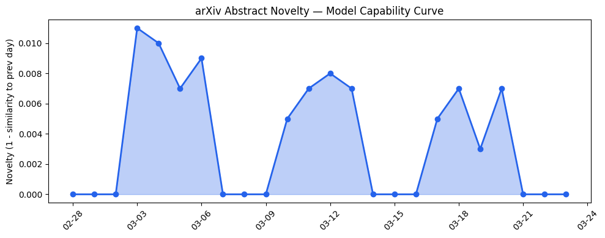
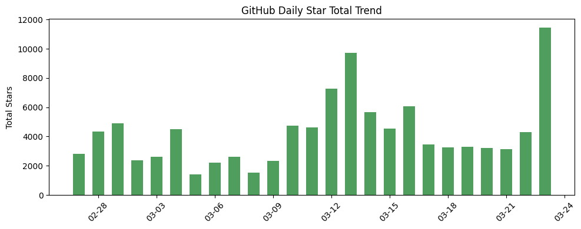
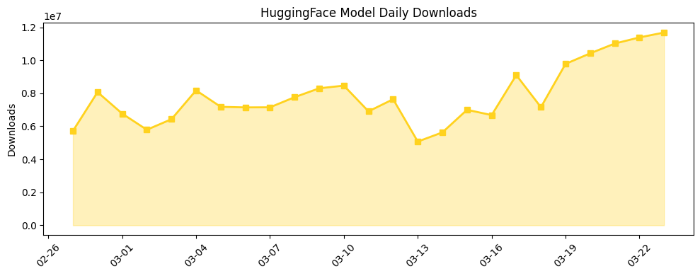

# 今日AI结构性变化
> AI基础设施层出现重大效率突破，多芯片推理架构和测试时量化技术显著降低部署门槛，同时资本从狂热转向理性投资阶段。

今日最显著的结构性变化是AI产业重心从模型能力竞赛转向部署效率优化。基础设施层的突破正在重塑产业格局，TTQ测试时量化和MoE专家推测技术实现了无需重新训练的推理优化，而Gimlet Labs的多芯片架构打破了NVIDIA的硬件垄断。这意味着AI产业正在从"追求更大模型"转向"追求更高效部署"的关键转折点。

- 🆕 **新兴方向**：技术层、资本信号、风险信号均出现全新话题（相似度<0.24）
- 📈 **持续趋势**：风险信号已连续8天增强，监管和安全议题持续升温
- 🔑 **新关键词**：Gimlet Labs, Helion, MoE, TTQ, multi-chip, model editing
- 📉 **消退关键词**：AI, ChatGPT, Google, 开源生态等泛化概念

# 技术层信号
🟡 渐进改善

模型能力边界在推理规划方面有系统化提升，但未出现根本性突破。[HyEvo: Self-Evolving Hybrid Agentic Workflows for Efficient Reasoning](https://arxiv.org/abs/2603.19639)提出的自进化混合工作流和[Learning to Disprove: Formal Counterexample Generation with Large Language Models](https://arxiv.org/abs/2603.19514)的反证生成技术，显示AI正在从单纯的内容生成向逻辑推理和动态优化演进。部分接地编码等神经符号结合方法表明，技术发展正从纯数据驱动转向符号逻辑与神经网络的深度融合。

趋势对比显示技术层出现全新话题（新颖度0.77），但arXiv能力曲线呈现"延续"态势（相似度0.991），说明今日论文更多是在既有方向上的深化而非突破。

# 产业资本信号
🟡 中等信号

资本流向出现显著转向：从大额模型层融资转向务实的基础设施投资。Gimlet Labs获8000万美元解决推理瓶颈，Littlebird获1100万美元开发上下文捕捉工具，显示资本正流向"让AI更好用"的工具层。同时，美国初创企业融资大幅放缓，超大轮融资减少表明估值理性化趋势确立。

基础设施层面，多芯片架构实现NVIDIA、AMD、Intel、ARM、Cerebras和d-Matrix协同推理，打破了单一硬件依赖。应用层深度渗透核电站操作、医疗教育、移动电源管理等专业领域，法律和金融领域的RAG增强显示AI正在替代传统专业分析工作。

# 潜在拐点判断
今日观察到明确的产业拐点信号：**AI投资从模型能力竞赛转向部署效率优化**。依据是基础设施层出现重大技术突破（TTQ量化、多芯片架构）与资本流向工具层的同步转向。这一拐点意味着产业进入成熟期，企业开始关注ROI和实际落地效果，而非单纯追求技术前沿。如果这一趋势持续，将加速AI在各行业的规模化部署，同时给纯模型开发公司带来盈利压力。

# 明日观察点
1. **多芯片架构落地进展**：关注Gimlet Labs技术在实际环境中的性能表现，判断是否真能打破NVIDIA垄断
2. **TTQ量化技术普及度**：观察开源社区对该技术的采纳速度，判断推理成本降低的实际影响
3. **监管风险升级信号**：五角大楼对Anthropic的制裁是否引发连锁反应，地缘政治风险如何影响AI供应链

# 长期趋势坐标
今日信号在AI产业演进中标志着从"技术探索期"向"规模部署期"的过渡。基础设施效率突破与资本理性化共同指向产业成熟化趋势。趋势报告显示整体新颖度0.671，属于中等创新水平，但关键词变化显示讨论正从泛化概念转向具体技术方案。这意味着AI产业正在形成更加务实和分工明确的价值链。

# 数据洞察

## arXiv 摘要对比 — 模型能力提升曲线
今日arXiv论文呈现明显的"延续"趋势（相似度0.991），能力得分0.009表明论文话题与历史高度一致。45篇论文主要围绕推理优化、工作流效率等既有方向深化，而非开辟新范式。

## GitHub Star 增速分析
MoneyPrinterTurbo以509.5%的惊人增速领跑，显示AI内容生成工具需求旺盛。TradingAgents相关仓库表现突出，反映金融AI应用热度。新仓库minimind和FastVideo值得关注，可能代表新的技术方向。

## HuggingFace 模型下载量变化
GLM-OCR和Qwen系列模型下载量领先，OCR和推理增强模型需求强劲。Nemotron-Cascade-2-30B-A3B以61.5%增速最快，显示企业对大规模商业模型的兴趣。蒸馏模型增长稳定，反映成本优化趋势。

# 参考来源

**论文**
- [HyEvo: Self-Evolving Hybrid Agentic Workflows for Efficient Reasoning](https://arxiv.org/abs/2603.19639) — arXiv
- [When both Grounding and not Grounding are Bad -- A Partially Grounded Encoding of Planning into SAT](https://arxiv.org/abs/2603.19429) — arXiv
- [Learning to Disprove: Formal Counterexample Generation with Large Language Models](https://arxiv.org/abs/2603.19514) — arXiv
- [TTQ: Activation-Aware Test-Time Quantization to Accelerate LLM Inference On The Fly](https://arxiv.org/abs/2603.19296) — arXiv
- [Speculating Experts Accelerates Inference for Mixture-of-Experts](https://arxiv.org/abs/2603.19289) — arXiv
- [PowerLens: Taming LLM Agents for Safe and Personalized Mobile Power Management](https://arxiv.org/abs/2603.19584) — arXiv
- [Enhancing Legal LLMs through Metadata-Enriched RAG Pipelines and Direct Preference Optimization](https://arxiv.org/abs/2603.19251) — arXiv
- [From Comprehension to Reasoning: A Hierarchical Benchmark for Automated Financial Research Reporting](https://arxiv.org/abs/2603.19254) — arXiv
- [When Prompt Optimization Becomes Jailbreaking: Adaptive Red-Teaming of Large Language Models](https://arxiv.org/abs/2603.19247) — arXiv

**公司动态**
- [Creating with Sora Safely](https://openai.com/index/creating-with-sora-safely) — OpenAI

**资本与行业**
- [Startup Gimlet Labs is solving the AI inference bottleneck in a surprisingly elegant way](https://techcrunch.com/2026/03/23/startup-gimlet-labs-is-solving-the-ai-inference-bottleneck-in-a-surprisingly-elegant-way/) — TechCrunch
- [Littlebird raises $11M for its AI-assisted 'recall' tool that reads your computer screen](https://techcrunch.com/2026/03/23/littlebird-raises-11m-to-capture-context-from-your-computer-so-you-can-query-your-data/) — TechCrunch
- [US Startup Funding Slows Sharply In March](https://news.crunchbase.com/business/us-startup-funding-slows-march-2026-data/) — Crunchbase
- [Elizabeth Warren calls Pentagon's decision to bar Anthropic 'retaliation'](https://techcrunch.com/2026/03/23/elizabeth-warren-anthropic-pentagon-defense-supply-chain-risk-retaliation/) — TechCrunch