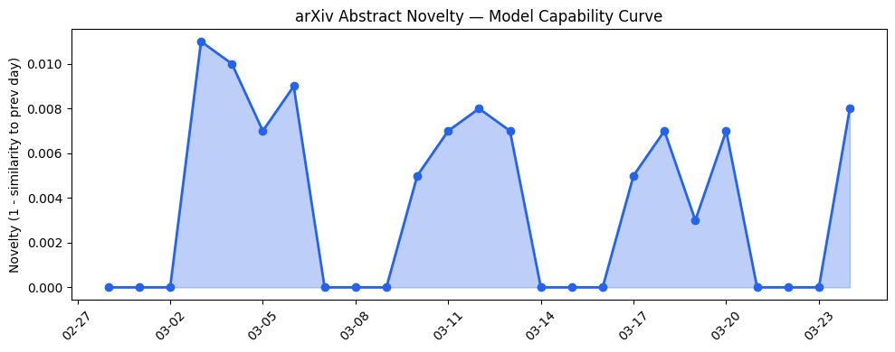
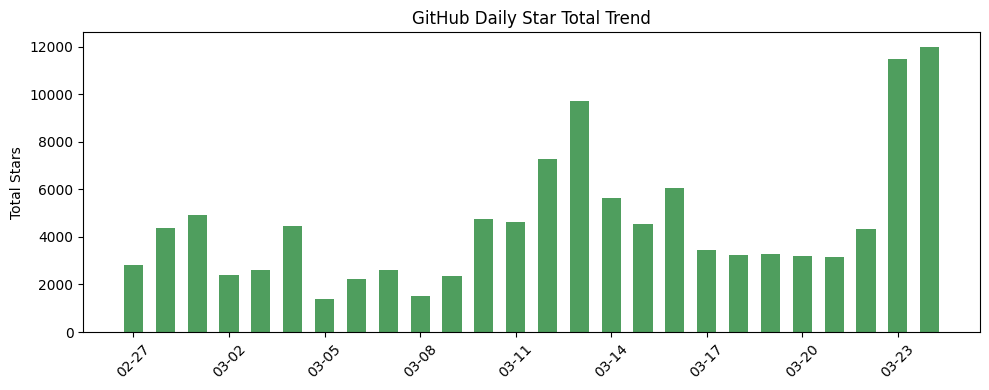
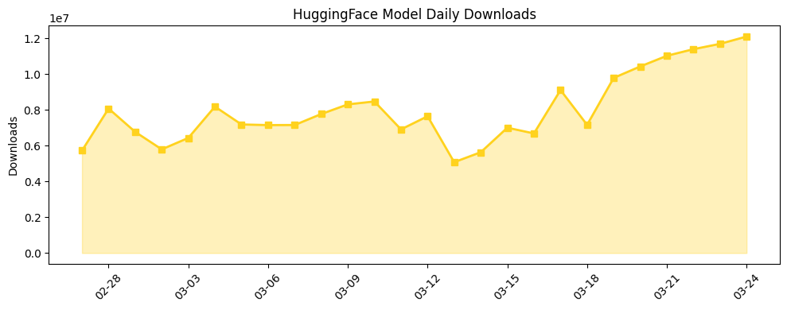

```
---
title: "AI结构性变化：从推理效率突破到企业级应用落地加速"
date: 2026-03-24
tags: [LLM, Multi-Agent Systems, ERP Integration, AI Security, Model Compression]
---
```

## 今日AI结构性变化

> AI产业正从技术探索期转向企业级应用落地期，推理效率优化与传统系统集成成为核心驱动力。

今日AI领域呈现明显的结构性转变：技术层的研究焦点从纯粹的模型能力提升转向推理效率优化，而产业资本则大规模流向能够直接集成到企业现有工作流中的AI解决方案。这意味着AI产业正在经历从"技术炫技"到"商业价值验证"的关键转折点。📈 持续趋势在技术层、基础设施、应用层、资本信号四个维度同时显现，🆕 新兴方向在基础设施、应用层、资本信号、风险信号领域涌现。

## 技术层信号

🟡 渐进改善

今日技术层的研究呈现出明显的效率导向特征。[ProMAS的错误预测框架](https://arxiv.org/abs/2603.20260)通过马尔佤转移动力学为多智能体系统提供前瞻性错误预警，[扩散模型的并行解码策略](https://arxiv.org/abs/2603.20216)显著提升生成效率，而[Fast-Slow Thinking RM](https://arxiv.org/abs/2603.20212)的混合奖励模型架构则在保持质量的同时优化计算资源分配。这些研究共同指向一个趋势：AI技术发展正从"更大更强"转向"更快更省"，反映了产业对实际部署成本效益的深度关注。虽然未出现根本性突破，但这种系统性的效率优化将为AI的大规模商业化应用奠定坚实基础。

## 产业资本信号

🔴 强信号

产业资本今日展现出对企业级AI解决方案的强烈信心。[Doss获得5500万美元B轮融资](https://techcrunch.com/2026/03/24/doss-raises-55m-for-ai-inventory-management-that-plugs-into-erp/)用于ERP集成的库存管理系统，标志着资本开始青睐能够直接嵌入企业现有工作流的AI应用。同时，[Kleiner Perkins募集35亿美元AI专项基金](https://news.crunchbase.com/venture/kleiner-perkins-raises-ai-focused-funds/)和[Databricks收购两家AI安全初创公司](https://techcrunch.com/2026/03/24/databricks-buys-two-startups-lakewatch-antimatter-siftd-ai-security/)的战略举动，显示大厂正通过资本手段加速完善其AI产品矩阵。这种资本流向表明市场已经超越了概念验证阶段，进入了规模化部署的价值兑现期。

## 潜在拐点判断

今日观察到企业级AI集成的重要拐点。传统ERP系统与AI的深度整合正在重塑企业软件市场格局，AI不再仅仅是独立工具，而是成为核心业务系统的智能增强层。这一拐点的依据在于：技术成熟度达到商业可用水平，资本大规模涌入验证商业模式，且传统软件巨头开始通过并购加速布局。影响将极为深远——未来企业软件竞争的核心将从功能完整性转向AI集成能力。

## 明日观察点

1. 企业级AI集成方案的后续融资动向，特别是面向传统行业垂直领域的解决方案
2. 大模型厂商在推理优化技术方面的产品化进展，关注是否会有专门的效率优化套件发布
3. AI安全与合规工具的市场接受度，观察监管政策与行业自律的协同效应

## 长期趋势坐标

从月度视角看，AI产业正在经历从技术驱动向应用驱动的结构性转型。技术层的持续效率优化与企业级应用的加速落地形成了良性循环，这种趋势在未来一个季度内预计将持续强化。新兴关键词如"ERP集成"、"预测性维护"、"库存管理"的出现，表明AI正在向实体经济更深层次渗透。整体新颖度0.663的水平显示当前处于既有趋势强化而非颠覆性创新的阶段。

## 数据洞察

### arXiv 摘要对比 — 模型能力提升曲线
今日arXiv论文能力得分0.008，平均相似度0.992，显示技术研究保持高度连续性。45篇论文主要集中在推理效率优化方向，而非基础能力突破，符合产业向应用落地转型的趋势。

### GitHub Star 增速分析
今日总获星12004，13个仓库中有2个新仓库。增长亮点包括[awesome-claude-code](https://github.com/hesreallyhim/awesome-claude-code)增长140.4%，反映开发者对Claude生态的高度关注；[minimind](https://github.com/jingyaogong/minimind)增长47.3%显示轻量化模型趋势。

### HuggingFace 模型下载量变化
总下载量1209万次，Qwen系列模型占据主导地位。增长亮点包括[Nemotron-Cascade-2-30B-A3B](https://huggingface.co/nvidia/Nemotron-Cascade-2-30B-A3B)增长268.9%，[Mistral-Small-4-119B-2603](https://huggingface.co/mistralai/Mistral-Small-4-119B-2603)增长248.3%，显示中等规模模型受到市场青睐。

## 参考来源

**论文研究**
- [ProMAS: Proactive Error Forecasting for Multi-Agent Systems Using Markov Transition Dynamics](https://arxiv.org/abs/2603.20260) — arXiv
- [Locally Coherent Parallel Decoding in Diffusion Language Models](https://arxiv.org/abs/2603.20216) — arXiv
- [Fast-Slow Thinking RM: Efficient Integration of Scalar and Generative Reward Models](https://arxiv.org/abs/2603.20212) — arXiv

**公司动态**
- [Doss raises $55M for AI inventory management that plugs into ERP](https://techcrunch.com/2026/03/24/doss-raises-55m-for-ai-inventory-management-that-plugs-into-erp/) — TechCrunch
- [Arm is releasing the first in-house chip in its 35-year history](https://techcrunch.com/2026/03/24/arm-is-releasing-its-first-in-house-chip-in-its-35-year-history/) — TechCrunch
- [Databricks bought two startups to underpin its new AI security product](https://techcrunch.com/2026/03/24/databricks-buys-two-startups-lakewatch-antimatter-siftd-ai-security/) — TechCrunch

**开源生态**
- [TurboQuant: Redefining AI efficiency with extreme compression](https://research.google/blog/turboquant-redefining-ai-efficiency-with-extreme-compression/) — Google AI Blog
- [An experimental study of KV cache reuse strategies in chunk-level caching systems](https://arxiv.org/abs/2603.20218) — arXiv

**资本与行业**
- [Kleiner Perkins Raises $3.5B For AI-Focused Funds](https://news.crunchbase.com/venture/kleiner-perkins-raises-ai-focused-funds/) — Crunchbase News
- [Helping developers build safer AI experiences for teens](https://openai.com/index/teen-safety-policies-gpt-oss-safeguard) — OpenAI Blog
- [Spotify tests new tool to stop AI slop from being attributed to real artists](https://techcrunch.com/2026/03/24/spotify-tests-new-tool-to-stop-ai-slop-from-being-attributed-to-real-artists/) — TechCrunch