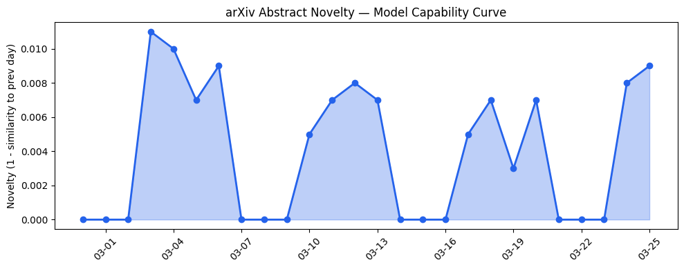
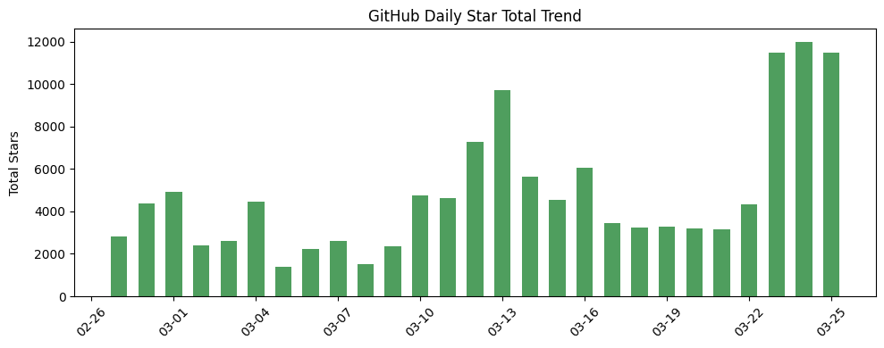
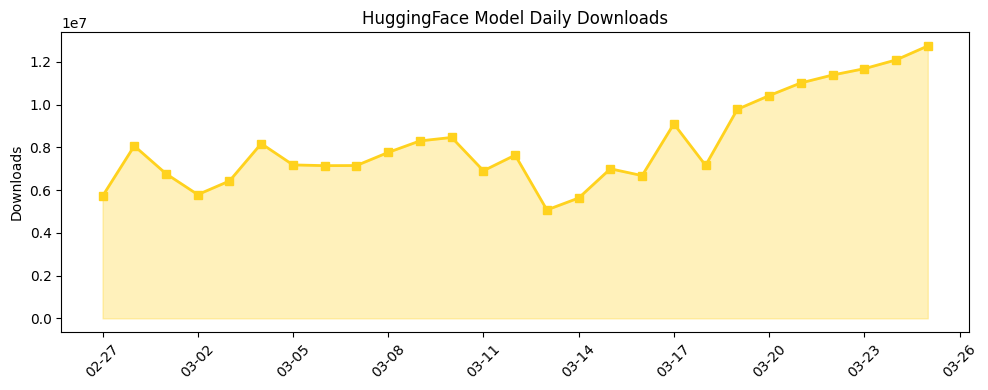

```
---
title: "AI安全与效率双重突破：从内存压缩到分布式攻击防御"
date: 2026-03-25
tags: [AI安全, 内存压缩, 多模态情感识别, LLM智能体, 企业AI应用]
---

## 今日AI结构性变化

> AI产业正从单纯追求模型能力转向安全框架强化与效率优化并行的成熟期发展阶段。

今日AI领域呈现结构性分化：一方面，OpenAI和学术机构加强安全治理机制，[Session Risk Memory](https://arxiv.org/abs/2603.22350)引入时序授权防御分布式攻击；另一方面，Google推出[TurboQuant内存压缩算法](https://techcrunch.com/2026/03/25/google-turboquant-ai-memory-compression-silicon-valley-pied-piper/)承诺将工作内存缩小6倍。这种"安全+效率"的双重突破标志着产业从野蛮生长进入精细化运营阶段。📈 基础设施持续升温 🔺 安全框架突然强化 🆕 内存压缩新兴方向

## 技术层信号

🟡 渐进改善

多模态情感识别和AI智能体架构出现显著进展，[Memory Bear AI的多模态情感智能引擎](https://arxiv.org/abs/2603.22306)与[STEM Agent自适应架构](https://arxiv.org/abs/2603.22359)共同推动AI从单一任务执行向复杂情境理解演进。Session Risk Memory的时序授权机制为解决分布式攻击提供了新范式，而渐进式量化方法改善了向量标记化鲁棒性。技术演进呈现"情感智能+安全架构+效率优化"的三重驱动特征。

## 产业资本信号

🔴 强信号

AI法律科技赛道成为资本新宠，[Harvey确认110亿美元估值](https://techcrunch.com/2026/03/25/harvey-confirms-11b-valuation-sequoia-triples-down/)显示专业服务AI化的巨大潜力，[Granola估值从2.5亿飙升至15亿美元](https://techcrunch.com/2026/03/25/granola-raises-125m-hits-1-5b-valuation-as-it-expands-from-meeting-notetaker-to-enterprise-ai-app/)印证企业级AI应用的估值重构。OpenAI并购加速，2026年前三个月交易量接近2025年全年水平，产业整合步伐明显加快。资本集中流向具有明确商业模式的企业应用层，而非底层基础设施。

## 潜在拐点判断

观察到政策监管拐点信号：[Sanders和AOC的数据中心建设禁令提案](https://techcrunch.com/2026/03/25/bernie-sanders-and-aoc-propose-a-ban-on-data-center-construction/)可能引发算力供给结构性收缩，与AI安全治理强化形成共振。若该法案通过，将迫使产业从算力依赖转向算法效率优化，加速内存压缩等技术的商业化落地。

## 明日观察点

1. 数据中心禁令法案的立法进程及产业界应对策略
2. TurboQuant等内存压缩技术的实际部署效果验证
3. Harvey等高估值AI法律科技公司的商业化进展

## 长期趋势坐标

从月度视角看，基础设施、应用层和资本信号均呈现持续8天的增强趋势，且各维度均出现全新话题（新奇度0.77-0.87），表明产业正在经历结构性重构。AI向传统行业渗透加速，建筑科技初创公司Trayd获得融资，教育领域出现家庭教育机器人应用，显示AI技术红利开始向实体经济扩散。

## 数据洞察

### arXiv 摘要对比 — 模型能力提升曲线
今日arXiv论文能力得分0.01，与历史均值相似度达0.99，显示技术演进保持高度连续性。45篇论文集中在智能体架构和安全机制优化，而非基础模型突破。

### GitHub Star 增速分析
今日总获星11503，[mvanhorn/last30days-skill](https://github.com/mvanhorn/last30days-skill)增长545%居首，技能学习类项目热度突显。新仓库[trustgraph-ai/trustgraph](https://github.com/trustgraph-ai/trustgraph)和[open-edge-platform/anomalib](https://github.com/open-edge-platform/anomalib)反映安全与边缘计算需求上升。

### HuggingFace 模型下载量变化
总下载量1274万，Qwen系列模型占据主导，[Qwen3.5-9B](https://huggingface.co/Qwen/Qwen3.5-9B)单日下载358万次。OCR模型[zai-org/GLM-OCR](https://huggingface.co/zai-org/GLM-OCR)需求旺盛，反映多模态应用落地加速。

### 趋势图




## 参考来源

**论文**
- [Memory Bear AI Memory Science Engine for Multimodal Affective Intelligence](https://arxiv.org/abs/2603.22306) — arXiv
- [STEM Agent: A Self-Adapting, Tool-Enabled, Extensible Architecture](https://arxiv.org/abs/2603.22359) — arXiv
- [Session Risk Memory: Temporal Authorization for Deterministic Pre-Execution Safety Gates](https://arxiv.org/abs/2603.22350) — arXiv
- [Mitigating Premature Discretization with Progressive Quantization](https://arxiv.org/abs/2603.22304) — arXiv

**公司动态**
- [Google unveils TurboQuant, a new AI memory compression algorithm](https://techcrunch.com/2026/03/25/google-turboquant-ai-memory-compression-silicon-valley-pied-piper/) — TechCrunch
- [Introducing the OpenAI Safety Bug Bounty program](https://openai.com/index/safety-bug-bounty) — OpenAI

**资本与行业**
- [Harvey confirms $11B valuation: Sequoia triples down](https://techcrunch.com/2026/03/25/harvey-confirms-11b-valuation-sequoia-triples-down/) — TechCrunch
- [Granola raises $125M, hits $1.5B valuation](https://techcrunch.com/2026/03/25/granola-raises-125m-hits-1-5b-valuation-as-it-expands-from-meeting-notetaker-to-enterprise-ai-app/) — TechCrunch
- [Data: OpenAI Has Already Done Nearly As Many M&A Deals In 2026 As It Did All of Last Year](https://news.crunchbase.com/ma/data-openai-2023-2026-acquisitions-open-source-astral-promptfoo/) — Crunchbase
- [Bernie Sanders and AOC propose a ban on data center construction](https://techcrunch.com/2026/03/25/bernie-sanders-and-aoc-propose-a-ban-on-data-center-construction/) — TechCrunch
```