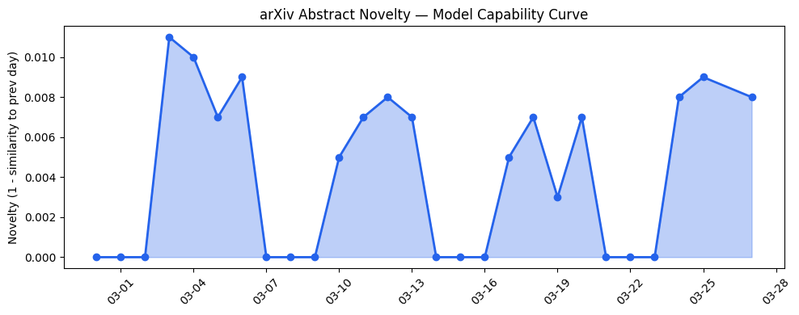
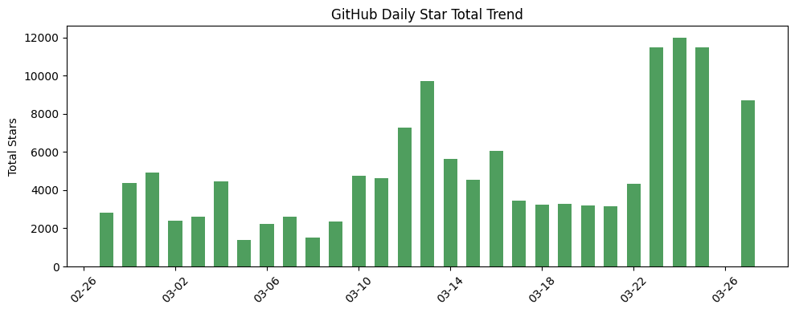
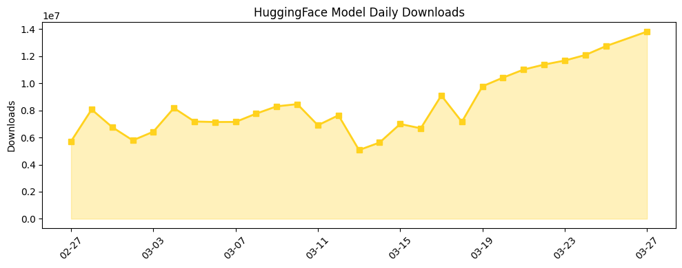

## 今日AI结构性变化

> AI产业竞争焦点正从基础模型能力转向智能体系统成熟度，工业级部署成为新的技术前沿。

这意味着AI产业格局正在经历从"模型即产品"到"系统即服务"的根本性转变。今日最显著的变化是智能体技术从实验室研究快速向工业场景渗透，[ARC-AGI-3](https://arxiv.org/abs/2603.24621)设定了新的智能体基准，而[AutoSAM](https://arxiv.org/abs/2603.24736)展示了工程领域的多模态工具编排能力。这种转变的重要性在于，AI价值创造的重心从模型性能指标转向了系统集成效率和业务场景适配度。

📈 持续趋势：资本信号、风险信号持续升温  
🆕 新兴方向：技术层、基础设施、应用层均出现全新话题  
🔑 新关键词：AutoSAM、Digital Twin、Industrial AI、Tool Orchestration

## 技术层信号

🟡 渐进改善

智能体系统的理论基础和工程实践同步推进，标志着Agentic AI进入成熟期。[Formal Semantics for Agentic Tool Protocols](https://arxiv.org/abs/2603.24747)为工具编排协议提供了形式化验证框架，而MCP协议的标准化工作正在构建智能体生态的基础设施。技术层的新兴话题得分0.75，表明这是与历史模式显著不同的创新方向。模型能力虽然延续性较强（相似度0.992），但应用范式正在从单一模型调用转向多智能体协作系统。

## 产业资本信号

🔴 强信号

资本密集流向AI基础设施和国防科技，[OpenAI再融资100亿美元](https://techcrunch.com/2026/03/27/why-softbanks-new-40b-loan-points-to-a-2026-openai-ipo/)的背景下，[SoftBank的400亿美元贷款](https://techcrunch.com/2026/03/27/why-softbanks-new-40b-loan-points-to-a-2026-openai-ipo/)明确指向2026年IPO预期。奥斯汀初创公司融资创纪录显示区域创新中心崛起，而OpenAI关闭非核心业务聚焦主业的战略调整，反映了资本对商业化效率的要求日益严格。资本信号连续8天持续增强，验证了市场对AI基础设施长期价值的认可。

## 潜在拐点判断

观察到Agentic AI从研究到工业部署的拐点正在形成。依据在于：技术层出现全新的工具编排范式，应用层在工业制造、应急响应等传统行业实现深度渗透，基础设施层面SK hynix潜在IPO将缓解内存瓶颈。这个拐点的影响是，AI产业竞争将从模型基准测试转向系统集成能力和行业解决方案的成熟度比拼。

## 明日观察点

1. Agentic AI在传统行业的落地案例是否出现规模化复制迹象
2. 内存芯片供应链改善对AI推理成本的实际影响
3. MCP协议标准化进程能否形成行业共识

## 长期趋势坐标

从月度视角看，AI产业正在经历从技术驱动到应用驱动的结构性转变。新兴关键词如Digital Twin、Industrial AI显示AI与实体经济融合加速，而消退的Transformer、自然语言处理等关键词表明基础模型技术进入平台期。overall_novelty得分0.638反映今日话题组合具有中等创新性，但更值得关注的是各维度新兴话题的协同出现，这暗示着产业生态正在重构。

## 数据洞察

### arXiv 摘要对比 — 模型能力提升曲线
今日45篇论文的能力得分0.008，延续性高达0.992，表明模型基础能力进入平稳发展期，创新重点转向系统架构和应用集成。

### GitHub Star 增速分析
AgentScope等多智能体框架增长显著（+117%），而传统模型项目增长放缓。新仓库如SolaceAgent-Mesh显示智能体网格架构兴起，datalab-to/chandra单日增长3048%反映数据处理工具需求爆发。

### HuggingFace 模型下载量变化
Qwen系列模型占据下载主导，但增长亮点来自专用化模型如daVinci-MagiHuman增长133%。模型蒸馏和优化版本下载活跃，显示市场追求效率优于绝对性能。

## 参考来源

**论文**
- [ARC-AGI-3: A New Challenge for Frontier Agentic Intelligence](https://arxiv.org/abs/2603.24621) — arXiv
- [AutoSAM: an Agentic Framework for Automating Input File Generation for the SAM Code](https://arxiv.org/abs/2603.24736) — arXiv
- [Formal Semantics for Agentic Tool Protocols: A Process Calculus Approach](https://arxiv.org/abs/2603.24747) — arXiv

**公司动态**
- [STADLER reshapes knowledge work at a 230-year-old company](https://openai.com/index/stadler) — OpenAI Blog
- [Protecting people from harmful manipulation](https://deepmind.google/blog/protecting-people-from-harmful-manipulation/) — Google DeepMind Blog

**资本与行业**
- [Why SoftBank's new $40B loan points to a 2026 OpenAI IPO](https://techcrunch.com/2026/03/27/why-softbanks-new-40b-loan-points-to-a-2026-openai-ipo/) — TechCrunch
- [The Week's 10 Biggest Funding Rounds: A Varied Week For Big Deals, Led By AI And Defense](https://news.crunchbase.com/venture/biggest-funding-rounds-ai-defense-openai-shield/) — Crunchbase News
- [Anthropic wins injunction against Trump administration over Defense Department saga](https://techcrunch.com/2026/03/26/anthropic-wins-injunction-against-trump-administration-over-defense-department-saga/) — TechCrunch