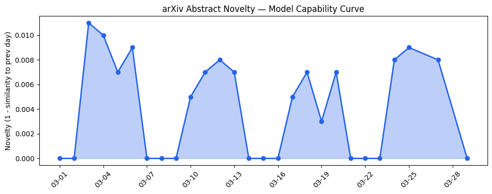
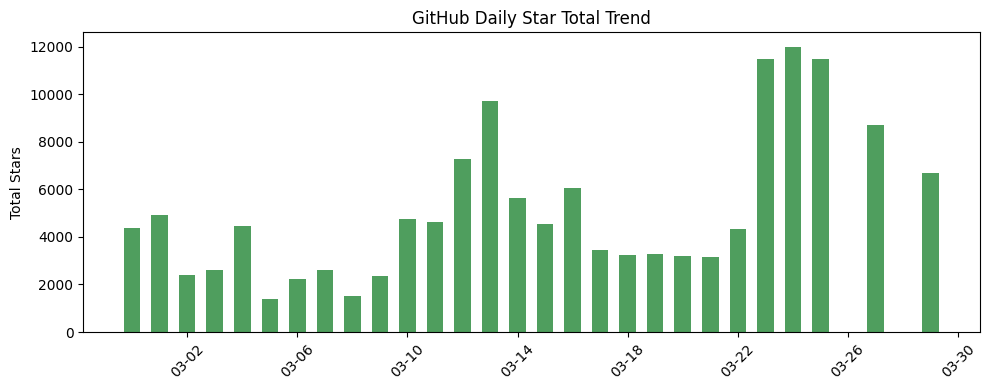
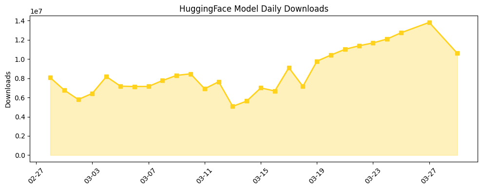

## 今日AI结构性变化

> AI产业正经历从技术狂热向商业理性的结构性转向，视频生成等高成本领域现收缩信号，消费级AI助手市场则呈现强劲增长。

今日AI产业最显著的变化是应用层开始出现明确的市场分化。一方面，[Sora可能关闭](https://techcrunch.com/2026/03/29/soras-shutdown-could-be-a-reality-check-moment-for-ai-video/)标志着资本对高成本AI视频应用的重新评估，另一方面[Claude付费用户激增](https://techcrunch.com/2026/03/28/anthropics-claude-popularity-with-paying-consumers-is-skyrocketing/)显示消费级AI助手市场的成熟。这种分化意味着AI产业正在从技术驱动转向市场驱动，投资者和企业开始更加关注实际商业回报而非技术噱头。

📈 持续趋势：资本信号在最近8天内持续增强
🆕 新兴方向：技术层、应用层、资本信号、风险信号均出现全新话题
🔑 新关键词：AI视频、消费级AI、企业战略调整
📉 消退关键词：Transformer、开源生态、资本动向

## 技术层信号

⚪ 无显著变化

今日技术层未见重大突破，主要关注点集中在应用层和资本层面。开源项目增长显示工具类框架的持续完善，但缺乏新的训练方法或架构创新。技术发展的重心似乎正在从基础模型创新转向应用层优化和商业化落地。

## 产业资本信号

🔴 强信号

资本层面出现明显的战略调整信号。[Sora可能关闭](https://techcrunch.com/2026/03/29/soras-shutdown-could-be-a-reality-check-moment-for-ai-video/)反映了资本对高成本AI视频应用的谨慎态度，而[Claude付费用户激增](https://techcrunch.com/2026/03/28/anthropics-claude-popularity-with-paying-consumers-is-skyrocketing/)则证明消费级AI市场的商业化潜力。同时，[xAI核心团队持续流失](https://techcrunch.com/2026/03/28/elon-musks-last-co-founder-reportedly-leaves-xai/)可能影响公司估值，显示资本开始更加注重团队的稳定性和执行力。

## 潜在拐点判断

观察到AI视频领域的潜在拐点。Sora可能关闭的信号表明，资本正在重新评估高成本AI应用的商业可行性，这可能标志着AI产业从技术狂热期进入商业理性期。视频生成等资源密集型应用可能面临投资收缩，而具有明确商业模式的应用将获得更多关注。

## 明日观察点

1. 关注OpenAI对Sora业务的最终决策及其对AI视频赛道的影响
2. 观察Claude付费用户增长是否可持续，以及是否引发其他厂商跟进
3. 监测xAI团队变动是否引发连锁反应，影响整个创业公司估值体系

## 长期趋势坐标

从月度视角看，AI产业正在经历明显的结构性调整。资本从盲目追逐技术热点转向关注实际商业回报，应用层出现明显的市场分化。消费级AI助手市场显示出强劲的增长潜力，而高成本的技术密集型应用面临重新评估。这种分化可能在未来几个月内进一步加剧，推动产业向更加理性的方向发展。

## 数据洞察

### arXiv 摘要对比 — 模型能力提升曲线
今日暂无数据

### GitHub Star 增速分析
今日GitHub生态呈现工具类项目的强劲增长。[SakanaAI/AI-Scientist-v2](https://github.com/SakanaAI/AI-Scientist-v2)单日增长390%，[microsoft/VibeVoice](https://github.com/microsoft/VibeVoice)增长272%，显示AI工具和框架类项目持续受到开发者关注。新出现的[OpenBB-finance/OpenBB](https://github.com/OpenBB-finance/OpenBB)项目反映了AI在金融数据分析领域的渗透加深。

### HuggingFace 模型下载量变化
模型下载量显示Qwen系列模型占据主导地位，[Qwen3.5-9B](https://huggingface.co/Qwen/Qwen3.5-9B)单日下载量达428万次。增长最快的[facebook/tribev2](https://huggingface.co/facebook/tribev2)增长892%，反映社区对新架构的关注。Claude相关蒸馏模型的多版本出现，印证了消费级AI助手市场的热度。

### 趋势图

## 参考来源

**公司动态**
- [Sora’s shutdown could be a reality check moment for AI video](https://techcrunch.com/2026/03/29/soras-shutdown-could-be-a-reality-check-moment-for-ai-video/) — TechCrunch AI
- [Anthropic’s Claude popularity with paying consumers is skyrocketing](https://techcrunch.com/2026/03/28/anthropics-claude-popularity-with-paying-consumers-is-skyrocketing/) — TechCrunch AI
- [Elon Musk’s last co-founder reportedly leaves xAI](https://techCrunch.com/2026/03/28/elon-musks-last-co-founder-reportedly-leaves-xai/) — TechCrunch AI

**开源生态**
- [Bluesky leans into AI with Attie, an app for building custom feeds](https://techcrunch.com/2026/03/28/bluesky-leans-into-ai-with-attie-an-app-for-building-custom-feeds/) — TechCrunch AI

**风险研究**
- [Stanford study outlines dangers of asking AI chatbots for personal advice](https://techcrunch.com/2026/03/28/stanford-study-outlines-dangers-of-asking-ai-chatbots-for-personal-advice/) — TechCrunch AI