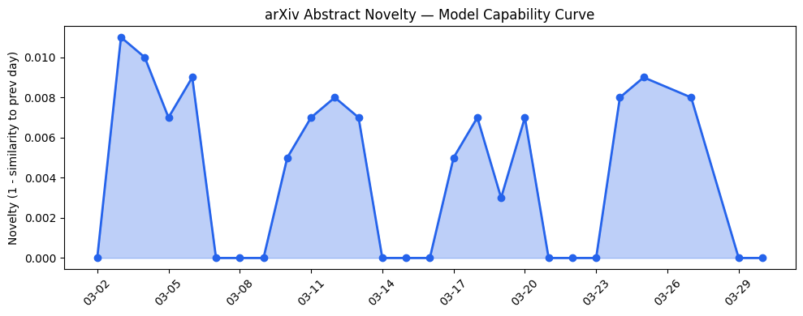
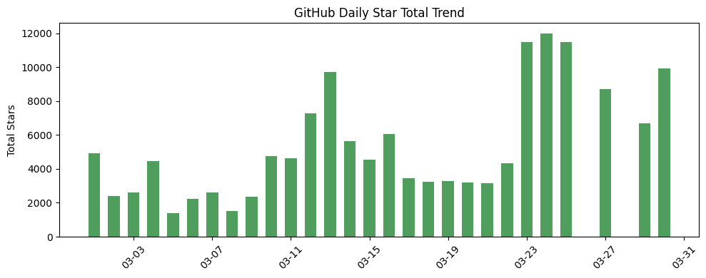
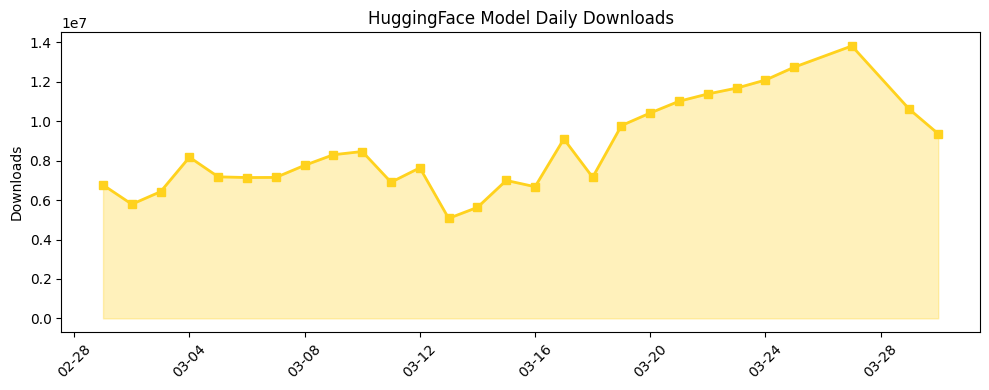

## 今日AI结构性变化

> AI安全评估正从静态内容审核转向动态行为风险监控，同时资本密集流向AI基础设施优化和边缘计算创新。

今日最显著的结构性变化是AI安全评估体系的范式转移。随着[BeSafe-Bench](https://arxiv.org/abs/2603.25747)等框架提出，AI安全关注点从传统的文本内容过滤扩展到了多模态代理在动态环境中的行为风险监控，这意味着AI产业正在从"说什么"的安全转向"做什么"的安全。与此同时，基础设施领域出现资本密集布局，ScaleOps、Rebellions、Mistral AI等公司总计融资超过15亿美元，表明产业正加速解决算力瓶颈问题。

📈 持续趋势：基础设施投资热度持续8天递增
🆕 新兴方向：行为安全评估、太空数据中心、代码验证
🔺 突然升温：多模态代理风险暴露、GPU效率优化
🔑 新关键词：Behavioral Risk、Space Computing、Code Verification

## 技术层信号

🟡 渐进改善

多模态代理的行为安全评估框架[BeSafe-Bench](https://arxiv.org/abs/2603.25747)填补了动态环境风险评估空白，标志着AI安全评估从静态内容审核向动态行为监控的范式转移。[CADSmith](https://arxiv.org/abs/2603.26512)通过程序化几何验证提升文本到CAD生成的精确性，显示AI正从通用能力向专业领域精度深化。同时，[DRiffusion](https://arxiv.org/abs/2603.25872)的草稿-精炼并行采样框架和MAGNET的去中心化自主专家模型生成范式，表明模型架构优化仍在持续推进。技术层出现全新话题（与历史最大相似度仅0.24），这可能是多模态代理安全评估这一新兴方向的早期信号。

## 产业资本信号

🔴 强信号

今日资本密集流向基础设施和工具层，总额超过15亿美元的融资显示产业正在系统性解决算力瓶颈问题。[ScaleOps融资1.3亿美元](https://techcrunch.com/2026/03/30/scaleops-130m-series-c-kubernetes-efficiency-ai-demand-funding/)专注于GPU短缺和云成本优化，[Rebellions融资4亿美元](https://techcrunch.com/2026/03/30/ai-chip-startup-rebellions-raises-400-million-at-2-3b-valuation-in-pre-ipo-round/)挑战Nvidia在AI推理芯片的垄断地位，而[Mistral AI通过8.3亿美元债务融资](https://techcrunch.com/2026/03/30/mistral-ai-raises-830m-in-debt-to-set-up-a-data-center-near-paris/)建设自有数据中心，减少对云厂商依赖。最值得注意的是[Starcloud融资1.7亿美元](https://techcrunch.com/2026/03/30/starcloud-raises-170-million-series-ato-build-data-centers-in-space/)探索太空数据中心建设，成为YC最快独角兽（17个月），标志着边缘计算向太空延伸的新趋势。

## 潜在拐点判断

观察到AI安全评估的拐点：从内容安全向行为安全转变。BeSafe-Bench框架的提出意味着产业开始系统化应对多模态代理在真实环境中的行为风险，这将对自动驾驶、机器人等实体AI应用的安全性标准产生深远影响。同时，太空数据中心的出现可能标志边缘计算的地理边界突破，为低延迟全球覆盖提供新可能。

## 明日观察点

1. 多模态代理安全评估标准是否会快速被行业采纳，形成新的合规要求
2. 太空数据中心概念是否引发更多资本跟进，形成新的基础设施竞赛
3. AI管理者接受度的社会影响是否会推动组织管理结构的重构

## 长期趋势坐标

从月度视角看，基础设施投资持续升温（8天递增趋势）表明算力优化仍是产业核心痛点。新兴的Behavioral Risk、Space Computing等关键词显示安全评估和计算范式正在重构。整体新颖度0.706表明今日话题组合具有较高创新性，AI产业正从模型能力竞争转向基础设施优化和安全体系完善的双轮驱动。

## 数据洞察

### arXiv 摘要对比 — 模型能力提升曲线
今日arXiv论文能力得分0.009，相似度0.991，显示技术演进保持延续性。45篇论文中，多模态代理安全和专业领域应用成为主要方向，模型能力正向垂直领域精度深化。

### GitHub Star 增速分析
今日总获星9922，8个仓库中有2个新仓库。[OpenBB-finance/OpenBB](https://github.com/OpenBB-finance/OpenBB)增长341.6%显示AI金融应用热度，[luongnv89/claude-howto](https://github.com/luongnv89/claude-howto)增长270.2%反映工具类内容需求旺盛。

### HuggingFace 模型下载量变化
总下载量936万，[Qwen/Qwen3.5-9B](https://huggingface.co/Qwen/Qwen3.5-9B)以449万下载领跑。增长榜中[meituan-longcat/LongCat-Next](https://huggingface.co/meituan-longcat/LongCat-Next)增长106.5%显示长文本处理需求，专业模型下载增长反映产业应用深化。

### 趋势图

## 参考来源

**论文**
- [BeSafe-Bench: Unveiling Behavioral Safety Risks of Situated Agents in Functional Environments](https://arxiv.org/abs/2603.25747) — arXiv
- [CADSmith: Multi-Agent CAD Generation with Programmatic Geometric Validation](https://arxiv.org/abs/2603.26512) — arXiv
- [DRiffusion: Draft-and-Refine Process Parallelizes Diffusion Models with Ease](https://arxiv.org/abs/2603.25872) — arXiv

**公司动态**
- [ScaleOps raises $130M to improve computing efficiency amid AI demand](https://techcrunch.com/2026/03/30/scaleops-130m-series-c-kubernetes-efficiency-ai-demand-funding/) — TechCrunch
- [AI chip startup Rebellions raises $400 million at $2.3B valuation](https://techcrunch.com/2026/03/30/ai-chip-startup-rebellions-raises-400-million-at-2-3b-valuation-in-pre-ipo-round/) — TechCrunch
- [Mistral AI raises $830M in debt to set up a data center near Paris](https://techcrunch.com/2026/03/30/mistral-ai-raises-830m-in-debt-to-set-up-a-data-center-near-paris/) — TechCrunch

**开源生态**
- [OpenBB-finance/OpenBB](https://github.com/OpenBB-finance/OpenBB) — GitHub
- [microsoft/VibeVoice](https://github.com/microsoft/VibeVoice) — GitHub
- [NousResearch/hermes-agent](https://github.com/NousResearch/hermes-agent) — GitHub

**资本与行业**
- [15% of Americans say they'd be willing to work for an AI boss](https://techcrunch.com/2026/03/30/ai-boss-supervisor-us-quinnipiac-poll/) — TechCrunch
- [Mantis Biotech is making 'digital twins' of humans](https://techcrunch.com/2026/03/30/mantis-biotech-is-making-digital-twins-of-humans-to-help-solve-medicines-data-availability-problem/) — TechCrunch
- [Starcloud raises $170 million Series A to build data centers in space](https://techcrunch.com/2026/03/30/starcloud-raises-170-million-series-ato-build-data-centers-in-space/) — TechCrunch