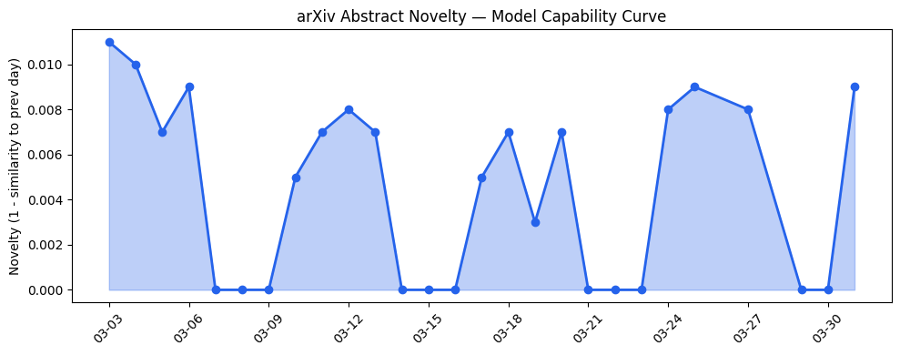
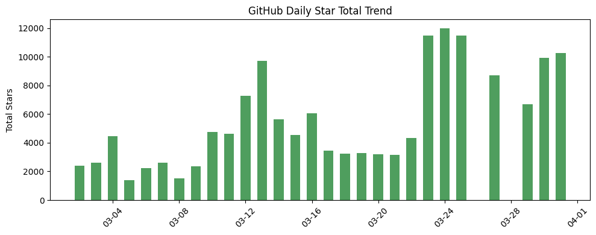
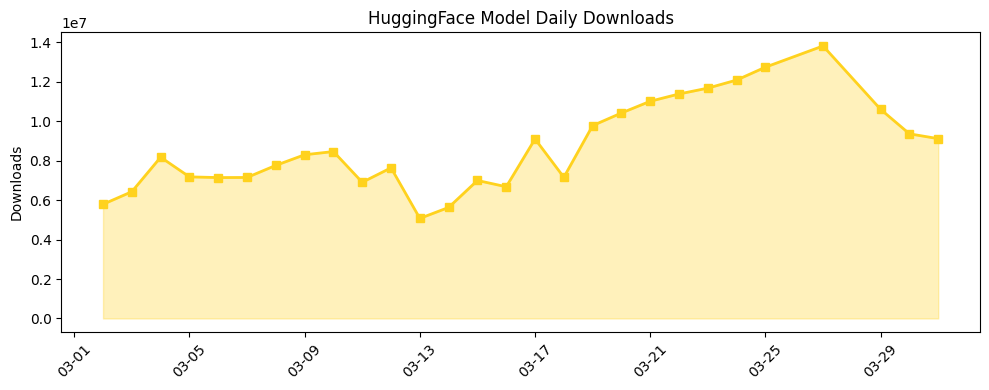

## 今日AI结构性变化

> 资本向头部极端集中与技术创新向合规性收敛形成双重结构重塑。

今日AI产业呈现明显的两极分化：一方面，OpenAI创纪录的1220亿美元融资将资本集中度推向新高度；另一方面，技术研究方向显著转向神经符号融合以满足监管合规需求。这意味着AI产业正在从"野蛮生长"转向"规范发展"，资本壁垒与技术门槛同步提升。📈 持续趋势、🆕 新兴方向、🔑 新关键词

## 技术层信号

🟡 渐进改善

技术层虽无突破性能力扩展，但方法学改进方向明确指向可解释性与合规性。[Neuro-Symbolic Learning for Predictive Process Monitoring via Two-Stage Logic Tensor Networks with Rule Pruning](https://arxiv.org/abs/2603.26944)和[Compliance-Aware Predictive Process Monitoring: A Neuro-Symbolic Approach](https://arxiv.org/abs/2603.26948)两篇论文共同展示了神经符号方法在业务流程监控中的合规优势，标志着AI系统设计开始深度整合逻辑约束。同时，[A Step Toward Federated Pretraining of Multimodal Large Language Models](https://arxiv.org/abs/2603.26786)显示联邦学习向多模态大模型扩展，为数据隐私合规提供技术路径。技术层的新兴话题（相似度仅0.25）可能指向这一合规技术范式的早期形成。

## 产业资本信号

🔴 强信号

OpenAI的1220亿美元融资不仅是金额创纪录，更关键的是其中30亿美元来自零售投资者，显示资本市场的参与深度发生质变。与此同时，[The Largest Recent Seed Rounds Are All For AI Companies](https://news.crunchbase.com/venture/data-largest-seed-rounds-ai-startups/)表明早期投资仍高度活跃，但资金明显向"AI+物理世界"场景倾斜。Runway设立1000万美元生态基金和Anthropic与澳大利亚政府的合作，反映头部玩家开始构建战略护城河。资本连续8天持续升温的趋势验证了市场对AI长期价值的共识强化。

## 潜在拐点判断

观察到神经符号AI方法从理论研究向合规实践迁移的拐点迹象。多篇论文同时聚焦EU AI Act第50条的具体合规要求，并将逻辑张量网络等符号方法应用于实际业务场景，这意味着AI开发范式可能从"性能优先"转向"合规优先"。这一转变将对模型架构、训练方法和部署标准产生深远影响。

## 明日观察点

1. 神经符号方法是否会从业务流程监控向更广泛的应用场景扩展
2. OpenAI巨额融资后的具体算力投资方向和技术路线图披露
3. EU AI Act合规要求对开源模型生态的实质性影响

## 长期趋势坐标

从月度视角看，AI产业正在经历从技术驱动向规则驱动的转型。overall_novelty达到0.632显示今日话题组合具有显著新意，特别是EU AI Act、Logic Tensor Networks等新关键词的出现，标志着监管合规正在成为技术演进的重要约束条件。同时，Multi-Agent Systems的持续升温与AI、Transformer等基础概念的消退，反映应用层复杂性和专业性要求的提升。

## 数据洞察

### arXiv 摘要对比 — 模型能力提升曲线
今日arXiv论文能力评分0.009，相似度0.991，显示技术演进保持连续性。45篇论文中神经符号方法和合规主题占比显著，但核心能力边界无突破性扩展。

### GitHub Star 增速分析
Microsoft/VibeVoice单日增长53.9%（3862星），显示语音生成技术关注度激增。多智能体相关仓库（NousResearch/hermes-agent）保持稳定增长，而一些工具类仓库出现明显下滑，反映开发者兴趣向核心技术创新集中。

### HuggingFace 模型下载量变化
Qwen3.5-9B以466万下载量居首，但增长亮点来自CohereLabs/cohere-transcribe-03-2026（78.9%增长）和chromadb/context-1（64.6%增长），显示语音转录和检索增强生成等应用技术需求旺盛。模型下载分布反映市场对即用型AI服务的强烈需求。

### 趋势图

## 参考来源

**论文研究**
- [Neuro-Symbolic Learning for Predictive Process Monitoring via Two-Stage Logic Tensor Networks with Rule Pruning](https://arxiv.org/abs/2603.26944) — arXiv
- [Compliance-Aware Predictive Process Monitoring: A Neuro-Symbolic Approach](https://arxiv.org/abs/2603.26948) — arXiv  
- [A Step Toward Federated Pretraining of Multimodal Large Language Models](https://arxiv.org/abs/2603.26786) — arXiv
- [MediHive: A Decentralized Agent Collective for Medical Reasoning](https://arxiv.org/abs/2603.27150) — arXiv
- [Transparency as Architecture: Structural Compliance Gaps in EU AI Act Article 50 II](https://arxiv.org/abs/2603.26983) — arXiv

**公司动态**
- [OpenAI, not yet public, raises $3B from retail investors in monster $122B fund raise](https://techcrunch.com/2026/03/31/openai-not-yet-public-raises-3b-from-retail-investors-in-monster-122b-fund-raise/) — TechCrunch
- [Alexa+ gets new food ordering experiences with Uber Eats and Grubhub](https://techcrunch.com/2026/03/31/alexa-plus-new-food-ordering-experiences-with-uber-eats-and-grubhub) — TechCrunch
- [Accelerating the next phase of AI](https://openai.com/index/accelerating-the-next-phase-ai) — OpenAI Blog

**资本与行业**
- [The Largest Recent Seed Rounds Are All For AI Companies](https://news.crunchbase.com/venture/data-largest-seed-rounds-ai-startups/) — Crunchbase
- [Exclusive: Runway launches $10M fund, Builders program to support early-stage AI startups](https://techcrunch.com/2026/03/31/exclusive-runway-launches-10m-fund-builders-program-to-support-early-stage-ai-startups/) — TechCrunch
- [Popular AI gateway startup LiteLLM ditches controversial startup Delve](https://techcrunch.com/2026/03/30/popular-ai-gateway-startup-litellm-ditches-controversial-startup-delve/) — TechCrunch