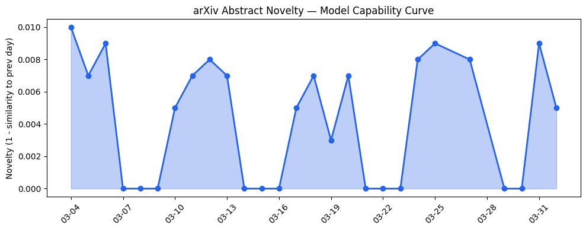
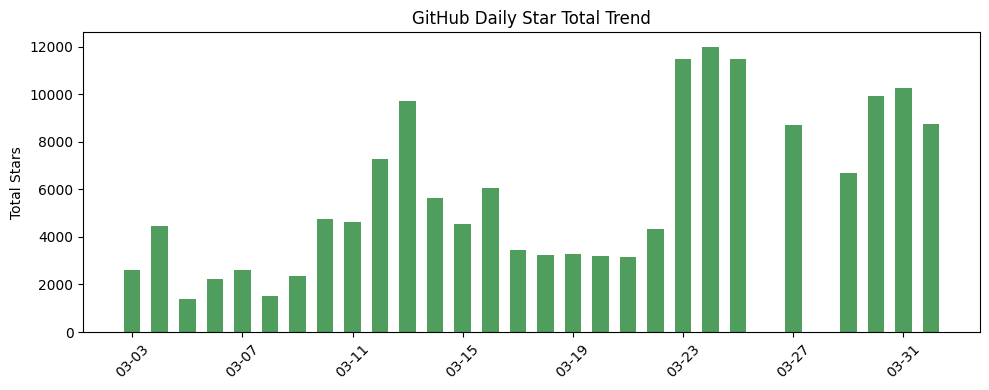
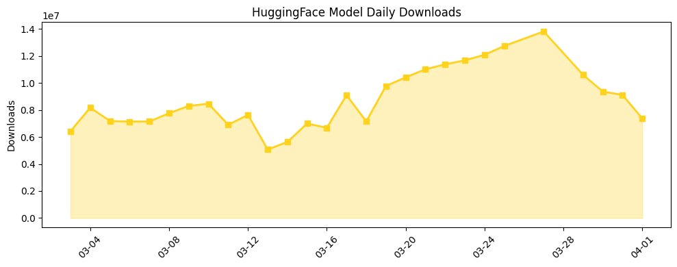

## 今日AI结构性变化

> AI产业正从单点模型能力竞争转向系统级智能架构与算力基础设施的全面军备竞赛。

今日最显著的结构性变化体现在两个层面：多智能体系统研究突破传统层级设计，显示AI正从个体智能向群体智能演进；同时基础设施投资创历史记录，表明产业意识到系统级能力需要匹配的算力基础。这意味着AI产业格局正在经历从"模型为王"到"系统制胜"的转变，技术栈的竞争维度从单一模型能力扩展到整个智能生态的构建能力。

📈 持续趋势：风险信号持续升温  
🆕 新兴方向：技术层、基础设施、应用层均出现全新话题  
🔺 突然升温：Multi-Agent Systems  
🔑 新关键词：Autonomous Agents、Self-Organization、Theory of Mind  
📉 消退关键词：传统NLP和基础模型相关话题

## 技术层信号

🟡 渐进改善

多智能体系统研究取得实质性进展，[Drop the Hierarchy and Roles](https://arxiv.org/abs/2603.28990)研究表明LLM智能体在最小协调下可自发形成复杂社会组织结构，挑战了传统层级设计范式。这标志着AI系统设计理念的重大转变——从精心设计的控制架构转向自组织涌现智能。[PAR²-RAG](https://arxiv.org/abs/2603.29085)提出的主动检索与推理结合范式进一步提升了多跳问答能力，而[Towards Computational Social Dynamics](https://arxiv.org/abs/2603.28928)则探索了半自主AI代理的社会动力学，显示技术层正从个体认知能力向群体协作智能演进。值得注意的是，安全微调对心智理论能力的影响研究提示我们需要在能力提升与安全约束间寻找平衡。

## 产业资本信号

🔴 强信号

Q1全球创投达到3000亿美元历史新高，AI计算和前沿实验室投资成为主要驱动力，显示资本对AI长期价值的坚定信心。基础设施层面，[Meta大规模建设天然气电厂](https://techcrunch.com/2026/04/01/metas-natural-gas-binge-could-power-south-dakota/)支持算力需求，[Cognichip获6000万美元融资](https://techcrunch.com/2026/04/01/cognichip-wants-ai-to-design-the-chips-that-power-ai-and-just-raised-60m-to-try/)用AI设计AI芯片，表明硬件赛道热度持续攀升。应用层，[Gradient Labs为银行客户提供AI账户经理](https://openai.com/index/gradient-labs)和[Slack集成30项AI功能](https://techcrunch.com/2026/03/31/salesforce-announces-an-ai-heavy-makeover-for-slack-with-30-new-features/)显示企业级应用深化，而[VideoLingo](https://github.com/Huanshere/VideoLingo)则展示了对传统视频字幕工作的替代潜力。

## 潜在拐点判断

今日观察到多智能体自组织研究的突破可能标志着AI系统设计范式的拐点。传统基于层级和角色设计的多智能体系统正被证明效率低于自组织架构，这意味着未来复杂AI系统的构建方式可能发生根本性改变。结合基础设施投资的激增，产业似乎正在为迎接更复杂、更自主的AI系统做准备。

## 明日观察点

1. 多智能体自组织研究是否能在更复杂任务中验证其优势
2. AI芯片设计自动化项目如Cognichip的技术路线和进展
3. 开源供应链安全事件（如LiteLLM漏洞）对行业信任度的影响

## 长期趋势坐标

从月度视角看，AI产业明显向两个方向分化：一方面是基础模型能力的渐进改善，另一方面是系统架构和基础设施的快速演进。趋势对比显示技术层、基础设施和应用层均出现全新话题，而传统NLP和基础模型相关话题正在消退，表明产业关注点正从模型基础能力向应用架构和系统集成转移。Q1创投破纪录表明资本对AI长期发展保持乐观，但风险信号的持续升温提示我们需要关注快速增长中的稳定性问题。

## 数据洞察

### arXiv 摘要对比 — 模型能力提升曲线
今日arXiv收录45篇论文，能力得分0.009，与历史均值相似度0.991，显示技术演进保持连续性。多智能体和社会动力学研究成为新的热点方向。

### GitHub Star 增速分析
今日新增8752星，13个仓库活跃。[PaddlePaddle/PaddleOCR](https://github.com/PaddlePaddle/PaddleOCR)增长74.5%表现突出，OCR技术需求旺盛。新仓库中[NVIDIA/Model-Optimizer](https://github.com/NVIDIA/Model-Optimizer)和[VideoLingo](https://github.com/Huanshere/VideoLingo)值得关注。

### HuggingFace 模型下载量变化
总下载量737万次，[Qwen/Qwen3.5-9B](https://huggingface.co/Qwen/Qwen3.5-9B)以468万次下载领跑。小型模型如[microsoft/harrier-oss-v1-0.6b](https://huggingface.co/microsoft/harrier-oss-v1-0.6b)增长104.6%，显示边缘计算需求上升。

### 趋势图

## 参考来源

**论文**
- [Drop the Hierarchy and Roles: How Self-Organizing LLM Agents Outperform Designed Structures](https://arxiv.org/abs/2603.28990) — arXiv
- [PAR²-RAG: Planned Active Retrieval and Reasoning for Multi-Hop Question Answering](https://arxiv.org/abs/2603.29085) — arXiv
- [Towards Computational Social Dynamics of Semi-Autonomous AI Agents](https://arxiv.org/abs/2603.28928) — arXiv
- [Theory of Mind and Self-Attributions of Mentality are Dissociable in LLMs](https://arxiv.org/abs/2603.28925) — arXiv

**公司动态**
- [Meta's natural gas binge could power South Dakota](https://techcrunch.com/2026/04/01/metas-natural-gas-binge-could-power-south-dakota/) — TechCrunch
- [Salesforce announces an AI-heavy makeover for Slack, with 30 new features](https://techcrunch.com/2026/03/31/salesforce-announces-an-ai-heavy-makeover-for-slack-with-30-new-features/) — TechCrunch
- [Anthropic took down thousands of GitHub repos trying to yank its leaked source code](https://techcrunch.com/2026/04/01/anthropic-took-down-thousands-of-github-repos-trying-to-yank-its-leaked-source-code-a-move-the-company-says-was-an-accident/) — TechCrunch

**开源生态**
- [NVIDIA / Model-Optimizer](https://github.com/NVIDIA/Model-Optimizer) — GitHub
- [VideoLingo](https://github.com/Huanshere/VideoLingo) — GitHub

**资本与行业**
- [Q1 2026 Shatters Venture Funding Records As AI Boom Pushes Startup Investment To $300B](https://news.crunchbase.com/venture/record-breaking-funding-ai-global-q1-2026/) — Crunchbase
- [Cognichip wants AI to design the chips that power AI, and just raised $60M to try](https://techcrunch.com/2026/04/01/cognichip-wants-ai-to-design-the-chips-that-power-ai-and-just-raised-60m-to-try/) — TechCrunch
- [Gradient Labs gives every bank customer an AI account manager](https://openai.com/index/gradient-labs) — OpenAI
- [Mercor says it was hit by cyberattack tied to compromise of open source LiteLLM project](https://techcrunch.com/2026/03/31/mercor-says-it-was-hit-by-cyberattack-tied-to-compromise-of-open-source-litellm-project/) — TechCrunch