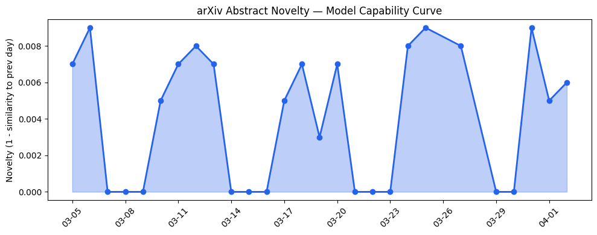
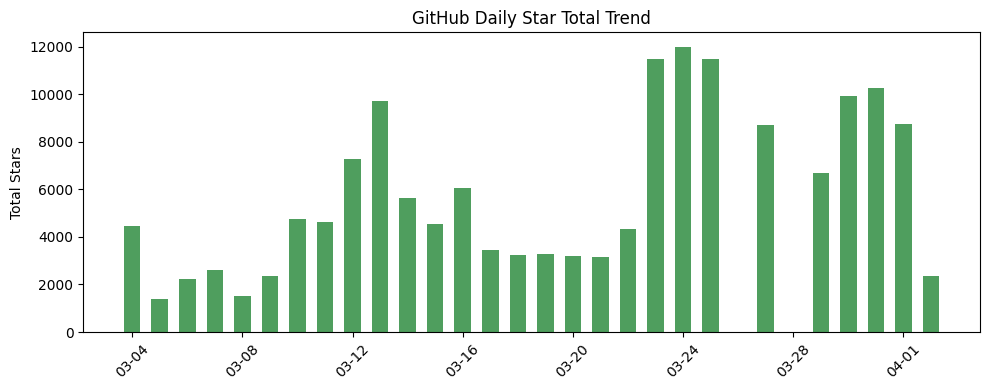
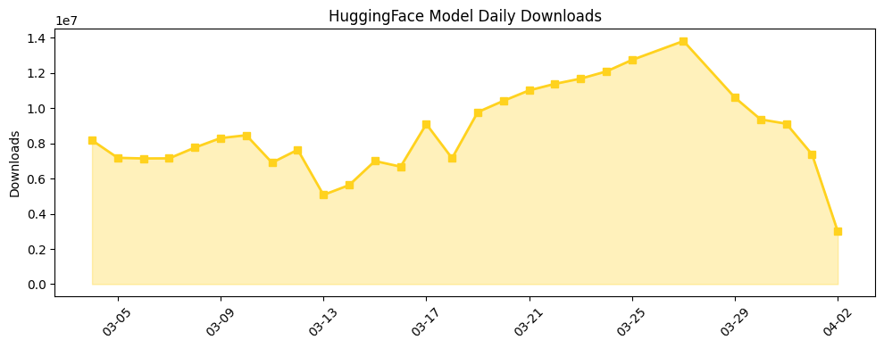

## 今日AI结构性变化

> 多智能体AI系统设计正成为主导性研究范式，同时基础模型初创公司融资出现爆发式增长。

今日AI产业格局显示出明显的"上层建筑"与"经济基础"的同步转向。技术前沿上，研究重点从单点模型能力突破转向复杂多智能体系统的协调与可靠性设计，这标志着AI应用正从工具级向系统级演进。资本层面，基础模型领域Q1融资额达到2025年全年的两倍，显示资本正以前所未有的规模押注AI底层技术栈。这种技术范式与资本流向的共振，预示着AI产业正在经历从"模型竞赛"到"系统集成"的关键转型期。🆕 新兴方向：Multi-Agent Systems、Fine-tuning、Tool-Use；📈 持续趋势：Foundation Models、RAG。

## 技术层信号

🟡 渐进改善

研究焦点明显从单一模型的能力提升转向多智能体系统的协同设计。在[临床预测的多智能体审议框架](https://arxiv.org/abs/2604.00085)中，研究人员展示了如何通过角色分工提升专业场景的可靠性；[行为健康通信模拟的安全感知框架](https://arxiv.org/abs/2604.00249)则强调了在多智能体环境中安全控制的重要性。这种转变意味着AI技术正从"如何让单个模型更强大"转向"如何让多个智能体安全高效地协作"，解决了单智能体在复杂任务中的可靠性和安全性瓶颈。同时，[决策中心设计](https://arxiv.org/abs/2604.00414)提出将决策逻辑与模型推理解耦，为构建更可控的AI系统提供了新思路。

## 产业资本信号

🔴 强信号

基础模型领域出现资本海啸，Q1融资额1780亿相比2025年全年889亿实现翻倍，这种集中度表明资本正以前瞻性布局押注AI基础设施层。与此同时，应用层初创公司如AI语音代理[Miravoice](https://news.crunchbase.com/venture/ai-interviewer-miravoice-raises-seed-funding-unusual/)和物理AI机器人[Anvil Robotics](https://news.crunchbase.com/venture/foundational-ai-startup-funding-doubled-openai-anthropic-xai-q1-2026/)获得种子轮融资，显示资本在基础设施和应用层同步活跃。巨头竞争加剧，[OpenAI收购TBPN播客](https://openai.com/index/openai-acquires-tbpn)扩大生态影响力，[微软发布三款新基础模型](https://techcrunch.com/2026/04/02/microsoft-takes-on-ai-rivals-with-three-new-foundational-models/)直接参与底层技术竞争。这种资本密集度可能推高整个行业的估值水平，为后续的产业整合埋下伏笔。

## 潜在拐点判断

观察到多智能体研究范式与基础模型资本投入的同步强化可能构成拐点。技术层面，多智能体框架从理论研究转向实际应用场景（临床、行为健康），标志着AI系统设计开始解决实际部署的可靠性问题；资本层面，基础模型融资额翻倍显示市场对底层技术长期价值的重新定价。这两个趋势的结合可能加速AI从实验室技术向产业级系统的转型，但拐点的确认需要观察后续几个月多智能体框架的实际落地效果和资本持续投入情况。

## 明日观察点

1. 关注多智能体框架在真实业务场景中的部署案例和性能指标
2. 观察基础模型巨额融资后的产品发布节奏和商业化进展
3. 监测开源模型（如Gemma 4）在多智能体系统中的适配和应用情况

## 长期趋势坐标

从月度视角看，AI产业正在经历从模型中心化向系统分布化的结构性转变。多智能体研究的兴起与基础模型资本的集中看似矛盾，实则反映了产业不同层面的成熟度差异：底层技术需要持续投入确保领先性，而上层应用需要分布式架构解决复杂问题。开源模型能力的持续提升（Gemma 4）为多智能体系统提供了更丰富的组件选择，而安全框架的完善则为大规模部署扫除障碍。这种"底层集中、上层分布"的格局可能成为未来几个季度的主导模式。

## 数据洞察

### arXiv 摘要对比 — 模型能力提升曲线
今日arXiv论文能力得分0.009，与历史均值相似度0.991，显示研究延续性强而非突破性进展。45篇论文中多智能体相关研究占比显著，但整体技术轨道保持稳定。

### GitHub Star 增速分析
今日新增2364星，5个仓库中有3个为新仓库。[google-research/timesfm](https://github.com/google-research/timesfm)增长226.5%表现突出，显示时间序列预测等专业方向受关注。新仓库[MervinPraison/PraisonAI](https://github.com/MervinPraison/PraisonAI)等可能反映多智能体开发工具的早期生态建设。

### HuggingFace 模型下载量变化
总下载量299万次，蒸馏模型和去审查模型占据前列，反映市场对轻量化和定制化需求的增长。[Holo3-35B-A3B](https://huggingface.co/Hcompany/Holo3-35B-A3B)增长1270%最为显著，显示新兴模型厂商开始获得关注。Gemma 4发布首日下载量2.9万次，表现平稳。

### 趋势图

## 参考来源

**论文**
- [One Panel Does Not Fit All: Case-Adaptive Multi-Agent Deliberation for Clinical Prediction](https://arxiv.org/abs/2604.00085) — arXiv
- [A Safety-Aware Role-Orchestrated Multi-Agent LLM Framework for Behavioral Health Communication Simulation](https://arxiv.org/abs/2604.00249) — arXiv
- [Decision-Centric Design for LLM Systems](https://arxiv.org/abs/2604.00414) — arXiv
- [PolarQuant: Optimal Gaussian Weight Quantization via Hadamard Rotation for LLM Compression](https://arxiv.org/abs/2603.29078) — arXiv
- [Empirical Validation of the Classification-Verification Dichotomy for AI Safety Gates](https://arxiv.org/abs/2604.00072) — arXiv

**公司动态**
- [Gemma 4: Byte for byte, the most capable open models](https://deepmind.google/blog/gemma-4-byte-for-byte-the-most-capable-open-models/) — Google DeepMind Blog
- [OpenAI acquires TBPN](https://openai.com/index/openai-acquires-tbpn) — OpenAI Blog
- [Microsoft takes on AI rivals with three new foundational models](https://techcrunch.com/2026/04/02/microsoft-takes-on-ai-rivals-with-three-new-foundational-models/) — TechCrunch AI

**资本与行业**
- [Sector Snapshot: Venture Funding To Foundational AI Startups In Q1 Was Double All Of 2025](https://news.crunchbase.com/venture/foundational-ai-startup-funding-doubled-openai-anthropic-xai-q1-2026/) — Crunchbase News
- [Exclusive: Miravoice, Builder Of An AI 'Interviewer' To Conduct Phone Surveys, Raises $6.3M](https://news.crunchbase.com/venture/ai-interviewer-miravoice-raises-seed-funding-unusual/) — Crunchbase News