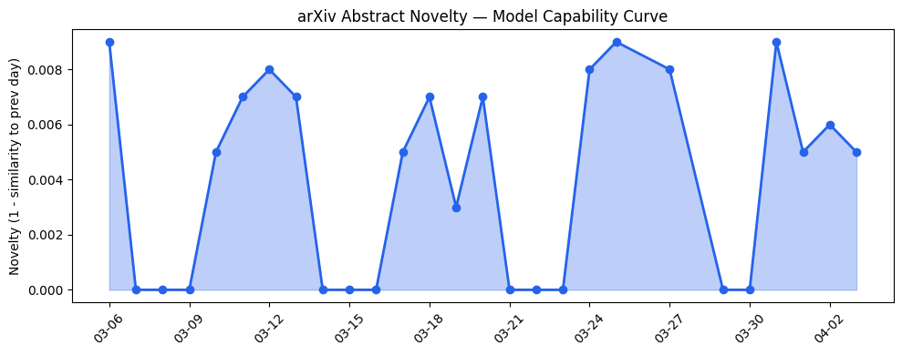
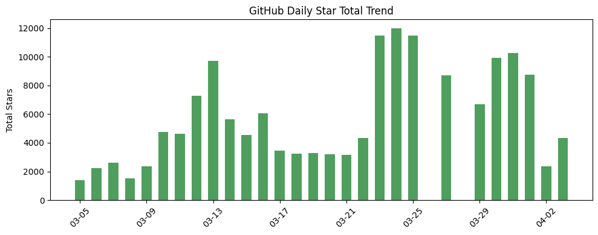
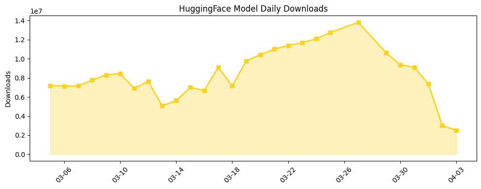

## 今日AI结构性变化

> AI巨头开始通过战略收购垂直整合专业领域能力，标志着行业从通用模型向专业应用深度渗透的结构性转变。

今天AI产业格局正在经历从横向扩张到纵向深耕的关键转折。[Anthropic收购生物科技初创公司Coefficient Bio](https://techcrunch.com/2026/04/03/anthropic-buys-biotech-startup-coefficient-bio-in-400m-deal-reports/)的4亿美元交易，不仅是资金流动的信号，更是AI公司从通用能力提供商向垂直领域解决方案商转型的标志性事件。这意味着头部AI企业不再满足于提供基础模型，而是通过收购专业能力来构建行业护城河。

📈 持续趋势：应用层和风险信号话题持续升温（8天递增）
🆕 新兴方向：技术层、基础设施、资本信号出现全新话题
🔑 新关键词：Biotech、Content Moderation、Money Laundering、Natural Gas

## 技术层信号

🟡 渐进改善

技术层呈现出专业化与统一化并行的双重趋势。[Dynin-Omni](https://arxiv.org/abs/2604.00007)实现了文本、图像、语音和视频理解的统一架构，同时嗅觉感知基准OP的提出标志着感知能力边界向更细微的感官维度拓展。更值得关注的是[Self-Routing](https://arxiv.org/abs/2604.00421)提出的无参数专家路由方法，这挑战了传统MoE中学习路由器的必要性，可能为模型架构设计带来范式变革。模型融合技术也出现了更理论化的数据无关协方差估计方法，显示技术演进从经验主义向理论指导转变。

## 产业资本信号

🔴 强信号

资本流向显示AI产业正在经历结构性重组。[Anthropic的4亿美元生物科技收购](https://techcrunch.com/2026/04/03/anthropic-buys-biotech-startup-coefficient-bio-in-400m-deal-reports/)不仅是金额巨大的交易，更是战略意图的明确宣告——AI巨头开始垂直整合专业领域能力。同时，47家早期公司在Q1成为独角兽的创纪录数据，显示早期AI公司估值持续走高，特别是在国防、可穿戴设备、能源和安全领域获得大额融资。[OpenAI的高管重组](https://techcrunch.com/2026/04/03/openai-executive-shuffle-new-roles-coo-brad-lightcap-fidji-simo-kate-rouch/)也暗示着战略调整，可能预示着更加注重商业化落地。

## 潜在拐点判断

观察到AI产业正处在从通用模型竞争向垂直领域渗透的拐点。Anthropic收购生物科技公司标志着头部AI企业开始通过并购快速获取专业领域能力，这种垂直整合策略可能重塑行业竞争格局。传统上AI公司主要通过内部研发扩展能力边界，现在转向外部收购，显示行业成熟度提升和专业化分工深化。

## 明日观察点

1. 其他AI巨头是否会跟进垂直领域收购策略，特别是Google、Microsoft等是否会进行类似生物科技领域的布局
2. Coefficient Bio的技术整合进度和商业化路径，这将检验垂直整合模式的实际效果
3. 早期独角兽估值持续走高的可持续性，特别是国防和能源等新兴领域的投资回报表现

## 长期趋势坐标

从月度视角看，AI产业正在经历从技术驱动向应用驱动的结构性转变。应用层话题持续8天升温表明行业关注点正从模型能力竞赛转向实际落地价值。同时，风险信号的同步升温显示随着AI深入关键领域，监管和伦理问题日益凸显。新兴关键词如Biotech、Money Laundering等专业领域术语的出现，印证了AI正在向更垂直、更专业的应用场景渗透。

## 数据洞察

### arXiv 摘要对比 — 模型能力提升曲线
今日arXiv论文能力得分0.008，相似度0.992，显示技术演进呈现延续性特征。45篇论文主要集中在模型架构优化和专业能力扩展，符合技术层渐进改善的判断。

### GitHub Star 增速分析
今日总获星4336，新仓库[oumi-ai/oumi](https://github.com/oumi-ai/oumi)和LearningCircuit/local-deep-research显示工具链和本地化部署成为新热点。mlx-vlm项目单日增长41倍，反映视觉语言模型持续受到关注。

### HuggingFace 模型下载量变化
总下载量252万次，Gemma系列模型下载量增长显著，特别是gemma-4-E4B-it增长405%，显示Google新模型受到市场积极反馈。非审查版本模型如Qwen3.5-9B-Uncensored占据下载榜首，反映用户对模型自由度的需求。

### 趋势图

## 参考来源

**论文**
- [Self-Routing: Parameter-Free Expert Routing from Hidden States](https://arxiv.org/abs/2604.00421) — arXiv
- [Dynin-Omni: Omnimodal Unified Large Diffusion Language Model](https://arxiv.org/abs/2604.00007) — arXiv
- [Benchmark for Assessing Olfactory Perception of Large Language Models](https://arxiv.org/abs/2604.00002) — arXiv
- [Detecting Complex Money Laundering Patterns with Incremental and Distributed Graph Modeling](https://arxiv.org/abs/2604.01315) — arXiv
- [The Silicon Mirror: Dynamic Behavioral Gating for Anti-Sycophancy in LLM Agents](https://arxiv.org/abs/2604.00478) — arXiv

**公司动态**
- [Anthropic buys biotech startup Coefficient Bio in $400M deal](https://techcrunch.com/2026/04/03/anthropic-buys-biotech-startup-coefficient-bio-in-400m-deal-reports/) — TechCrunch
- [OpenAI executive shuffle includes new role for COO Brad Lightcap](https://techcrunch.com/2026/04/03/openai-executive-shuffle-new-roles-coo-brad-lightcap-fidji-simo-kate-rouch/) — TechCrunch
- [Anthropic ramps up its political activities with a new PAC](https://techcrunch.com/2026/04/03/anthropic-ramps-up-its-political-activities-with-a-new-pac/) — TechCrunch

**开源生态**
- [oumi-ai / oumi](https://github.com/oumi-ai/oumi) — GitHub
- [Blaizzy/mlx-vlm](https://github.com/Blaizzy/mlx-vlm) — GitHub

**资本与行业**
- [This Is A Momentous Year For Early-Stage Unicorns](https://news.crunchbase.com/venture/data-early-stage-unicorns-seed-ai-defense-tech/) — Crunchbase
- [AI companies are building huge natural gas plants to power data centers](https://techcrunch.com/2026/04/03/ai-companies-are-building-huge-natural-gas-plants-to-power-data-centers-what-could-go-wrong/) — TechCrunch
- [The Facebook insider building content moderation for the AI era](https://techcrunch.com/2026/04/03/moonbounce-fundraise-content-moderation-for-the-ai-era/) — TechCrunch
- [People would rather have an Amazon warehouse in their backyard than a data center](https://techcrunch.com/2026/04/03/people-would-rather-have-an-amazon-warehouse-in-their-backyard-than-a-data-center/) — TechCrunch