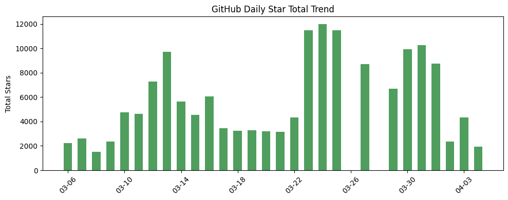
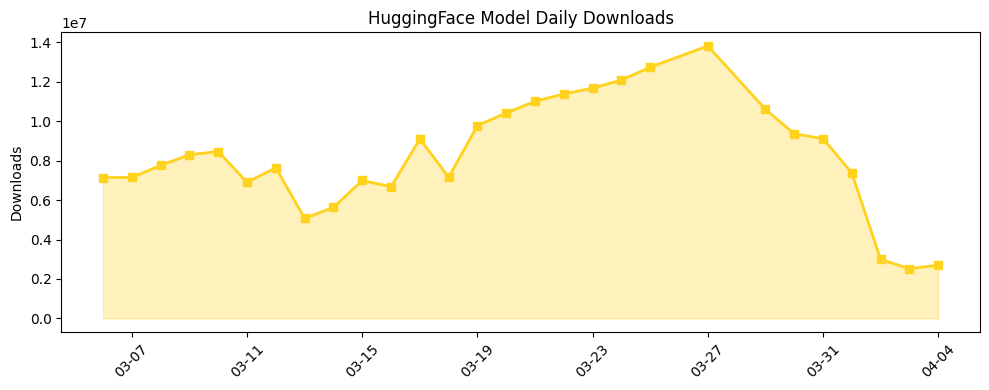

## 今日AI结构性变化

> Anthropic在私募市场热度首次超越OpenAI，同时Netflix开源视频生成模型显示流媒体巨头深度布局AI内容创作工具。

这意味着AI产业正在经历从"模型竞赛"向"应用生态"的实质性转变。Anthropic在私募市场的强势表现反映了投资者对差异化商业模式和垂直整合能力的重新定价，而Netflix的[void-model](https://huggingface.co/netflix/void-model)开源则标志着内容平台开始主动塑造AI工具生态。📈 技术层、应用层、资本信号持续升温；🆕 MLX、video-to-video、agent management等新兴方向；🔺 Anthropic热度飙升；📉 ChatGPT、Transformer等传统关键词消退。

## 技术层信号

🟡 渐进改善

Netflix开源的[void-model](https://huggingface.co/netflix/void-model)视频生成模型并非技术突破，而是产业应用的重要信号——流媒体巨头开始将内部研发的AI工具开放给开发者生态，这预示着视频生成能力正从实验室走向规模化应用。同时，苹果主导的[mlx-lm](https://github.com/ml-explore/mlx-lm)项目在GitHub上新发布，推动LLM在苹果芯片上的高效运行，显示边缘设备推理优化成为新的技术焦点。技术层出现全新话题（相似度仅0.08），可能指向苹果生态的AI部署范式正在形成。

## 产业资本信号

🔴 强信号

Anthropic成为私募市场最热交易，OpenAI失去领先地位，这一转折点意味着资本市场开始重新评估AI公司的估值逻辑。根据[TechCrunch报道](https://techcrunch.com/2026/04/03/anthropic-is-having-a-moment-in-the-private-markets-spacex-could-spoil-the-party/)，二级市场私募股交易活跃度创历史新高，Anthropic对[Claude Code订阅服务](https://techcrunch.com/2026/04/04/anthropic-says-claude-code-subscribers-will-need-to-pay-extra-for-openclaw-support/)的分层定价显示其商业化策略更加精细化。同时，SpaceX即将IPO可能分流AI投资资金，但当前资本明显偏好具有明确商业化路径的AI公司。

## 潜在拐点判断

观察到Anthropic在私募市场热度超越OpenAI的拐点信号。这意味着投资者开始从"押注技术领先"转向"押注商业模式"，Anthropic的垂直整合策略（从基础模型到开发工具链）相比OpenAI的平台化路线获得了更高溢价。这一变化可能引发其他AI公司重新调整商业化策略，加速从技术供给方向解决方案提供商转型。

## 明日观察点

1. Anthropic私募交易量的持续性，是否形成新的估值基准
2. Netflix开源模型在开发者社区的采纳情况，是否引发其他内容平台跟进
3. MLX生态的进展，苹果芯片在AI推理市场的渗透速度

## 长期趋势坐标

从月维度看，AI产业正从集中化模型研发向分布式应用生态演进。技术层的新兴话题得分高达0.9以上，表明边缘计算、视频生成、代理管理等方向正在形成新的增长极。资本层面，私募市场对Anthropic的追捧反映了后模型时代投资者更关注商业化能力和生态构建，而非单纯的参数规模竞赛。

## 数据洞察

### GitHub Star 增速分析
microsoft/agent-framework日增66星（增长94.1%），显示AI代理框架持续受到关注。新仓库imbue-ai/mngr和ml-explore/mlx-lm的发布，分别代表代理管理和边缘计算两个新兴方向。整体日增1924星，但多个仓库出现负增长，显示开发者注意力向头部项目集中。

### HuggingFace 模型下载量变化
单日下载量269万次，Gemma系列模型表现突出。unsloth/gemma-4-26B-A4B-it-GGUF下载30.1万次（增长203.6%），google/gemma-4-26B-A4B-it下载13.3万次（增长446.8%），显示量化版本和成本优化模型需求强劲。模型量化成为基础设施层的重要趋势。

### arXiv 摘要对比 — 模型能力提升曲线
今日暂无数据。

### 趋势图

## 参考来源

**论文与开源**
- [netflix/void-model](https://huggingface.co/netflix/void-model) — HuggingFace
- [ml-explore / mlx-lm](https://github.com/ml-explore/mlx-lm) — GitHub
- [unsloth/gemma-4-26B-A4B-it-GGUF](https://huggingface.co/unsloth/gemma-4-26B-A4B-it-GGUF) — HuggingFace
- [imbue-ai / mngr](https://github.com/imbue-ai/mngr) — GitHub

**公司动态**
- [Anthropic is having a moment in the private markets; SpaceX could spoil the party](https://techcrunch.com/2026/04/03/anthropic-is-having-a-moment-in-the-private-markets-spacex-could-spoil-the-party/) — TechCrunch
- [Anthropic says Claude Code subscribers will need to pay extra for OpenClaw usage](https://techcrunch.com/2026/04/04/anthropic-says-claude-code-subscribers-will-need-to-pay-extra-for-openclaw-support/) — TechCrunch