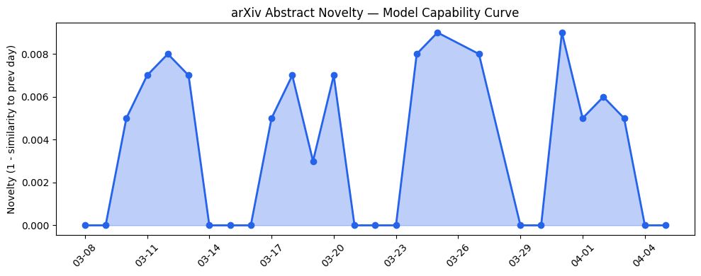
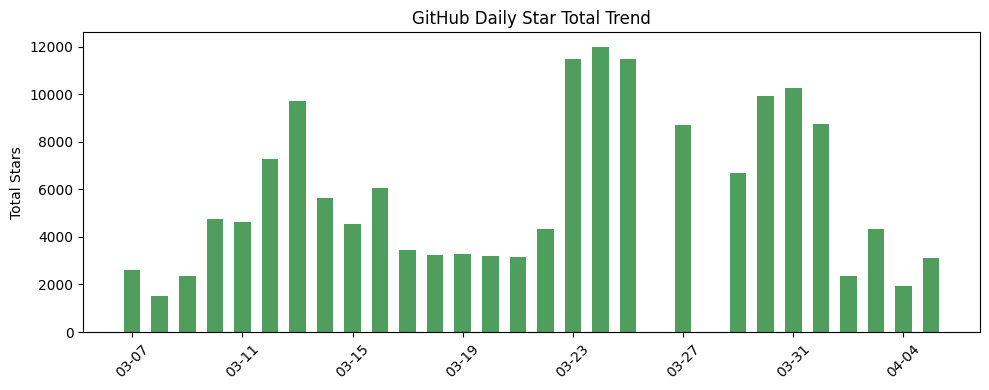
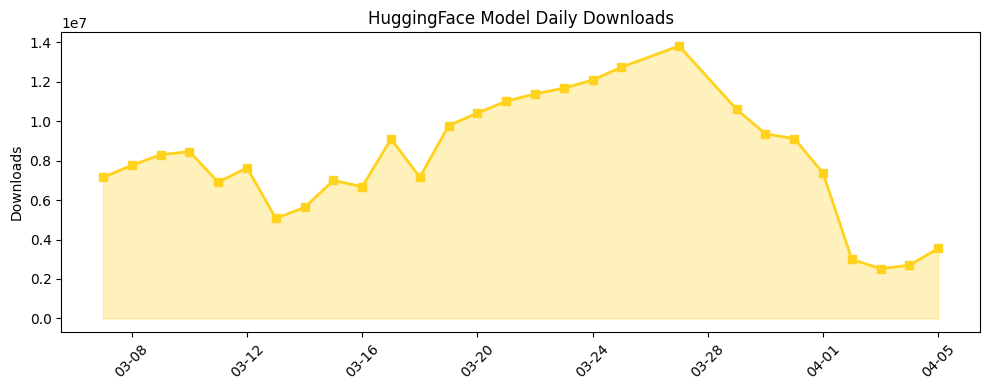

## 今日AI结构性变化

> 微软服务条款明确AI仅为娱乐用途，标志着企业开始系统性地规避AI应用责任风险，同时日本劳动力短缺正加速物理AI从试点走向实际部署。

今日AI产业格局正在经历责任风险与物理落地的双重转折点。微软在[Copilot服务条款](https://techcrunch.com/2026/04/05/copilot-is-for-entertainment-purposes-only-according-to-microsofts-terms-of-service/)中明确将AI定位为"仅供娱乐用途"，这是大型科技公司首次系统性地规避AI应用责任，可能重塑行业监管标准。与此同时，日本劳动力危机推动[物理AI在实际场景部署](https://techcrunch.com/2026/04/05/japan-is-proving-experimental-physical-ai-is-ready-for-the-real-world/)，标志着AI开始填补传统人力密集型岗位缺口。

📈 持续趋势：应用层话题持续升温（8天内5/7天递增）
🆕 新兴方向：技术层、基础设施、应用层、资本信号、风险信号均出现全新话题
🔑 新关键词：AI Liability、Physical AI、Orbital Data Centers、Labor Shortage

## 技术层信号

⚪ 无显著变化

今日技术层未见突破性进展，主要为开源框架和工具的持续迭代。[RAG-Anything框架](https://github.com/HKUDS/RAG-Anything)提供一体化RAG解决方案，[Gemma开源模型库](https://github.com/google-deepmind/gemma)和[OmniVoice语音合成管道](https://huggingface.co/k2-fsa/OmniVoice)均在现有技术范式内优化，未形成新的能力边界。趋势对比显示技术层出现全新话题（与历史最大相似度仅0.13），但今日具体表现尚未体现这一信号。

## 产业资本信号

🟡 中等信号

资本关注点正从纯软件AI向物理基础设施扩展。[SpaceX轨道数据中心概念](https://techcrunch.com/2026/04/05/can-orbital-data-centers-help-justify-a-massive-valuation-for-spacex/)被纳入估值考量，反映资本开始重视AI算力的空间布局创新。虽然目前仍处概念阶段，但这一方向可能为未来算力部署提供新范式。应用层资本流向显示[交易分析AI工具](https://github.com/atilaahmettaner/tradingview-mcp)等垂直领域持续获得关注，但整体投资规模未见显著放大。

## 潜在拐点判断

观察到两个潜在拐点：AI责任规避拐点和物理AI规模化拐点。微软的服务条款调整可能引发行业连锁反应，企业或将普遍采用类似责任限制策略，这将影响AI应用商业化路径。日本物理AI部署从实验走向实际生产环境，标志AI开始系统性替代人力短缺岗位，这一模式可能在老龄化经济体快速复制。

## 明日观察点

1. 其他科技巨头是否会跟进微软的责任规避策略，以及监管机构如何回应
2. 日本物理AI部署效果数据是否支撑更大规模推广
3. SpaceX轨道数据中心概念的技术可行性和资本反应

## 长期趋势坐标

从月度视角看，AI产业正从技术狂热转向务实落地。整体新颖度0.753显示今日话题组合与历史显著不同，关键词变化反映行业关注点从基础模型（Transformer、NLP等消退）转向应用风险（AI Liability新兴）和物理部署（Physical AI新兴）。日本劳动力短缺驱动的AI部署可能成为全球老龄化社会的样板，而责任规避趋势可能倒逼监管框架完善。

## 数据洞察

### arXiv 摘要对比 — 模型能力提升曲线
今日无arXiv摘要数据，无法评估最新研究进展。

### GitHub Star 增速分析
今日GitHub生态活跃度分化明显。[microsoft/agent-framework](https://github.com/microsoft/agent-framework)单日增长338星（增幅412%），显示智能体框架持续受捧，而[NousResearch/hermes-agent](https://github.com/NousResearch/hermes-agent)等成熟项目增长放缓。新仓库[RAG-Anything](https://github.com/HKUDS/RAG-Anything)、[gemma](https://github.com/google-deepmind/gemma)等反映开源社区对工具链完善的需求。

### HuggingFace 模型下载量变化
模型下载量单日达355万次，Gemma系列表现突出。[gemma-4-26B-A4B-it](https://huggingface.co/google/gemma-4-26B-A4B-it)下载量增长103.6%，显示开源中等规模模型需求旺盛。[OmniVoice](https://huggingface.co/k2-fsa/OmniVoice)语音模型增长95.9%，反映多模态应用持续升温。下载量前十中Gemma占据六席，开源模型生态呈现集中化趋势。

### 趋势图

## 参考来源

**论文与开源**
- [RAG-Anything: All-in-One RAG Framework](https://github.com/HKUDS/RAG-Anything) — GitHub
- [Gemma open-weight LLM library](https://github.com/google-deepmind/gemma) — GitHub
- [OmniVoice text-to-speech pipeline](https://huggingface.co/k2-fsa/OmniVoice) — HuggingFace
- [Advanced TradingView MCP Server for AI-powered market analysis](https://github.com/atilaahmettaner/tradingview-mcp) — GitHub

**公司动态**
- [Copilot is 'for entertainment purposes only,' according to Microsoft's terms of use](https://techcrunch.com/2026/04/05/copilot-is-for-entertainment-purposes-only-according-to-microsofts-terms-of-service/) — TechCrunch
- [In Japan, the robot isn’t coming for your job; it’s filling the one nobody wants](https://techcrunch.com/2026/04/05/japan-is-proving-experimental-physical-ai-is-ready-for-the-real-world/) — TechCrunch

**资本与行业**
- [Can orbital data centers help justify a massive valuation for SpaceX?](https://techcrunch.com/2026/04/05/can-orbital-data-centers-help-justify-a-massive-valuation-for-spacex/) — TechCrunch