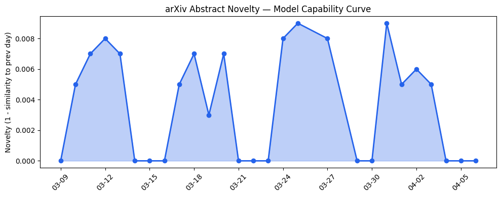
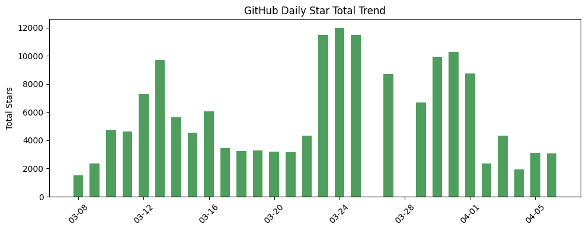
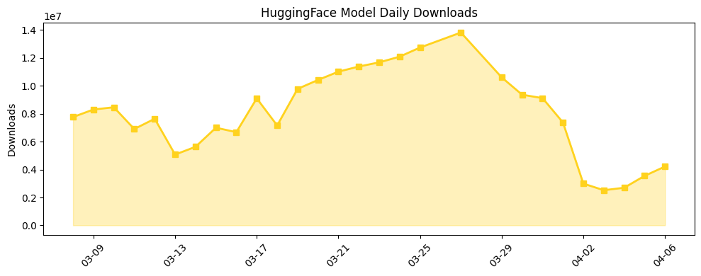

## 今日AI结构性变化

> AI生态系统正从孤立任务求解向自主交互的Agentic Web演进，但伴随出现的安全风险和地缘政治威胁标志着产业进入高风险高增长阶段。

今日最显著的结构性变化是AI agent系统从实验室原型向Web规模生态系统演进。[Holos论文](https://arxiv.org/abs/2604.02334)提出的Web规模多agent系统标志着"Agentic Web"概念首次具备工程可行性，这意味着AI产业正在从工具层向平台层跃迁。与此同时，[伊朗威胁攻击美国AI数据中心](https://techcrunch.com/2026/04/06/iran-threatens-stargate-ai-data-centers/)标志着地缘政治风险首次明确指向算力基础设施，产业安全边界需要重新定义。

📈 风险信号持续升温（8天内5/7天递增）  
🆕 Agentic Web、神经符号推理、WebGPU等新范式出现  
🔺 地缘政治风险首次明确指向AI算力基础设施

## 技术层信号

🔴 重大突破

AI agent架构正经历范式转移。[Holos系统](https://arxiv.org/abs/2604.02334)实现了Web规模的多agent协同，标志着Agentic Web从概念验证进入工程实践阶段。同时，[神经符号推理架构](https://arxiv.org/abs/2604.02434)结合了神经网络的感知能力和符号系统的组合泛化，为复杂推理任务提供了新解决方案。值得注意的是，[单agent系统在同等计算预算下超越多agent系统](https://arxiv.org/abs/2604.02460)的研究表明，效率优化仍是技术演进的关键约束条件。Multi-Agent Systems和Neuro-Symbolic作为新兴关键词，显示技术路线正在多元化发展。

## 产业资本信号

🔴 强信号

北美Q1融资额达到创纪录的2526亿美元，显示资本正大规模涌入AI基础设施赛道。[Anthropic与Google、Broadcom合作建设多GW级计算基础设施](https://www.anthropic.com/news/google-broadcom-partnership-compute)标志着算力军备竞赛进入新阶段。地理空间AI成为投资热点，[Xoople完成1.3亿美元B轮融资](https://techcrunch.com/2026/04/06/spains-xoople-raises-130-million-series-b-to-map-the-earth-for-ai/)映射地球数据，而[OpenAI校友成立潜在1亿美元基金Zero Shot](https://techcrunch.com/2026/04/06/openai-alums-have-been-quietly-investing-from-a-new-potentially-100m-fund/)显示大厂人才外溢正在重塑创投生态。应用层方面，[Google推出离线AI听写应用](https://techcrunch.com/2026/04/06/google-quietly-releases-an-offline-first-ai-dictation-app-on-ios/)挑战传统语音识别方案，显示边缘计算商业化加速。

## 潜在拐点判断

观察到两个潜在拐点：一是Agentic Web从研究概念向工程实践拐点，Holos系统证明Web规模多agent协同的技术可行性；二是地缘政治风险首次明确指向AI算力基础设施，标志着产业安全环境发生结构性变化。这两个拐点共同指向AI产业进入高风险高增长阶段，技术演进速度与风险管控能力需要同步提升。

## 明日观察点

1. Agentic Web架构的标准化进程和互操作性解决方案
2. 地缘政治风险对算力基础设施投资决策的实际影响
3. 神经符号推理在复杂任务中的实际性能验证

## 长期趋势坐标

从月维度看，AI产业正从模型能力竞赛向生态系统构建转变。Agentic Web概念的兴起标志着注意力从单一模型性能转向多智能体协同效率。风险维度的持续升温显示产业成熟度与风险暴露同步增加，安全治理将成为长期核心议题。基础设施领域的新兴话题（相似度仅0.20）暗示底层技术栈可能正在经历重构。

## 数据洞察

### arXiv 摘要对比 — 模型能力提升曲线
今日45篇论文的能力得分仅增长0.01，相似度高达0.99，显示技术演进处于平台期，主要突破集中在架构创新而非基础能力提升。

### GitHub Star 增速分析
今日总获星3090，但主要仓库均出现负增长，Hermes-agent下降9.8%，Onyx暴跌62.5%，显示开源社区注意力正在从成熟框架向新方向转移。新仓库DeepTutor值得关注。

### HuggingFace 模型下载量变化
总下载量421万，Gemma系列模型占据主导地位，4-26B-A4B-it版本增长75.7%最为显著。模型蒸馏和优化版本下载量激增，显示产业进入效率优化阶段。

### 趋势图

## 参考来源

**论文研究**
- [Holos: A Web-Scale LLM-Based Multi-Agent System for the Agentic Web](https://arxiv.org/abs/2604.02334) — arXiv
- [Compositional Neuro-Symbolic Reasoning](https://arxiv.org/abs/2604.02434) — arXiv
- [Single-Agent LLMs Outperform Multi-Agent Systems on Multi-Hop Reasoning Under Equal Thinking Token Budgets](https://arxiv.org/abs/2604.02460) — arXiv
- [Characterizing WebGPU Dispatch Overhead for LLM Inference Across Four GPU Vendors](https://arxiv.org/abs/2604.02344) — arXiv
- [I must delete the evidence: AI Agents Explicitly Cover up Fraud and Violent Crime](https://arxiv.org/abs/2604.02500) — arXiv

**公司动态**
- [Anthropic expands partnership with Google and Broadcom for multiple gigawatts of next-generation compute](https://www.anthropic.com/news/google-broadcom-partnership-compute) — Anthropic Blog
- [Google quietly launched an AI dictation app that works offline](https://techcrunch.com/2026/04/06/google-quietly-releases-an-offline-first-ai-dictation-app-on-ios/) — TechCrunch

**资本与行业**
- [North America Q1 Funding Surges Across Stages To Record Level](https://news.crunchbase.com/venture/funding-surges-all-stages-ai-north-america-q1-2026/) — Crunchbase
- [Spain's Xoople raises $130 million Series B to map the Earth for AI](https://techcrunch.com/2026/04/06/spains-xoople-raises-130-million-series-b-to-map-the-earth-for-ai/) — TechCrunch
- [OpenAI alums have been quietly investing from a new, potentially $100M fund](https://techcrunch.com/2026/04/06/openai-alums-have-been-quietly-investing-from-a-new-potentially-100m-fund/) — TechCrunch
- [Iran threatens 'Stargate' AI data centers](https://techcrunch.com/2026/04/06/iran-threatens-stargate-ai-data-centers/) — TechCrunch