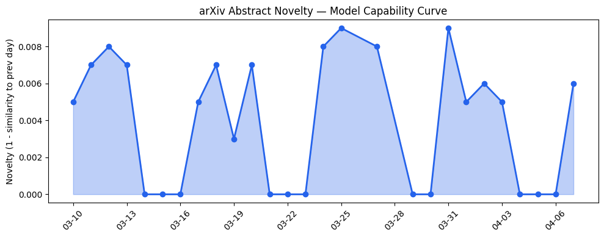
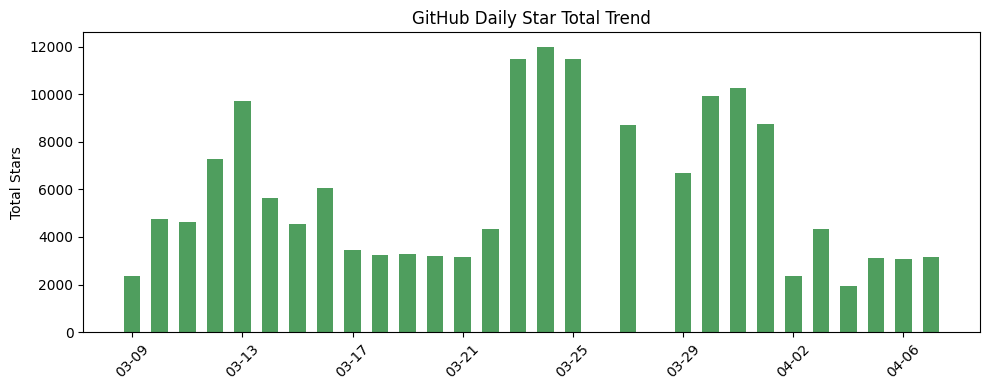
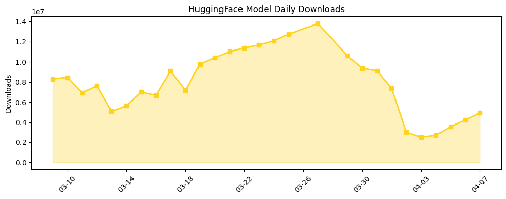

## 今日AI结构性变化

> AI产业格局正从模型能力竞赛转向基础设施军备竞赛，资本密集投入驱动计算效率优化成为核心战场。

今天最显著的结构性变化是AI基础设施投资加速，数据中心建设和芯片合作成为竞争焦点。NVIDIA投资Firmus使其估值达到55亿美元，Anthropic扩大与Google/Broadcom的TPU合作，Uber转向Amazon AI芯片，这一系列动作表明算力供给已成为制约AI发展的瓶颈。同时，模型压缩和推理优化技术密集出现，反映产业正从追求模型规模转向追求部署效率。

📈 持续趋势：应用层和资本信号连续8天增强  
🆕 新兴方向：技术层和资本信号出现全新话题  
🔺 突然升温：Ternary Networks、TPU、Firmus等关键词首次出现  
📉 消退关键词：AI安全、开源生态、自然语言处理等传统议题关注度下降

## 技术层信号

🟡 渐进改善

模型能力边界虽无重大突破，但推理效率优化技术密集涌现。[SoLA](https://arxiv.org/abs/2604.03258)结合软激活稀疏性和低秩分解实现LLM压缩，[Knowledge Packs](https://arxiv.org/abs/2604.03270)通过预计算KV缓存实现零token知识传递，[NativeTernary](https://arxiv.org/abs/2604.03336)为三元神经网络权重设计原生编码方案。这些技术共同指向一个趋势：产业正从模型能力竞赛转向部署效率竞赛，计算成本优化成为技术演进的主要驱动力。Ternary Networks等新范式的出现表明硬件友好型算法设计正在获得更多关注。

## 产业资本信号

🔴 强信号

基础设施投资成为资本追逐焦点，[Firmus融资13.5亿美元估值达55亿美元](https://techcrunch.com/2026/04/07/firmus-the-southgate-ai-datacenter-builder-backed-by-nvidia-hits-5-5b-valuation/)反映AI基础设施稀缺性。私人财富直接参与早期AI投资，家族办公室绕过VC直接投资初创公司，显示资本对AI长期价值的认可。[Anthropic深化与Google/Broadcom的TPU合作](https://techcrunch.com/2026/04/07/anthropic-compute-deal-google-broadcom-tpus/)和[Intel加入Musk的Terafab项目](https://techcrunch.com/2026/04/07/intel-signs-on-to-elon-musks-terafab-chips-project/)表明大厂正通过战略合作确保算力供给。

## 潜在拐点判断

观察到AI投资模式拐点：私人财富直接参与早期投资可能改变传统VC主导的融资生态。基础设施公司估值飙升（Firmus 55亿美元）标志算力供给从成本中心转向价值创造中心。芯片合作模式从采购关系转向深度战略合作，可能重塑产业链分工格局。

## 明日观察点

1. 更多基础设施投资案例是否出现，验证今日趋势的持续性
2. 模型压缩技术是否开始影响主流产品部署策略
3. 私人资本直接参与AI投资是否成为普遍现象

## 长期趋势坐标

从月维度看，AI产业正经历从软件创新向硬件基础设施的重心转移。资本持续8天关注应用层和资本信号，表明商业化落地和投资回报成为核心考量。基础设施投资升温与模型压缩技术突破形成协同，指向产业进入效率优化阶段。关键词趋势显示传统AI安全、开源生态议题关注度下降，产业资源向能产生直接商业价值的方向集中。

## 数据洞察

### arXiv 摘要对比 — 模型能力提升曲线
今日arXiv论文能力得分0.008，与历史均值相似度0.992，技术演进呈现延续性特征。45篇论文中模型压缩和推理优化占比显著，反映研究重点从能力突破转向效率优化。

### GitHub Star 增速分析
今日新增stars 3152，[HKUDS/DeepTutor](https://github.com/HKUDS/DeepTutor)增长58.4%表现突出，新repo [HKUDS/AutoAgent](https://github.com/HKUDS/AutoAgent)显示智能体方向持续受关注。[NousResearch/hermes-agent](https://github.com/NousResearch/hermes-agent)增长33.4%验证应用层热度。

### HuggingFace 模型下载量变化
总下载量494万，Gemma系列模型占据主导，[google/gemma-4-31B-it](https://huggingface.co/google/gemma-4-31B-it)下载88.4万次。模型优化版本如[dealignai/Gemma-4-31B-JANG_4M-CRACK](https://huggingface.co/dealignai/Gemma-4-31B-JANG_4M-CRACK)增长115%最快，反映市场对部署友好型模型的需求。

### 趋势图

## 参考来源

**论文**
- [SoLA: Leveraging Soft Activation Sparsity and Low-Rank Decomposition for Large Language Model Compression](https://arxiv.org/abs/2604.03258) — arXiv cs.CL
- [Knowledge Packs: Zero-Token Knowledge Delivery via KV Cache Injection](https://arxiv.org/abs/2604.03270) — arXiv cs.CL
- [NativeTernary: A Self-Delimiting Binary Encoding for Ternary Neural Network Weights](https://arxiv.org/abs/2604.03336) — arXiv cs.LG
- [Toward Full Autonomous Laboratory Instrumentation Control with Large Language Models](https://arxiv.org/abs/2604.03286) — arXiv cs.AI
- [Integrating Artificial Intelligence, Physics, and Internet of Things: A Framework for Cultural Heritage Conservation](https://arxiv.org/abs/2604.03233) — arXiv cs.LG

**公司动态**
- [Firmus, the 'Southgate' AI data center builder backed by Nvidia, hits $5.5B valuation](https://techcrunch.com/2026/04/07/firmus-the-southgate-ai-datacenter-builder-backed-by-nvidia-hits-5-5b-valuation/) — TechCrunch AI
- [Anthropic ups compute deal with Google and Broadcom amid skyrocketing demand](https://techcrunch.com/2026/04/07/anthropic-compute-deal-google-broadcom-tpus/) — TechCrunch AI
- [Uber is the latest to be won over by Amazon's AI chips](https://techcrunch.com/2026/04/07/uber-is-the-latest-to-be-won-over-by-amazons-ai-chips/) — TechCrunch AI
- [Intel signs on to Elon Musk's Terafab chips project](https://techcrunch.com/2026/04/07/intel-signs-on-to-elon-musks-terafab-chips-project/) — TechCrunch AI

**开源生态**
- [HKUDS/DeepTutor](https://github.com/HKUDS/DeepTutor) — GitHub
- [NousResearch/hermes-agent](https://github.com/NousResearch/hermes-agent) — GitHub
- [HKUDS/AutoAgent](https://github.com/HKUDS/AutoAgent) — GitHub

**资本与行业**
- [The AI gold rush is pulling private wealth into riskier, earlier bets](https://techcrunch.com/2026/04/07/the-ai-gold-rush-is-pulling-private-wealth-into-riskier-earlier-bets/) — TechCrunch AI
- [AI startup Rocket offers vibe McKinsey-style reports at a fraction of the cost](https://techcrunch.com/2026/04/06/indian-startup-rocket-wants-its-ai-to-do-mckinsey-style-consulting-at-a-fraction-of-the-cost/) — TechCrunch AI