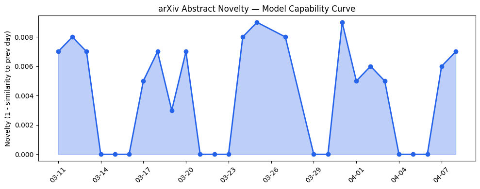
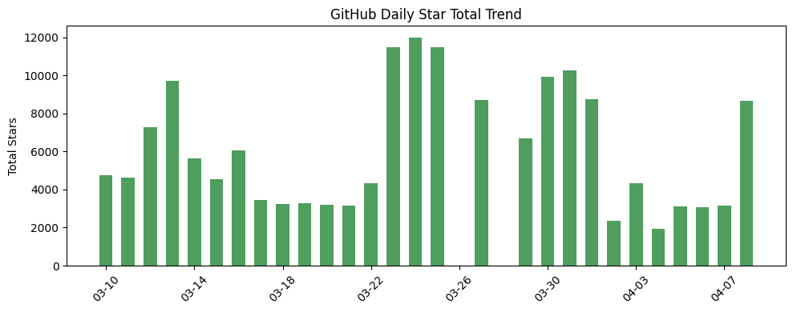
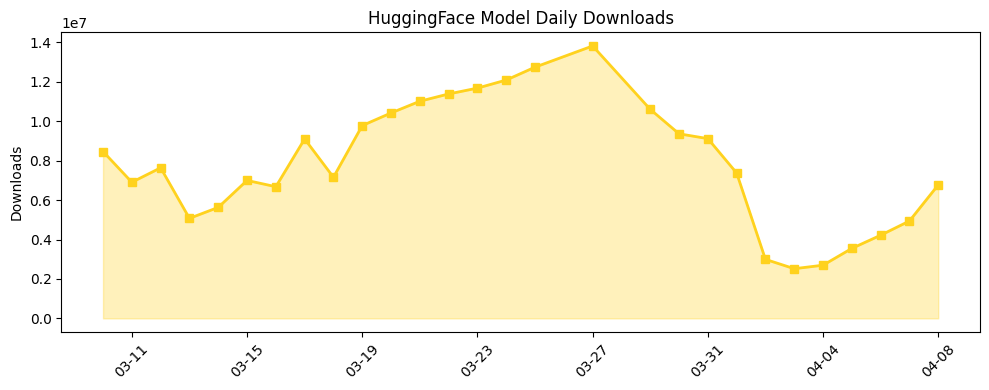

## 今日AI结构性变化

> AI智能体基础设施正达到生产就绪的成熟度，企业级解决方案加速落地，而研究重点转向提升推理可靠性和训练效率。

这意味着AI产业正从模型能力竞赛转向系统级工程化部署。企业级AI解决方案不再是概念验证，而是开始深度集成到核心工作流中。📈 应用层持续升温、🆕 内存管理/推测采样等新关键词涌现、🔺 多智能体系统在专业领域深化应用。

## 技术层信号

🟡 渐进改善

模型能力边界在专业领域持续扩展，[MedGemma 1.5](https://arxiv.org/abs/2604.05081)支持CT/MRI体积数据和病理切片分析，标志着多模态医疗AI向临床实用化迈进。更关键的是，研究重点明显转向推理可靠性和训练效率——[Cactus的约束接受推测采样](https://arxiv.org/abs/2604.04987)优化自回归解码效率，[MegaTrain](https://arxiv.org/abs/2604.05091)实现单GPU训练100B+参数模型，显示产业正系统性地解决规模化部署的瓶颈问题。多智能体框架在化学合成([MMORF](https://arxiv.org/abs/2604.05075))和学术写作([PaperOrchestra](https://arxiv.org/abs/2604.05018))的专业应用，表明智能体技术开始渗透高价值工作流。

## 产业资本信号

🟡 中等信号

资本布局呈现明显的生态化特征，[AWS同时投资Anthropic和OpenAI](https://techcrunch.com/2026/04/08/aws-boss-explains-why-investing-billions-in-both-anthropic-and-openai-is-an-ok-conflict/)显示云厂商不再押注单一模型提供商，而是构建完整的AI服务栈。企业市场成为竞争焦点，[OpenAI推出企业AI新阶段](https://openai.com/index/next-phase-of-enterprise-ai)，[Atlassian在Confluence集成第三方智能体](https://techcrunch.com/2026/04/08/atlassian-confluence-visual-ai-tools-agents/)，表明AI正从工具级应用转向平台级集成。开源项目[mem0](https://github.com/mem0ai/mem0)获得关注，反映智能体内存管理这一基础设施层开始标准化。

## 潜在拐点判断

观察到智能体技术从实验室到企业生产环境的拐点迹象。证据包括：多智能体系统在化学合成、学术写作等专业领域的具体应用落地；企业软件平台开始原生集成智能体功能；推理效率和训练成本的技术突破降低了部署门槛。这一拐点意味着AI价值创造从模型能力展示转向实际工作流优化。

## 明日观察点

1. 企业级AI智能体部署案例是否从试点扩展到核心业务系统
2. 多智能体系统在专业领域的性能指标和ROI数据披露
3. 推理加速和训练优化技术的实际落地效果验证

## 长期趋势坐标

从月度视角看，应用层话题持续升温（最近8天5/7天递增），表明AI价值实现的重心正从技术研发转向产业落地。企业AI、多智能体系统、训练效率等关键词的新增，与AI安全、联邦学习等话题的消退形成对比，反映产业关注点从技术可行性转向规模化部署。整体新颖度0.576显示今日变化属于渐进式改善而非颠覆性突破，符合技术成熟曲线中期的特征。

## 数据洞察

### arXiv 摘要对比 — 模型能力提升曲线
能力得分0.009，平均相似度0.991，趋势为"延续"，显示技术演进保持稳定节奏。今日45篇论文中，医疗多模态、推理可靠性和训练效率成为主要研究方向，符合产业从追求参数规模转向实用化的趋势。

### GitHub Star 增速分析
今日总star数8649，8个仓库中有2个新仓库([mem0ai/mem0](https://github.com/mem0ai/mem0)、[HKUDS/AI-Trader](https://github.com/HKUDS/AI-Trader))。增长最快的[tradingview-mcp](https://github.com/atilaahmettaner/tradingview-mcp)增长1052.6%，反映交易自动化需求旺盛；[NousResearch/hermes-agent](https://github.com/NousResearch/hermes-agent)增长126.2%，显示智能体框架持续受关注。

### HuggingFace 模型下载量变化
总下载量677万次，Gemma系列模型占据主导地位。增长最快的[VoxCPM2](https://huggingface.co/openbmb/VoxCPM2)增长369%，显示语音模型需求上升；Gemma-4系列模型普遍增长25-50%，反映31B参数级别模型成为实用化部署的主流选择。

## 参考来源

**论文**
- [MedGemma 1.5 Technical Report](https://arxiv.org/abs/2604.05081) — arXiv
- [MMORF: A Multi-agent Framework for Designing Multi-objective Retrosynthesis Planning Systems](https://arxiv.org/abs/2604.05075) — arXiv
- [PaperOrchestra: A Multi-Agent Framework for Automated AI Research Paper Writing](https://arxiv.org/abs/2604.05018) — arXiv
- [Cactus: Accelerating Auto-Regressive Decoding with Constrained Acceptance Speculative Sampling](https://arxiv.org/abs/2604.04987) — arXiv
- [MegaTrain: Full Precision Training of 100B+ Parameter Large Language Models on a Single GPU](https://arxiv.org/abs/2604.05091) — arXiv

**公司动态**
- [The next phase of enterprise AI](https://openai.com/index/next-phase-of-enterprise-ai) — OpenAI Blog
- [Introducing Muse Spark: Scaling Towards Personal Superintelligence](https://ai.meta.com/blog/introducing-muse-spark-msl/) — Meta AI Blog
- [Introducing the Child Safety Blueprint](https://openai.com/index/introducing-child-safety-blueprint) — OpenAI Blog

**开源生态**
- [mem0ai / mem0: Universal memory layer for AI Agents](https://github.com/mem0ai/mem0) — GitHub
- [AI-Trader: 100% Fully-Automated Agent-Native Trading](https://github.com/HKUDS/AI-Trader) — GitHub
- [NousResearch/hermes-agent](https://github.com/NousResearch/hermes-agent) — GitHub

**资本与行业**
- [AWS boss explains why investing billions in both Anthropic and OpenAI is an OK conflict](https://techcrunch.com/2026/04/08/aws-boss-explains-why-investing-billions-in-both-anthropic-and-openai-is-an-ok-conflict/) — TechCrunch
- [Atlassian launches visual AI tools and third-party agents in Confluence](https://techcrunch.com/2026/04/08/atlassian-confluence-visual-ai-tools-agents/) — TechCrunch
- [Tubi is the first streamer to launch a native app within ChatGPT](https://techcrunch.com/2026/04/08/tubi-is-the-first-streamer-to-launch-a-native-app-within-chatgpt/) — TechCrunch