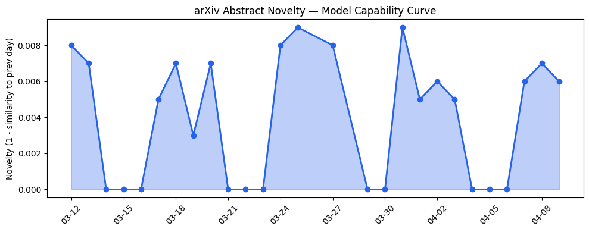
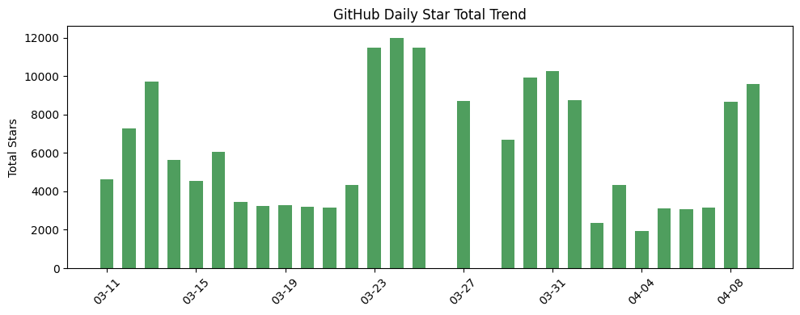
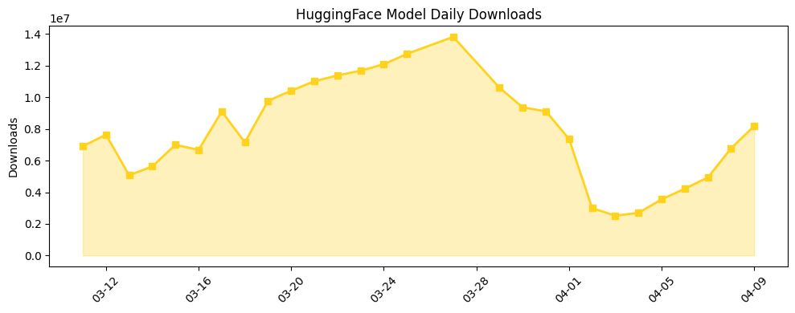

## 今日AI结构性变化

> AI agent基础设施成熟度显著提升，但监管风险集中爆发，OpenAI面临首次重大法律挑战。

今天标志着AI产业从技术探索向系统化部署的关键转折。一方面，[Qualixar OS](https://arxiv.org/abs/2604.06392)首次提出应用层操作系统概念，统一多LLM提供商、多框架的异构多智能体系统编排，意味着AI Agent基础设施正在从工具集向平台化操作系统演进。另一方面，佛罗里达州总检察长对OpenAI的调查开创了AI公司法律责任的先例，监管风险从理论担忧变为现实威胁。

📈 持续趋势：应用层话题持续升温（8天递增）  
🆕 新兴方向：技术层和基础设施出现全新话题（相似度仅0.23/0.22）  
🔺 突然升温：AI Agents关键词热度上升  
📉 消退关键词：自然语言处理、Transformer等基础技术关注度下降

## 技术层信号

🟡 渐进改善

模型能力边界没有显著突破，但可靠性技术持续改进成为焦点。[Weakly Supervised Distillation](https://arxiv.org/abs/2604.06277)将幻觉检测信号蒸馏到Transformer表示中，[ProofSketcher](https://arxiv.org/abs/2604.06401)采用LLM+轻量证明检查器的混合架构提升数学逻辑推理可靠性，反映产业从追求性能极限转向确保输出可信度。技术层出现全新话题信号表明，AI Agent操作系统等系统级创新正在形成新的技术范式，而不仅仅是模型层面的渐进优化。参数高效微调技术如[TalkLoRA](https://arxiv.org/abs/2604.06291)优化通信感知的LoRA混合适配，支撑多智能体系统的实际部署需求。

## 产业资本信号

🟡 中等信号

资本继续向垂直行业AI应用集中，税务自动化初创公司[Juno](https://news.crunchbase.com/fintech/cpa-founded-ai-tax-return-startup-juno-seed-funding/)获1200万美元种子轮，反映专业服务自动化成为投资热点。OpenAI推出100美元/月Pro计划填补价格空白，Meta AI应用排名快速上升至AppStore第五，显示消费级AI应用竞争加剧。同时，Mercor数据泄露后估值挑战表明AI初创公司风险开始暴露，资本对安全性和合规性要求提高。基础设施层面，Google-Intel深化合作应对全球CPU短缺，亚马逊CEO公开挑战Nvidia，芯片供应链竞争格局正在重构。

## 潜在拐点判断

观察到两个潜在拐点：一是AI Agent从工具级向操作系统级演进，Qualixar OS可能成为类似Android的生态基石；二是AI监管从立法讨论进入执法实践，OpenAI调查案可能确立AI公司产品责任边界。这两个拐点分别代表技术成熟度和产业规范化的临界点，将深刻影响未来3-5年的产业格局。

## 明日观察点

1. 佛罗里达州调查的法律论据和行业反应，特别是其他AI公司的风险评估调整
2. Qualixar OS开源生态的早期采用者反馈和开发者社区建设进展  
3. 垂直行业AI应用融资是否延续强劲势头，特别是受监管行业如金融、医疗的合规解决方案

## 长期趋势坐标

从月度视角看，AI产业正在经历从模型中心化向应用生态化的结构性转变。技术层的新兴话题信号表明，系统级创新（如Agent操作系统）开始获得与模型架构同等重要的关注度。应用层持续升温反映AI正加速渗透专业领域，从金融[Kronos](https://github.com/shiyu-coder/Kronos)到医疗GLP-1RA分析，垂直行业解决方案成为增长主力。监管风险的实质性出现将推动产业从野蛮生长向规范发展过渡，合规能力和风险管理成为核心竞争力。

## 数据洞察

### arXiv 摘要对比 — 模型能力提升曲线
今日arXiv论文能力得分0.008，与历史均值相似度0.992，显示技术演进保持连续性。45篇论文中可靠性增强技术占比显著，反映研究重点从性能突破转向实用化保障。

### GitHub Star 增速分析
今日总获星9603，9个仓库中有3个新仓库上榜。[NousResearch/hermes-agent](https://github.com/NousResearch/hermes-agent)增长17.8%领跑，Agent框架持续受关注。新仓库[Kronos](https://github.com/shiyu-coder/Kronos)（金融市场基础模型）和[dflash](https://github.com/z-lab/dflash)（推理优化）体现金融AI和效率优化两大趋势。

### HuggingFace 模型下载量变化
总下载量818万，Gemma系列模型占据下载榜前列。[zai-org/GLM-5.1](https://huggingface.co/zai-org/GLM-5.1)增长551%最快，显示中文模型需求强劲。模型下载分布反映产业从通用基座模型向专业领域模型扩散的趋势。

### 趋势图

## 参考来源

**论文**
- [Qualixar OS: A Universal Operating System for AI Agent Orchestration](https://arxiv.org/abs/2604.06392) — arXiv
- [Weakly Supervised Distillation of Hallucination Signals into Transformer Representations](https://arxiv.org/abs/2604.06277) — arXiv
- [ProofSketcher: Hybrid LLM + Lightweight Proof Checker for Reliable Math/Logic Reasoning](https://arxiv.org/abs/2604.06401) — arXiv

**公司动态**
- [Florida AG announces investigation into OpenAI over shooting that allegedly involved ChatGPT](https://techcrunch.com/2026/04/09/florida-ag-investigation-openai-chatgpt-shooting/) — TechCrunch
- [Sierra's Bret Taylor says the era of clicking buttons is over](https://techcrunch.com/2026/04/09/sierras-bret-taylor-says-the-era-of-clicking-buttons-is-over/) — TechCrunch
- [ChatGPT finally offers $100/month Pro plan](https://techcrunch.com/2026/04/09/chatgpt-pro-plan-100-month-codex/) — TechCrunch

**开源生态**
- [Kronos: A Foundation Model for the Language of Financial Markets](https://github.com/shiyu-coder/Kronos) — GitHub
- [DFlash: Block Diffusion for Flash Speculative Decoding](https://github.com/z-lab/dflash) — GitHub
- [TalkLoRA: Communication-Aware Mixture of Low-Rank Adaptation for Large Language Models](https://arxiv.org/abs/2604.06291) — arXiv

**资本与行业**
- [Exclusive: Juno, CPA-Founded Startup That Aims To Make Tax Returns Less Painful With AI, Raises $12M](https://news.crunchbase.com/fintech/cpa-founded-ai-tax-return-startup-juno-seed-funding/) — Crunchbase
- [Google and Intel deepen AI infrastructure partnership](https://techcrunch.com/2026/04/09/google-and-intel-deepen-ai-infrastructure-partnership/) — TechCrunch
- [Meta AI app climbs to No. 5 on the App Store after Muse Spark launch](https://techcrunch.com/2026/04/09/meta-ai-app-climbs-to-no-5-on-the-app-store-after-muse-spark-launch/) — TechCrunch