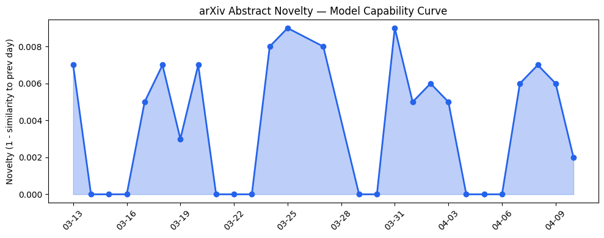
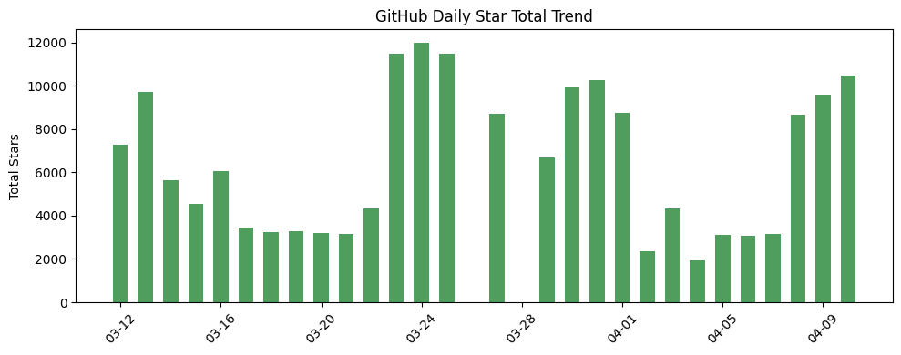
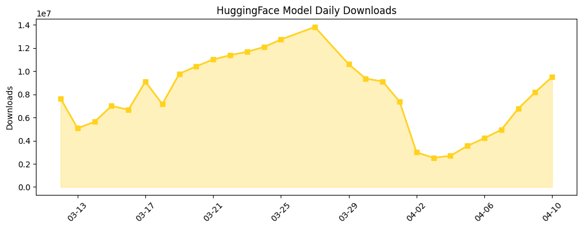

## 今日AI结构性变化

> AI产业正从模型能力扩展转向推理稳定性、边缘部署效率和跨模态连续性的系统性优化，同时产品安全责任风险开始显现。

今日最显著的结构性变化是技术焦点从"更大更强"转向"更稳更轻"。📈 持续趋势的技术层、基础设施和风险信号在最近8天内持续升温，🔺 突然升温的RAG技术显示检索增强生成正成为主流范式，🆕 新兴方向包括AI连续性评估(ATANT)、边缘计算和轻量级路由引擎(AgentGate)。这意味着AI产业进入成熟期，企业不再盲目追求参数规模，而是关注实际部署中的稳定性、成本控制和长期可用性。

## 技术层信号

🟡 渐进改善

技术层出现显著范式转变：[Reasoning Fails Where Step Flow Breaks](https://arxiv.org/abs/2604.06695)等论文不再追求推理能力边界扩展，而是深入分析长推理链的稳定性问题，标志着模型开发从"能做"转向"能稳定做"。同时，[ATANT](https://arxiv.org/abs/2604.06710)提出AI连续性评估框架，强调跨时间上下文保持能力，这对企业级应用至关重要。[AgentGate](https://arxiv.org/abs/2604.06696)的轻量级路由引擎构建了"Agent互联网"新范式，为多智能体系统的大规模部署奠定基础。技术层话题向量在最近8天持续增强，且出现全新话题(相似度仅0.22)，表明这是一个真正的范式转变而非短期热点。

## 产业资本信号

⚪ 弱信号

今日资本层面相对平静，[Crunchbase报道](https://news.crunchbase.com/venture/biggest-funding-rounds-chips-aviation-biotech-sifive/)显示资金向芯片设计(SiFive)、航空、生物技术等传统硬科技集中，AI领域无突出融资事件。这种资本静默期可能意味着投资者正在观望技术层的新范式如何转化为商业价值，或者等待边缘计算等新兴方向出现明确的领头羊。基础设施层面的轻量化趋势虽然明确，但尚未引发大规模投资热潮。

## 潜在拐点判断

观察到两个潜在拐点：一是AI产品责任风险拐点，[OpenAI被起诉案件](https://techcrunch.com/2026/04/10/stalking-victim-sues-openai-claims-chatgpt-fueled-her-abusers-delusions-and-ignored-her-warnings/)可能开启AI公司对用户生成内容承担直接责任的新时代；二是边缘AI部署拐点，多篇论文同时聚焦资源感知知识蒸馏和客户端优化，表明边缘部署从理论探索进入工程实践阶段。这两个拐点分别对应风险管控和商业化落地两个关键维度。

## 明日观察点

1. 关注OpenAI诉讼案的司法进展及其对行业安全标准的潜在影响
2. 观察边缘计算相关论文是否引发硬件厂商或云服务商的战略调整
3. 监测轻量级路由引擎(AgentGate)概念在开源社区的采纳速度

## 长期趋势坐标

从月维度看，AI产业正经历从"模型中心化"向"部署分布式"的结构性转变。整体新颖性得分0.614表明今日变化具有中等创新性，但连续性评估(ATANT)、边缘计算等新关键词的出现预示季度级别的趋势形成。消退关键词如Transformer、自然语言处理显示基础架构技术讨论趋于成熟，产业焦点转向应用层优化和风险管理。

## 数据洞察

### arXiv 摘要对比 — 模型能力提升曲线
能力得分仅0.008，平均相似度0.992，显示今日论文主要是在现有能力框架内进行优化而非突破。45篇论文中绝大多数关注推理稳定性、部署效率等工程问题，符合技术层从扩张转向优化的整体趋势。

### GitHub Star 增速分析
今日总星数10488，[Kronos](https://github.com/shiyu-coder/Kronos)以170%增速领先，[hermes-agent](https://github.com/NousResearch/hermes-agent)保持稳定增长，而多个交易相关项目出现大幅下滑，显示开发者兴趣从金融应用转向基础架构工具。

### HuggingFace 模型下载量变化
总下载量950万次，Gemma系列模型占据主导地位，下载量增长普遍在20-30%之间。[VoxCPM2](https://huggingface.co/openbmb/VoxCPM2)以107%增速领先，语音模型需求开始显现。模型下载的稳定增长表明产业应用持续深化。

### 趋势图

## 参考来源

**论文研究**
- [Reasoning Fails Where Step Flow Breaks](https://arxiv.org/abs/2604.06695) — arXiv
- [AgentGate: A Lightweight Structured Routing Engine for the Internet of Agents](https://arxiv.org/abs/2604.06696) — arXiv
- [ATANT: An Evaluation Framework for AI Continuity](https://arxiv.org/abs/2604.06710) — arXiv
- [KD-MARL: Resource-Aware Knowledge Distillation in Multi-Agent Reinforcement Learning](https://arxiv.org/abs/2604.06691) — arXiv

**公司动态**
- [ChatGPT for sales teams](https://openai.com/academy/sales) — OpenAI Blog
- [Stalking victim sues OpenAI, claims ChatGPT fueled her abuser's delusions](https://techcrunch.com/2026/04/10/stalking-victim-sues-openai-claims-chatgpt-fueled-her-abusers-delusions-and-ignored-her-warnings/) — TechCrunch
- [Anthropic temporarily banned OpenClaw's creator from accessing Claude](https://techcrunch.com/2026/04/10/anthropic-temporarily-banned-openclaws-creator-from-accessing-claude/) — TechCrunch

**开源生态**
- [Kronos](https://github.com/shiyu-coder/Kronos) — GitHub
- [hermes-agent](https://github.com/NousResearch/hermes-agent) — GitHub
- [Gemma系列模型](https://huggingface.co/models?search=gemma) — HuggingFace

**资本与行业**
- [The Week's 10 Biggest Funding Rounds: SiFive Leads With $400M For Custom Chip Designs](https://news.crunchbase.com/venture/biggest-funding-rounds-chips-aviation-biotech-sifive/) — Crunchbase News