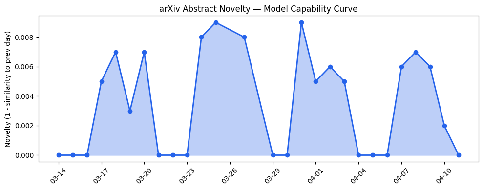
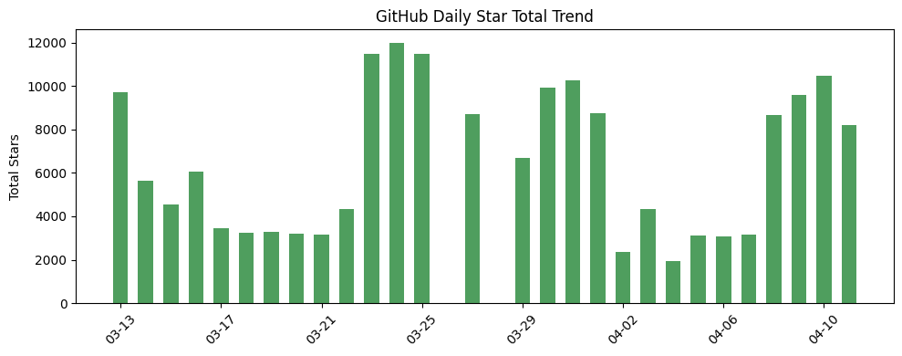
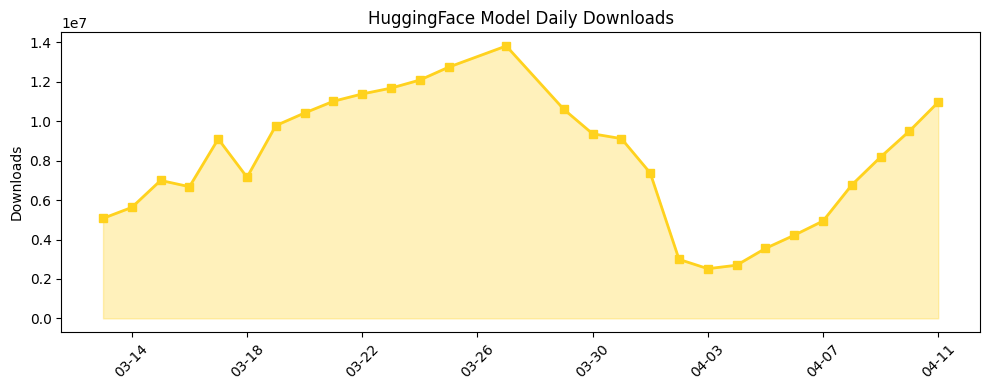

## 今日AI结构性变化

> OpenAI通过系统化的行业应用指南发布，标志着AI正从通用工具向垂直行业深度渗透的结构性转变。

今日最显著的结构性变化是AI产业从技术竞赛阶段正式进入行业落地阶段。OpenAI一次性发布医疗、金融、营销等六大领域的应用指南，特别是[医疗领域的HIPAA合规指南](https://openai.com/academy/healthcare)，表明AI巨头正主动推动技术向高价值、高壁垒的垂直行业渗透。这意味着AI产业格局正在从"谁能做出最强模型"转向"谁能最好地解决行业问题"。

📈 持续趋势：基础设施、资本信号、风险信号话题持续升温
🆕 新兴方向：技术层、应用层、资本信号、风险信号均出现全新话题

## 技术层信号

⚪ 无显著变化

今日无新的模型能力突破，技术层面保持稳定。OpenAI发布的行业应用指南主要围绕现有技术能力展开，显示当前AI产业正进入技术消化和应用优化阶段。趋势对比报告显示技术层出现全新话题（相似度仅0.17），可能预示着新的技术方向正在酝酿。

## 产业资本信号

⚪ 弱信号

今日无明确的融资或投资动态，资本层面相对平静。然而趋势数据显示资本信号话题在最近8天持续升温，且出现全新话题（相似度0.19），暗示资本可能正在重新评估AI投资策略，从通用模型转向垂直应用。

## 潜在拐点判断

观察到行业应用渗透的加速拐点。OpenAI系统性地发布六大行业指南，特别是医疗领域的HIPAA合规方案，表明AI正从实验性应用转向企业级部署。这一拐点的影响在于：垂直行业的专业知识和合规要求将成为新的竞争壁垒，通用模型厂商需要与行业专家深度合作才能实现真正的商业价值。

## 明日观察点

1. 关注其他AI厂商是否跟进发布类似行业指南，验证行业渗透是否成为普遍趋势
2. 观察医疗、金融等垂直领域企业的AI部署进展，特别是合规要求的实际落地情况
3. 监测供应链安全事件的后续影响，评估AI开发生态的安全加固需求

## 长期趋势坐标

从月度视角看，AI产业正经历从技术驱动向应用驱动的结构性转型。新兴关键词如"Industry Adoption"、"Workflow Automation"、"Personalization"显示企业级应用正在成为主流。同时，"Supply Chain Security"的凸显表明随着AI渗透加深，安全性和可靠性问题日益重要。传统技术关键词如"Transformer"、"自然语言处理"正在淡出，产业关注点明显向实际价值创造转移。

## 数据洞察

### arXiv 摘要对比 — 模型能力提升曲线
今日暂无数据

### GitHub Star 增速分析
今日GitHub生态呈现分化态势：总新增8204星，但主要项目增长乏力。shiyu-coder/Kronos小幅增长0.8%，而NousResearch/hermes-agent等知名项目出现负增长。新仓库Arindam200/awesome-ai-apps等显示开发者兴趣正向应用层转移。

### HuggingFace 模型下载量变化
HuggingFace下载量达1096万次，Google Gemma系列模型占据主导地位。增长最快的是openbmb/VoxCPM2（增长52%）和zai-org/GLM-5.1（增长50.6%），显示语音和多模态模型需求上升。Gemma-4-31B-it单日下载202万次，反映企业级大模型部署加速。

### 趋势图

## 参考来源

**论文与研究报告**
- 无今日新增

**公司动态**
- [Healthcare](https://openai.com/academy/healthcare) — OpenAI Blog
- [Financial services](https://openai.com/academy/financial-services) — OpenAI Blog  
- [ChatGPT for marketing teams](https://openai.com/academy/marketing) — OpenAI Blog
- [Our response to the Axios developer tool compromise](https://openai.com/index/axios-developer-tool-compromise) — OpenAI Blog

**开源生态**
- shiyu-coder/Kronos — GitHub
- NousResearch/hermes-agent — GitHub
- google/gemma-4-31B-it — HuggingFace

**资本与行业**
- [Sam Altman responds to 'incendiary' New Yorker article](https://techcrunch.com/2026/04/11/sam-altman-responds-to-incendiary-new-yorker-article-after-attack-on-his-home/) — TechCrunch AI