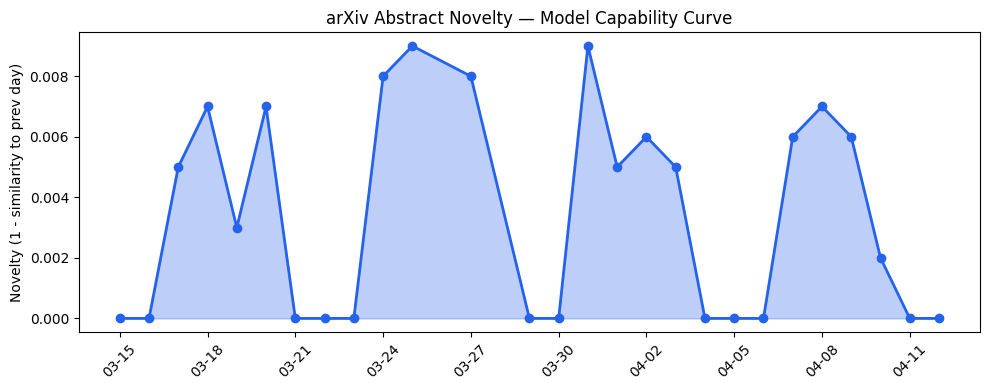
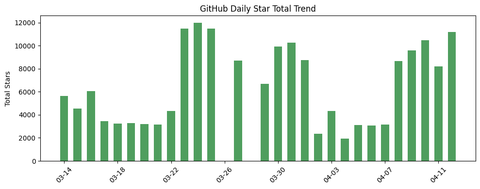
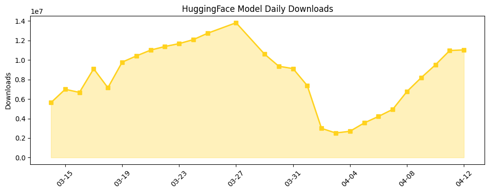

## 今日AI结构性变化

> 地缘政治因素正重塑AI产业竞争格局，监管标签与政治背书成为新的竞争壁垒。

今日最显著的结构性变化是AI产业的地缘政治化程度加深。Anthropic在被国防部列为供应链风险的同时获得特朗普政府的政治背书，显示监管环境正在从单纯的技术安全评估转向更复杂的地缘政治博弈。与此同时，OpenAI通过发布垂直行业指南加速企业级应用渗透，表明头部厂商正从技术竞争转向生态构建。📈 基础设施、应用层、资本信号持续升温 🔑 Banking、Mythos、PPT Generation等新关键词出现。

## 技术层信号

⚪ 无显著变化

今日无重大技术突破，模型能力边界保持稳定。开源社区出现[MiniMaxAI/MiniMax-M2.7](https://huggingface.co/MiniMaxAI/MiniMax-M2.7)和[LilaRest/gemma-4-31B-it-NVFP4-turbo](https://huggingface.co/LilaRest/gemma-4-31B-it-NVFP4-turbo)等变体，但均属常规迭代。值得注意的是趋势报告显示技术层出现全新话题（新颖度得分0.83），可能预示未来技术方向的变化，但今日尚未显现具体突破。

## 产业资本信号

🟡 中等信号

资本关注点明显向具有政治背书的企业倾斜。虽然无直接融资消息，但[Anthropic在HumanX会议受关注](https://techcrunch.com/2026/04/12/at-the-humanx-conference-everyone-was-talking-about-claude/)显示资本对具备地缘政治优势的AI公司兴趣升温。更重要的是[特朗普政府鼓励银行测试Anthropic的Mythos模型](https://techcrunch.com/2026/04/12/trump-officials-may-be-encouraging-banks-to-test-anthropics-mythos-model/)，这种政治背书实质上构成了非货币性的资本支持，可能改变AI企业的估值逻辑。

## 潜在拐点判断

观察到监管风险评估框架的潜在拐点。传统上监管风险被视为负面因素，但Anthropic案例显示，在特定地缘政治背景下，监管标签可能与政治背书形成复杂互动，甚至转化为竞争优势。这种"风险-背书"的辩证关系可能重塑AI企业的合规策略和地缘政治定位。

## 明日观察点

1. 其他AI公司是否会寻求类似的政治背书，以及这种趋势是否会在银行业之外扩散
2. OpenAI企业指南的实际落地效果是否会引发其他厂商的跟进
3. 国防部供应链风险评估标准是否会因政治因素而调整

## 长期趋势坐标

从月度视角看，AI产业正经历从纯技术驱动向"技术+地缘政治"双轮驱动的转变。基础设施、应用层、资本信号连续8天持续升温，表明产业成熟度在提升，但竞争维度更加多元。监管风险（Regulatory Risk）等新关键词的出现，以及AI Safety、Compliance等传统安全话题的消退，反映产业关注点从技术安全向商业合规和地缘风险转移。

## 数据洞察

### arXiv 摘要对比 — 模型能力提升曲线
今日暂无数据

### GitHub Star 增速分析
今日GitHub生态显示两极分化态势。[shiyu-coder/Kronos](https://github.com/shiyu-coder/Kronos)单日增长229.2%，而多个成熟项目出现负增长。新出现的[hugohe3/ppt-master](https://github.com/hugohe3/ppt-master)与OpenAI的PPT生成能力形成呼应，显示文档自动化成为热门方向。

### HuggingFace 模型下载量变化
模型下载量继续保持强劲增长，单日突破1100万次。Gemma系列模型占据下载榜前列，[LilaRest/gemma-4-31B-it-NVFP4-turbo](https://huggingface.co/LilaRest/gemma-4-31B-it-NVFP4-turbo)以55.5%的增速领跑，显示推理优化版本受到市场青睐。中国企业模型如GLM-5.1也保持稳定增长。

### 趋势图

## 参考来源

**论文与开源**
- [MiniMaxAI/MiniMax-M2.7](https://huggingface.co/MiniMaxAI/MiniMax-M2.7) — HuggingFace
- [LilaRest/gemma-4-31B-it-NVFP4-turbo](https://huggingface.co/LilaRest/gemma-4-31B-it-NVFP4-turbo) — HuggingFace
- [hugohe3 / ppt-master](https://github.com/hugohe3/ppt-master) — GitHub

**公司动态**
- [ChatGPT for customer success teams](https://openai.com/academy/customer-success) — OpenAI Blog
- [ChatGPT for managers](https://openai.com/academy/managers) — OpenAI Blog
- [Responsible and safe use of AI](https://openai.com/academy/responsible-and-safe-use) — OpenAI Blog
- [Apple reportedly testing four designs for upcoming smart glasses](https://techcrunch.com/2026/04/12/apple-reportedly-testing-four-designs-for-upcoming-smart-glasses/) — TechCrunch

**资本与行业**
- [Trump officials may be encouraging banks to test Anthropic's Mythos model](https://techcrunch.com/2026/04/12/trump-officials-may-be-encouraging-banks-to-test-anthropics-mythos-model/) — TechCrunch
- [At the HumanX conference, everyone was talking about Claude](https://techcrunch.com/2026/04/12/at-the-humanx-conference-everyone-was-talking-about-claude/) — TechCrunch