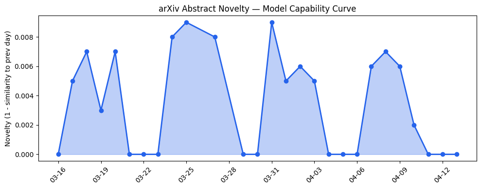
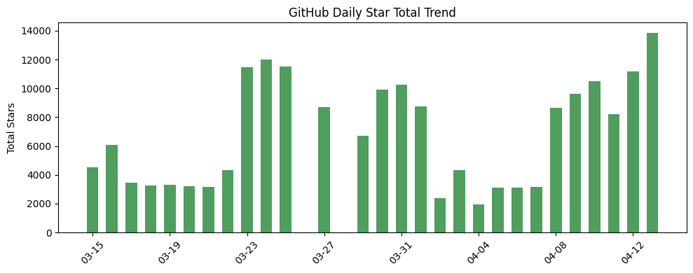
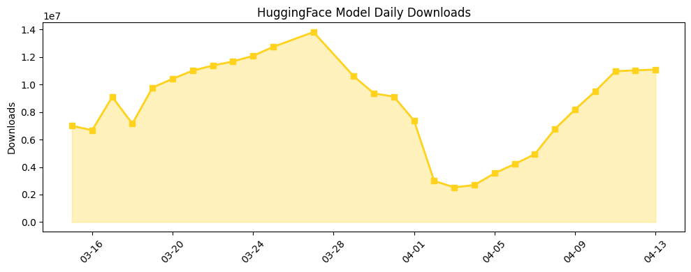

## 今日AI结构性变化

> AI产业正从模型能力竞争转向智能体治理架构的系统性构建，企业级AI安全与可审计性成为新的技术焦点。

今日最显著的结构性变化是AI产业重心从单纯的模型能力提升转向智能体治理体系的系统性构建。OpenKedge提出的"执行边界安全"概念将状态突变重新定义为受治理过程，而非API调用的直接结果，这代表了智能体架构的重要范式转变。与此同时，企业级AI应用正加速落地，Cloudflare与OpenAI的合作标志着智能体工作流正成为企业基础设施的核心组成部分。

📈 持续趋势：基础设施话题连续8天升温  
🆕 新兴方向：技术层和风险信号均出现全新话题（相似度<0.25）  
🔺 突然升温：AI Agents、Enterprise AI、Reasoning关键词热度上升  
📉 消退关键词：NVIDIA、SpaceX、Federated Learning等基础设施相关词汇降温

## 技术层信号

🟡 渐进改善

技术层今日呈现渐进式优化特征，[SPPO](https://arxiv.org/abs/2604.08865)针对长链推理任务的序列级PPO优化和[ViSA](https://arxiv.org/abs/2604.08863)的视觉到符号推理能力展示了推理能力的持续精进。然而，真正的结构性变化来自[OpenKedge](https://arxiv.org/abs/2604.08601)提出的智能体治理框架，它将安全性和可审计性从事后监管前置到执行过程中，这种"执行边界安全"范式可能重塑未来AI智能体的架构标准。技术层的新兴话题信号（相似度仅0.23）表明我们可能正见证智能体治理这一全新技术方向的诞生。

## 产业资本信号

🟡 中等信号

产业资本层面显示企业级AI应用的商业化加速。[Vercel因AI代理业务收入激增准备IPO](https://techcrunch.com/2026/04/13/vercel-ceo-guillermo-rauch-signals-ipo-readiness-as-ai-agents-fuel-revenue-surge/)反映了AI智能体已形成可观的商业规模，而[亚洲AI初创融资达三年新高](https://news.crunchbase.com/venture/china-leads-startup-funding-ai-seed-growth-asia-q1-2026/)则显示资本对AI应用层的持续看好。微软继续开发OpenClaw-like智能体，OpenAI与Cloudflare的深度合作，都指向企业级智能体市场正在快速成熟。

## 潜在拐点判断

今日观察到智能体治理架构可能正处于拐点前夜。OpenKedge框架将智能体安全从传统的对齐技术转向执行过程的系统性治理，这种范式转变若被产业广泛采纳，将重新定义AI智能体的安全标准和架构原则。结合企业级智能体工作流的快速落地，我们可能正站在从"功能智能体"向"可信智能体"转变的临界点。

## 明日观察点

1. 智能体治理框架是否获得更多产业支持，特别是大型云厂商的采纳动向
2. 企业级AI安全标准的具体落地案例和效果验证
3. 推理优化技术在实际业务场景中的性能表现和成本效益

## 长期趋势坐标

从月度视角看，AI产业正经历从基础设施投资向应用层价值创造的明确转向。基础设施话题的持续升温（8天递增）反映了底层支撑体系的成熟，而技术层和风险信号的新兴话题则预示着治理和安全将成为下一阶段的核心竞争维度。企业级AI的加速落地表明产业开始从技术验证转向规模化价值创造，这一趋势可能在未来季度持续强化。

## 数据洞察

### arXiv 摘要对比 — 模型能力提升曲线
今日arXiv论文能力得分0.008，相似度0.992，显示技术演进保持高度连续性。45篇论文中推理优化和治理框架占据主导，反映产业关注点从基础能力向应用可靠性转移。

### GitHub Star 增速分析
[NousResearch/hermes-agent](https://github.com/NousResearch/hermes-agent)单日增长47.2%（11297星），显示智能体框架热度爆发。新仓库axolotl-ai-cloud/axolotl和AIDC-AI/Pixelle-Video的涌现表明开发活动向工具链和应用层扩散。

### HuggingFace 模型下载量变化
总下载量1108万次，Gemma系列模型占据主导。值得注意的是[MiniMaxAI/MiniMax-M2.7](https://huggingface.co/MiniMaxAI/MiniMax-M2.7)单日增长1993.8%，显示专用模型在特定场景的快速采纳。蒸馏模型和优化版本下载量增长显著，反映产业对效率的迫切需求。

## 参考来源

**论文**
- [OpenKedge: Governing Agentic Mutation with Execution-Bound Safety and Evidence Chains](https://arxiv.org/abs/2604.08601) — arXiv
- [SPPO: Sequence-Level PPO for Long-Horizon Reasoning Tasks](https://arxiv.org/abs/2604.08865) — arXiv
- [Hidden in Plain Sight: Visual-to-Symbolic Analytical Solution Inference from Field Visualizations](https://arxiv.org/abs/2604.08863) — arXiv
- [From Business Events to Auditable Decisions: Ontology-Governed Graph Simulation for Enterprise AI](https://arxiv.org/abs/2604.08603) — arXiv

**公司动态**
- [Enterprises power agentic workflows in Cloudflare Agent Cloud with OpenAI](https://openai.com/index/cloudflare-openai-agent-cloud) — OpenAI Blog
- [Microsoft is working on yet another OpenClaw-like agent](https://techcrunch.com/2026/04/13/microsoft-is-working-on-yet-another-openclaw-like-agent/) — TechCrunch
- [The largest orbital compute cluster is open for business](https://techcrunch.com/2026/04/13/the-largest-orbital-compute-cluster-is-open-for-business/) — TechCrunch

**资本与行业**
- [China Leads Asia's Startup Funding To Its Highest Level In More Than 3 Years](https://news.crunchbase.com/venture/china-leads-startup-funding-ai-seed-growth-asia-q1-2026/) — Crunchbase News
- [Vercel CEO Guillermo Rauch signals IPO readiness as AI agents fuel revenue surge](https://techcrunch.com/2026/04/13/vercel-ceo-guillermo-rauch-signals-ipo-readiness-as-ai-agents-fuel-revenue-surge/) — TechCrunch
- [Stanford report highlights growing disconnect between AI insiders and everyone else](https://techcrunch.com/2026/04/13/stanford-report-highlights-growing-disconnect-between-ai-insiders-and-everyone-else/) — TechCrunch