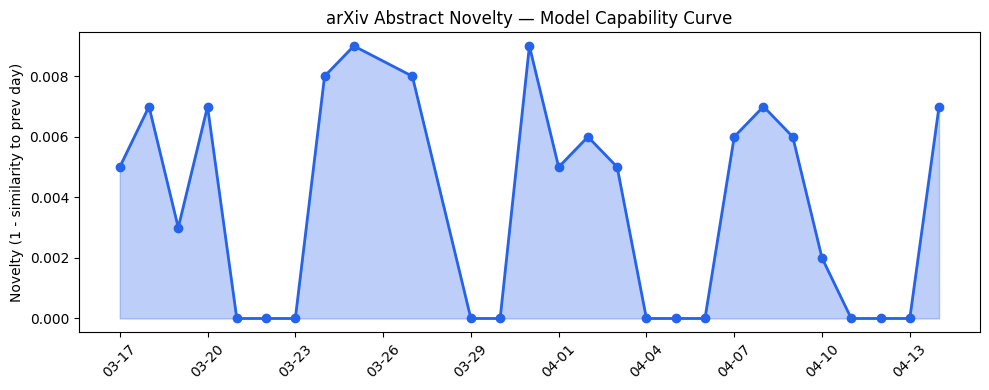
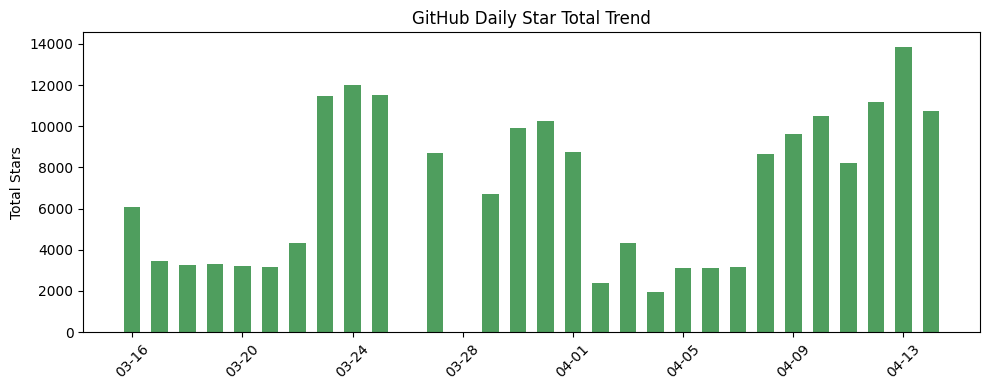
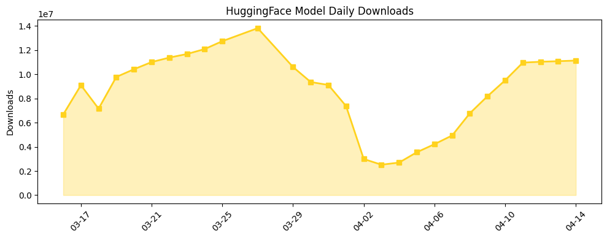

## 今日AI结构性变化

> AI产业正经历从通用能力向垂直专业领域的深度渗透，同时全球资本流向出现结构性转变。

今日最显著的结构性变化体现在两个层面：技术层面向科学推理和网络安全等专业领域纵深发展，资本层面欧洲首次成为AI风险投资的主导力量。这意味着AI产业正在从"广度扩张"转向"深度专业化"，同时全球创新重心可能正在向欧洲转移。📈 持续趋势：技术层、基础设施层话题持续升温；🆕 新兴方向：Belief-State RL、Cyber Defense、Embodied Reasoning等专业领域；🔺 突然升温：European VC成为新关键词。

## 技术层信号

🟡 渐进改善

AI系统能力边界正在从通用智能向专业科学推理和具身推理领域深化。[LABBench2](https://arxiv.org/abs/2604.09554)为生物学研究AI系统提供改进基准，标志着科学AI正在从概念验证走向实际应用阶段。更具突破性的是[OOWM](https://arxiv.org/abs/2604.09580)通过面向对象编程式世界建模，为具身推理提供了结构化表示框架，这将显著提升机器人在复杂环境中的规划能力。[Belief-State RWKV](https://arxiv.org/abs/2604.09671)将循环状态明确解释为信念状态，为部分可观测环境下的强化学习开辟了新路径，这种"信念状态"框架可能成为下一代RL系统的核心范式。

## 产业资本信号

🔴 强信号

欧洲AI投资出现历史性转折点：Q1 2026年AI首次占据欧洲风险投资50%以上份额，总额达17.6亿美元。这一结构性变化表明欧洲正在成为全球AI创新的新重心，尽管交易量大幅下降，但资金向头部项目集中的趋势明显。产业层面，[OpenAI收购AI个人理财初创公司Hiro](https://techcrunch.com/2026/04/13/openai-has-bought-ai-personal-finance-startup-hiro/)显示大模型公司正积极向垂直应用领域扩张，而[Google将AI Skills集成到Chrome浏览器](https://techcrunch.com/2026/04/14/google-adds-ai-skills-to-chrome-to-help-you-save-favorite-workflows)则体现了工作流自动化的深度整合。

## 潜在拐点判断

观察到两个潜在拐点：欧洲风险投资占比首超50%标志着全球AI资本格局可能正在重构；Belief-State RL框架的提出可能成为部分可观测环境下强化学习的技术拐点。前者基于欧洲VC连续两个季度增长且年同比增长近30%的强劲数据，后者基于该框架对传统RL范式的根本性改进。

## 明日观察点

1. 欧洲AI投资集中领域的进一步细分分析，判断资金具体流向哪些技术方向
2. Belief-State RL框架在更多基准测试中的表现验证
3. 专业领域AI系统（如网络安全、科学推理）的商业化进展

## 长期趋势坐标

从月维度看，AI产业正在经历明显的专业化分工趋势。技术层持续8天的升温态势表明基础研究活力充沛，而应用层新兴话题的出现则反映了商业化探索的广度扩展。Google Gemma系列模型在HuggingFace下载量中的主导地位显示开源模型生态正在形成新的格局，专业化、垂直化将成为未来季度的核心主题。

## 数据洞察

### arXiv 摘要对比 — 模型能力提升曲线
今日arXiv论文能力得分0.009，与历史均值相似度0.991，显示技术发展呈现延续性态势。45篇论文中，科学推理和具身推理相关研究占比显著提升，符合产业向专业化发展的趋势。

### GitHub Star 增速分析
今日总star增长10738，新出现[vllm-project/vllm](https://github.com/vllm-project/vllm)和[Tracer-Cloud/opensre](https://github.com/Tracer-Cloud/opensre)两个重要仓库。值得注意的是[virattt/ai-hedge-fund](https://github.com/virattt/ai-hedge-fund)单日增长28.8%，显示AI在金融领域的应用关注度快速提升。

### HuggingFace 模型下载量变化
总下载量1114万次，Google Gemma系列占据主导地位。[MiniMaxAI/MiniMax-M2.7](https://huggingface.co/MiniMaxAI/MiniMax-M2.7)和[zai-org/GLM-5.1](https://huggingface.co/zai-org/GLM-5.1)分别增长138.8%和136.1%，显示中文模型生态活力强劲。

### 趋势图

## 参考来源

**论文**
- [LABBench2: An Improved Benchmark for AI Systems Performing Biology Research](https://arxiv.org/abs/2604.09554) — arXiv
- [OOWM: Structuring Embodied Reasoning and Planning via Object-Oriented Programmatic World Modeling](https://arxiv.org/abs/2604.09580) — arXiv
- [Belief-State RWKV for Reinforcement Learning under Partial Observability](https://arxiv.org/abs/2604.09671) — arXiv
- [Deliberative Alignment is Deep, but Uncertainty Remains](https://arxiv.org/abs/2604.09665) — arXiv
- [Human vs. Machine Deception: Distinguishing AI-Generated and Human-Written Fake News Using Ensemble Learning](https://arxiv.org/abs/2604.09960) — arXiv

**公司动态**
- [Trusted access for the next era of cyber defense](https://openai.com/index/scaling-trusted-access-for-cyber-defense) — OpenAI Blog
- [Google adds AI Skills to Chrome to help you save favorite workflows](https://techcrunch.com/2026/04/14/google-adds-ai-skills-to-chrome-to-help-you-save-favorite-workflows) — TechCrunch
- [OpenAI has bought AI personal finance startup Hiro](https://techcrunch.com/2026/04/13/openai-has-bought-ai-personal-finance-startup-hiro/) — TechCrunch
- [Anthropic co-founder confirms the company briefed the Trump administration on Mythos](https://techcrunch.com/2026/04/14/anthropic-co-founder-confirms-the-company-briefed-the-trump-administration-on-mythos/) — TechCrunch

**开源生态**
- [OpeFlo: Automated UX Evaluation via Simulated Human Web Interaction with GUI Grounding](https://arxiv.org/abs/2604.09581) — arXiv

**资本与行业**
- [AI Drives Europe's Second Straight Quarter Of Funding Gain As Deal Volume Falls Sharply](https://news.crunchbase.com/venture/funding-picked-up-ai-led-europe-q1-2026/) — Crunchbase