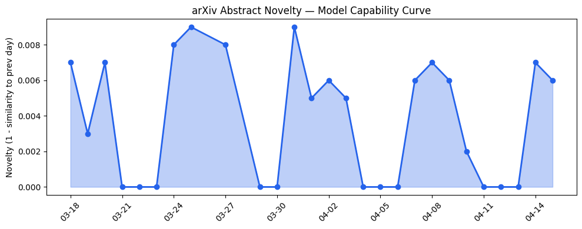
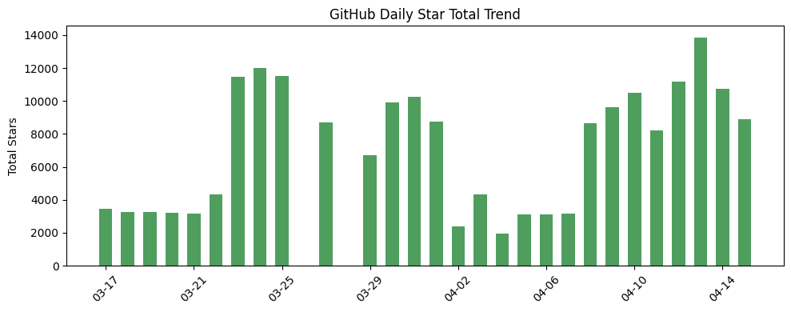
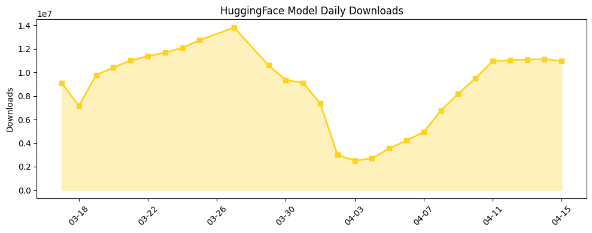

## 今日AI结构性变化

> AI智能体系统正从实验研究转向企业级部署，技术层的内存治理、推理优化与基础设施层的安全沙箱形成完整技术栈。

今日AI产业最显著的结构性变化是**智能体技术栈的成熟化**。内存治理作为新原语的出现、多标记预测机制的揭示，以及OpenAI Agents SDK的更新，标志着AI智能体正在从实验室概念转向企业级可部署系统。这种转变意味着AI产业正在经历从"模型即服务"到"智能体即服务"的范式迁移，企业工作流将迎来深度重构。

📈 持续趋势：Enterprise AI、RAG  
🆕 新兴方向：Long-horizon Tasks、Memory Governance、Multi-token Prediction

## 技术层信号

🟡 渐进改善

智能体长程任务能力诊断取得关键进展，[The Long-Horizon Task Mirage?](https://arxiv.org/abs/2604.11978)揭示了智能体系统在复杂任务中的失效模式，而[How Transformers Learn to Plan via Multi-Token Prediction](https://arxiv.org/abs/2604.11912)则从机制层面解释了多标记预测如何提升推理的全局结构捕捉能力。内存治理作为新原语的出现（[When to Forget: A Memory Governance Primitive](https://arxiv.org/abs/2604.12007)）和多项式扩展秩适应（[Polynomial Expansion Rank Adaptation](https://arxiv.org/abs/2604.11841)）表明，AI系统正在从单纯的参数优化转向更复杂的系统级设计。尽管抽象语义理解仍是瓶颈，但技术层已开始构建完整的智能体技术栈。

## 产业资本信号

🟡 中等信号

资本流向显示AI教育应用和垂直行业解决方案成为投资热点，[Gizmo获得2200万美元投资](https://techcrunch.com/2026/04/15/ai-learning-app-gizmo-levels-up-with-13m-users-and-a-22m-investment/)标志着学习型AI代理的商业化验证。企业级AI代理平台估值逻辑逐步清晰，[Hightouch ARR达1亿美元](https://techcrunch.com/2026/04/15/hightouch-reaches-100m-arr-fueled-by-marketing-tools-powered-by-ai/)证明AI营销工具已实现规模化收入。传统企业转型加速，[Allbirds从鞋业转向AI服务器业务](https://techcrunch.com/2026/04/15/after-sale-of-its-shoe-business-allbirds-pivots-to-ai/)体现传统行业的AI化趋势，而医疗AI初创公司的快速收购（[Blankemeier案例](https://news.crunchbase.com/ma/selling-healthcare-ai-startup-success-blankemeier-cognita/)）显示垂直领域整合加速。

## 潜在拐点判断

今日观察到智能体技术栈完整化的早期拐点信号。内存治理、推理优化、安全沙箱等组件的协同出现，标志着AI智能体正在从分散的技术点向系统化架构演进。这一拐点的影响在于：企业级AI部署将从"模型集成"升级为"智能体工作流重构"，催生新的基础设施和服务模式。但拐点强度仍属中等，需要观察后续商业化案例的规模化验证。

## 明日观察点

1. 企业级智能体部署案例的具体技术架构和性能指标
2. 内存治理等新原语在更多任务场景中的泛化能力验证
3. 垂直行业AI代理的商业模式创新和用户接受度数据

## 长期趋势坐标

从月维度看，AI产业正在经历从基础模型能力竞赛向智能体系统优化的重心转移。趋势数据显示，Enterprise AI和RAG持续升温，而基础设施和安全相关话题相对降温，反映产业关注点从底层技术向应用落地迁移。这种趋势预示着未来季度将出现更多端到端的智能体解决方案，而非孤立的模型改进。

## 数据洞察

### arXiv 摘要对比 — 模型能力提升曲线
今日arXiv论文能力得分0.008，相似度0.992，显示技术演进保持连续性。45篇论文中智能体相关研究占比显著，反映学术界对长程任务和系统架构的关注度提升。

### GitHub Star 增速分析
开源生态出现明显的智能体框架分化，[NousResearch/hermes-agent](https://github.com/NousResearch/hermes-agent)等成熟框架增长放缓，而[sgl-project/sglang](https://github.com/sgl-project/sglang)等高性能推理框架和[google/magika](https://github.com/google/magika)等工具库快速增长，反映产业需求从原型开发转向生产部署。

### HuggingFace 模型下载量变化
模型下载呈现明显的实用化趋势，[google/gemma系列](https://huggingface.co/google/gemma-4-31B-it)占据主导，而推理优化版本和垂直领域模型（如[k2-fsa/OmniVoice](https://huggingface.co/k2-fsa/OmniVoice)）增长迅猛，显示开发者更关注部署效率和特定场景适用性。

## 参考来源

**论文研究**
- [The Long-Horizon Task Mirage? Diagnosing Where and Why Agentic Systems Break](https://arxiv.org/abs/2604.11978) — arXiv
- [How Transformers Learn to Plan via Multi-Token Prediction](https://arxiv.org/abs/2604.11912) — arXiv
- [When to Forget: A Memory Governance Primitive](https://arxiv.org/abs/2604.12007) — arXiv
- [Polynomial Expansion Rank Adaptation: Enhancing Low-Rank Fine-Tuning with High-Order Interactions](https://arxiv.org/abs/2604.11841) — arXiv

**公司动态**
- [The next evolution of the Agents SDK](https://openai.com/index/the-next-evolution-of-the-agents-sdk) — OpenAI Blog
- [Hightouch reaches $100M ARR fueled by marketing tools powered by AI](https://techcrunch.com/2026/04/15/hightouch-reaches-100m-arr-fueled-by-marketing-tools-powered-by-ai/) — TechCrunch
- [After sale of its shoe business, Allbirds pivots to AI](https://techcrunch.com/2026/04/15/after-sale-of-its-shoe-business-allbirds-pivots-to-ai/) — TechCrunch

**开源生态**
- [SGLang is a high-performance serving framework for large language models and multimodal models](https://github.com/sgl-project/sglang) — GitHub
- [Fast and accurate AI powered file content types detection](https://github.com/google/magika) — GitHub

**资本与行业**
- [AI learning app Gizmo levels up with 13M users and a $22M investment](https://techcrunch.com/2026/04/15/ai-learning-app-gizmo-levels-up-with-13m-users-and-a-22m-investment/) — TechCrunch
- [I Sold My Startup A Year After Founding It. Here's Why That Was The Fastest Way To Build Real-World Healthcare AI](https://news.crunchbase.com/ma/selling-healthcare-ai-startup-success-blankemeier-cognita/) — Crunchbase