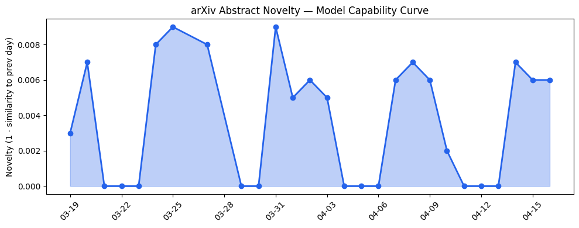
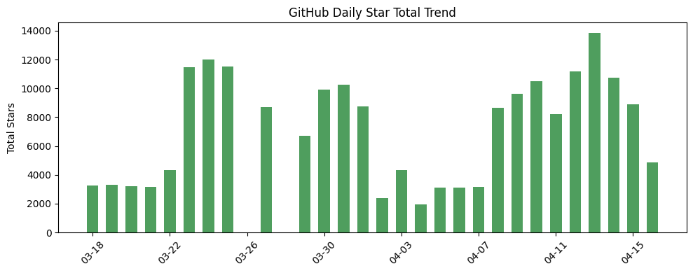
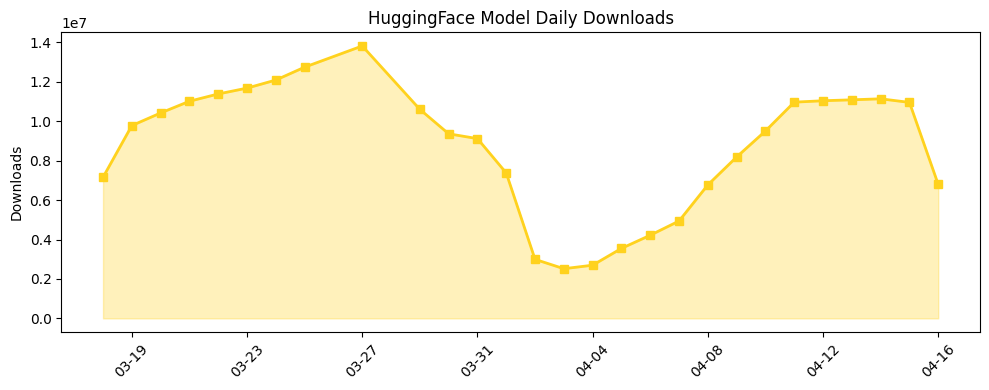

## 今日AI结构性变化

> AI代理系统正从实验室研究转向企业级部署，在可靠性监控、成本优化和垂直行业应用三个维度同时出现突破性进展。

今日AI产业格局正在经历从"模型能力竞赛"向"代理系统成熟度"的结构性转变。这意味着企业级AI部署的关注点从单纯的性能指标转向了可靠性、成本和垂直整合能力。技术层出现全新话题（相似度仅0.25），基础设施层同样涌现新兴方向（相似度0.21），显示Agentic AI正在形成独立的技术栈和产业生态。

📈 持续趋势：技术层话题向量连续8天增强
🆕 新兴方向：GUI Agents、Agent Monitoring、Physical Intelligence等关键词首次集中出现
📉 消退关键词：AI Infrastructure、Multi-Agent Systems等传统话题热度下降

## 技术层信号

🟡 渐进改善

AI代理能力边界在GUI操作、科学推理和机器人控制等复杂场景取得系统性进展。[Towards Scalable Lightweight GUI Agents via Multi-role Orchestration](https://arxiv.org/abs/2604.13488)提出多角色编排架构，解决单一代理在复杂环境中的局限性，标志着代理系统设计从单体智能向协作智能的范式转变。[Physical Intelligence](https://techcrunch.com/2026/04/16/physical-intelligence-a-hot-robotics-startup-says-its-new-robot-brain-can-figure-out-tasks-it-was-never-taught/)的机器人大脑展示出零样本任务理解能力，为 embodied AI 的商业化铺平道路。技术层的新兴话题信号（新颖度0.75）表明，代理系统正在形成独立于基础模型的技术路线图。

## 产业资本信号

🔴 强信号

资本高度集中于AI基础设施和垂直应用，[Upscale AI洽谈20亿美元估值](https://techcrunch.com/2026/04/16/upscale-ai-in-talks-to-raise-at-2b-valuation-says-report/)显示市场对底层技术的高溢价。[InsightFinder融资1500万美元](https://techcrunch.com/2026/04/16/insightfinder-raises-15m-to-help-companies-figure-out-where-ai-agents-go-wrong/)专注于AI代理监控，标志着"AgentOps"细分赛道的正式形成。风险投资向头部企业集中趋势明显，[Crunchbase数据显示](https://news.crunchbase.com/venture/capital-concentrated-ai-global-q1-2026/)2026年第一季度资本集中度创历史新高，反映市场对成熟AI解决方案的强烈需求。

## 潜在拐点判断

观察到Agentic AI从研究探索到规模化部署的拐点。依据包括：技术层多角色协作架构成熟、基础设施层边缘推理成本优化突破、资本层Agent监控细分赛道形成。这一拐点的影响是AI产业重心将从模型训练转向代理系统集成，催生新的中间件和服务生态。

## 明日观察点

1. 关注各大云厂商是否会推出专门的Agent托管服务，与现有的模型服务形成差异化竞争
2. 观察医疗、网络安全等垂直行业的AI代理部署案例是否出现规模化复制
3. 监控开源社区对多角色代理框架的采纳速度，特别是企业级需求的响应情况

## 长期趋势坐标

从月度视角看，AI代理正在形成独立的技术栈和商业模式。整体新颖度0.54表明今日变化具有中等程度的创新性，但多个维度同时出现突破性进展。长期来看，代理系统的成熟将推动AI从工具性技术向自主性平台的转变，重新定义人机协作的基本范式。新兴关键词如GUI Agents、Physical Intelligence显示代理系统正在向更复杂的交互场景扩展。

## 数据洞察

### arXiv 摘要对比 — 模型能力提升曲线
今日arXiv收录45篇论文，能力得分0.008，与历史均值相似度0.992，呈现延续性趋势。论文主题集中在GUI代理、多角色编排等代理系统优化方向，显示研究重点从基础模型能力向应用层系统设计转移。

### GitHub Star 增速分析
今日总获星4841，新增6个仓库。[lsdefine/GenericAgent](https://github.com/lsdefine/GenericAgent)单日增长113.8%，显示通用代理框架需求旺盛。新仓库中出现[openai/openai-agents-python](https://github.com/openai/openai-agents-python)等官方代理工具库，标志大厂开始标准化代理开发流程。

### HuggingFace 模型下载量变化
总下载量679万，[google/gemma-4-31B-it](https://huggingface.co/google/gemma-4-31B-it)保持领先。增长最快的是[baidu/ERNIE-Image-Turbo](https://huggingface.co/baidu/ERNIE-Image-Turbo)（增长226.7%），反映多模态推理需求上升。[MiniMaxAI/MiniMax-M2.7](https://huggingface.co/MiniMaxAI/MiniMax-M2.7)增长67.1%，显示商用模型部署加速。

### 趋势图

## 参考来源

**论文**
- [Towards Scalable Lightweight GUI Agents via Multi-role Orchestration](https://arxiv.org/abs/2604.13488) — arXiv
- [WebXSkill: Skill Learning for Autonomous Web Agents](https://arxiv.org/abs/2604.13318) — arXiv
- [Dental-TriageBench: Benchmarking Multimodal Reasoning for Hierarchical Dental Triage](https://arxiv.org/abs/2604.13060) — arXiv

**公司动态**
- [Physical Intelligence says its new robot brain can figure out tasks it was never taught](https://techcrunch.com/2026/04/16/physical-intelligence-a-hot-robotics-startup-says-its-new-robot-brain-can-figure-out-tasks-it-was-never-taught/) — TechCrunch
- [Introducing GPT-Rosalind for life sciences research](https://openai.com/index/introducing-gpt-rosalind) — OpenAI
- [Luma launches AI-powered production studio with faith-focused Wonder Project](https://techcrunch.com/2026/04/16/luma-launches-ai-powered-production-studio-with-faith-focused-wonder-project/) — TechCrunch

**开源生态**
- [omlx: LLM inference server with continuous batching & SSD caching for Apple Silicon](https://github.com/jundot/omlx) — GitHub
- [openai/openai-agents-python](https://github.com/openai/openai-agents-python) — GitHub

**资本与行业**
- [InsightFinder raises $15M to help companies figure out where AI agents go wrong](https://techcrunch.com/2026/04/16/insightfinder-raises-15m-to-help-companies-figure-out-where-ai-agents-go-wrong/) — TechCrunch
- [These 3 Charts Show How Venture Capital Has Concentrated At The Top In 2026](https://news.crunchbase.com/venture/capital-concentrated-ai-global-q1-2026/) — Crunchbase