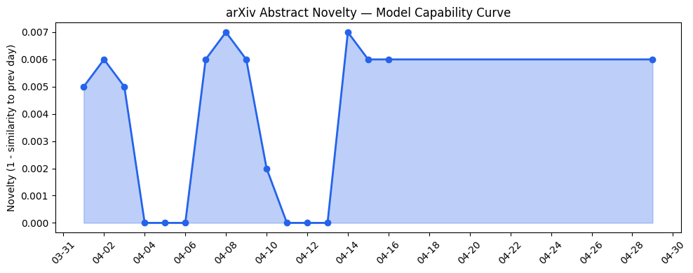
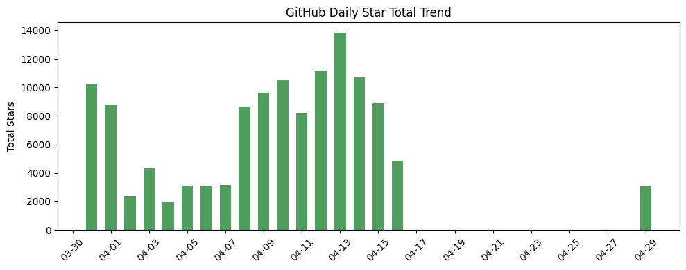
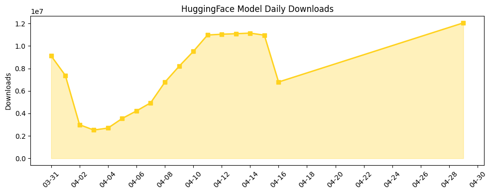

## 今日AI结构性变化
> 今日新增的AI信息显示，技术层面上LLM的研究和应用取得了多项进展，基础设施层面上推理成本和芯片/算力趋势没有显著变化，应用层面上AI进入了新行业和新场景，资本信号显示融资方向和估值水平有所变化，风险信号显示监管/立法和伦理/安全领域有新动向。
今天最值得注意的结构性变化是技术层面上LLM的研究和应用取得了多项进展，包括自动化本体生成、心理框架的构建和推理能力的提高。这意味着AI技术的边界正在不断扩展，新的应用场景和行业正在被开发。同时，资本信号显示融资方向和估值水平有所变化，表明投资者对AI产业的信心和预期正在发生变化。
📈 持续趋势：技术层面上LLM的研究和应用取得了多项进展。
🆕 新兴方向：AI进入了新行业和新场景，包括医疗、法律、教育和制造。
🔺 突然升温：风险信号显示监管/立法和伦理/安全领域有新动向。
🔑 新关键词：LLM、自动化本体生成、心理框架、推理能力、融资方向、估值水平。
📉 消退关键词：Multi-Agent Systems。

## 技术层信号
🔴 重大突破

技术层面上LLM的研究和应用取得了多项进展，包括自动化本体生成、心理框架的构建和推理能力的提高。这些进展表明AI技术的边界正在不断扩展，新的应用场景和行业正在被开发。例如，[Towards Automated Ontology Generation from Unstructured Text: A Multi-Agent LLM Approach](https://arxiv.org/abs/2604.23090) 和 [PhySE: A Psychological Framework for Real-Time AR-LLM Social Engineering Attacks](https://arxiv.org/abs/2604.23148) 的研究成果展示了LLM在自动化本体生成和心理框架构建方面的潜力。

## 产业资本信号
🔴 强信号

资本信号显示融资方向和估值水平有所变化，表明投资者对AI产业的信心和预期正在发生变化。例如，[Parallel Web Systems hits $2B valuation five months after its last big raise](https://techcrunch.com/2026/04/29/parallel-web-systems-hits-2b-valuation-five-months-after-its-last-big-raise/) 和 [Exclusive: Supabase Execs Were So Impressed With Dreambase, They Became Investors In Its $3.7M Round](https://news.crunchbase.com/venture/supabase-startup-investment-dreambase-ai-felicis/) 的报道显示了投资者对AI产业的关注和支持。

## 潜在拐点判断
根据今日的结构性变化和趋势信号，我们可以判断AI产业正在经历一个潜在的拐点。技术层面上LLM的研究和应用取得了多项进展，资本信号显示融资方向和估值水平有所变化，这些都表明AI产业正在进入一个新的发展阶段。然而，风险信号显示监管/立法和伦理/安全领域有新动向，这也意味着AI产业将面临新的挑战和机遇。

## 明日观察点
1. 技术层面上LLM的研究和应用的进一步进展。
2. 资本信号的变化和投资者对AI产业的预期。
3. 监管/立法和伦理/安全领域的新动向和挑战。

## 长期趋势坐标
从月/季视角来看，AI产业的长期趋势坐标显示出以下特征：技术层面上LLM的研究和应用取得了多项进展，资本信号显示融资方向和估值水平有所变化，风险信号显示监管/立法和伦理/安全领域有新动向。这些趋势表明AI产业正在进入一个新的发展阶段，新的应用场景和行业正在被开发，投资者对AI产业的信心和预期正在发生变化。

## 数据洞察
### arXiv 摘要对比 — 模型能力提升曲线
今日暂无数据。

### GitHub Star 增速分析
GitHub Star 增速分析显示，[hugohe3/ppt-master](https://github.com/hugohe3/ppt-master) 和 [ZhuLinsen/daily_stock_analysis](https://github.com/ZhuLinsen/daily_stock_analysis) 的 Star 数量增长迅速。

### HuggingFace 模型下载量变化
HuggingFace 模型下载量变化显示，[google/gemma-4-31B-it](https://huggingface.co/google/gemma-4-31B-it) 和 [unsloth/Qwen3.6-35B-A3B-GGUF](https://huggingface.co/unsloth/Qwen3.6-35B-A3B-GGUF) 的下载量增长迅速。

### 趋势图

## 参考来源
- [Towards Automated Ontology Generation from Unstructured Text: A Multi-Agent LLM Approach](https://arxiv.org/abs/2604.23090)
- [PhySE: A Psychological Framework for Real-Time AR-LLM Social Engineering Attacks](https://arxiv.org/abs/2604.23148)
- [Parallel Web Systems hits $2B valuation five months after its last big raise](https://techcrunch.com/2026/04/29/parallel-web-systems-hits-2b-valuation-five-months-after-its-last-big-raise/)
- [Exclusive: Supabase Execs Were So Impressed With Dreambase, They Became Investors In Its $3.7M Round](https://news.crunchbase.com/venture/supabase-startup-investment-dreambase-ai-felicis/)