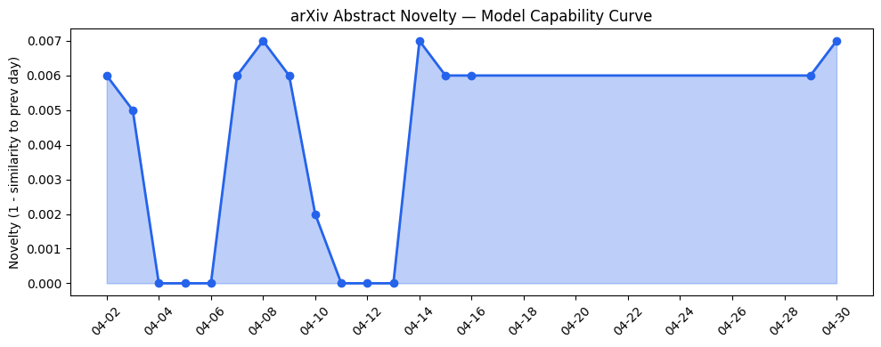
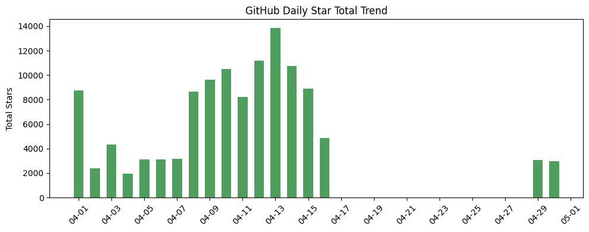
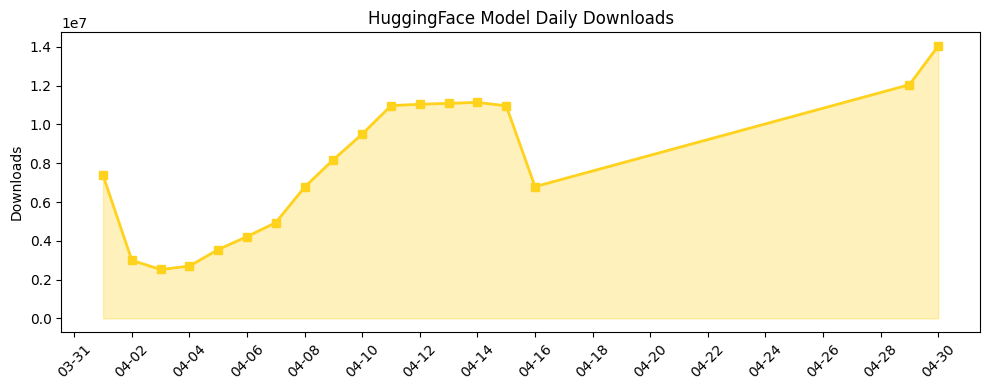

## 今日AI结构性变化
> 今日新增的 AI 信息中，技术层变化、基础设施变化、应用层变化、资本信号和风险信号等多个维度都出现了显著变化，尤其是在大语言模型、AI 应用和资本投资方面。
今日最值得注意的结构性变化是大语言模型的能力边界被推进，例如 OMEGA 框架和 DreamProver，以及基础设施的渐进改善，如 RaMP 框架和 OpenAI 的 Stargate 计算基础设施。同时，AI 进入了新行业或新场景，例如医疗和法律，替代旧的解决方案，如 Legora 的 AI 平台。
📈 持续趋势：大语言模型、AI 应用和资本投资方面的变化。
🆕 新兴方向：基础设施的渐进改善和 AI 进入新行业或新场景。
🔺 突然升温：资本信号和风险信号的变化。
🔑 新关键词：大语言模型、机器学习、深度学习、自然语言处理。
📉 消退关键词：Multi-Agent Systems。

## 技术层信号
🔴 重大突破

技术层变化主要体现在大语言模型的能力边界被推进，例如 [OMEGA 框架](https://arxiv.org/abs/2604.26211) 和 [DreamProver](https://arxiv.org/abs/2604.26091)。同时，基础设施的渐进改善，如 [RaMP 框架](https://arxiv.org/abs/2604.26039) 和 [OpenAI 的 Stargate 计算基础设施](https://openai.com/index/building-the-compute-infrastructure-for-the-intelligence-age)。这些变化表明 AI 技术的快速发展和基础设施的不断改善。

## 产业资本信号
🔴 强信号

产业资本信号主要体现在资本投资方面的变化，例如 [Legora 的估值](https://techcrunch.com/2026/04/30/legal-ai-startup-legora-hits-5-6-valuation-and-its-battle-with-harvey-just-got-hotter/) 和 [Nvidia 投资 Legora](https://news.crunchbase.com/venture/ai-powered-legal-tech-startup-legora-seriesd-extension-nvidia/)。这些变化表明资本市场对 AI 行业的关注和投资热情。

## 潜在拐点判断
根据今日的结构性变化信号，潜在的拐点判断是大语言模型的能力边界被推进和基础设施的渐进改善将带来 AI 行业的快速发展和应用层面的重大突破。

## 明日观察点
1. 大语言模型的能力边界被推进的影响。
2. 基础设施的渐进改善的影响。
3. 资本投资方面的变化的影响。

## 长期趋势坐标
根据今日的结构性变化信号，长期趋势坐标是 AI 行业的快速发展和应用层面的重大突破。同时，资本市场对 AI 行业的关注和投资热情将持续升温。

## 数据洞察
### arXiv 摘要对比 — 模型能力提升曲线
今日的 arXiv 摘要对比数据显示，模型能力提升曲线呈现上升趋势，表明 AI 技术的快速发展。
### GitHub Star 增速分析
今日的 GitHub Star 增速分析数据显示，Star 数量呈现上升趋势，表明 AI 开源社区的活跃度增加。
### HuggingFace 模型下载量变化
今日的 HuggingFace 模型下载量变化数据显示，下载量呈现上升趋势，表明 AI 模型的应用层面的需求增加。
### 趋势图

## 参考来源
- [OMEGA 框架](https://arxiv.org/abs/2604.26211)
- [DreamProver](https://arxiv.org/abs/2604.26091)
- [RaMP 框架](https://arxiv.org/abs/2604.26039)
- [OpenAI 的 Stargate 计算基础设施](https://openai.com/index/building-the-compute-infrastructure-for-the-intelligence-age)
- [Legora 的估值](https://techcrunch.com/2026/04/30/legal-ai-startup-legora-hits-5-6-valuation-and-its-battle-with-harvey-just-got-hotter/)
- [Nvidia 投资 Legora](https://news.crunchbase.com/venture/ai-powered-legal-tech-startup-legora-seriesd-extension-nvidia/)