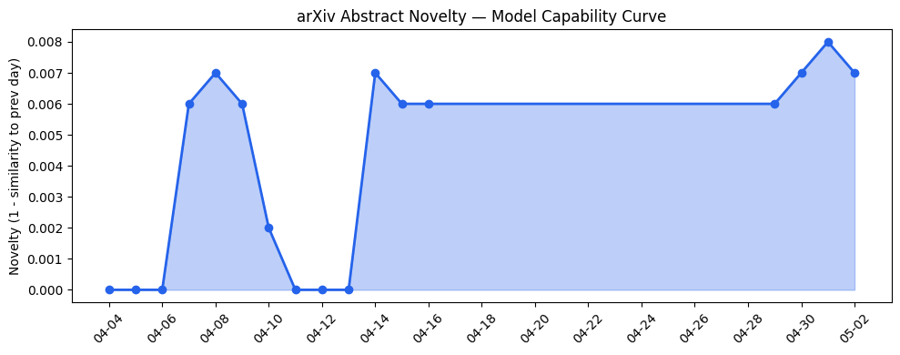
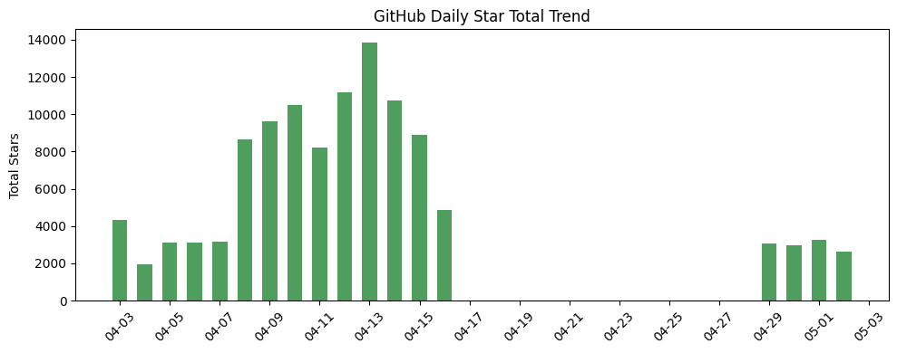
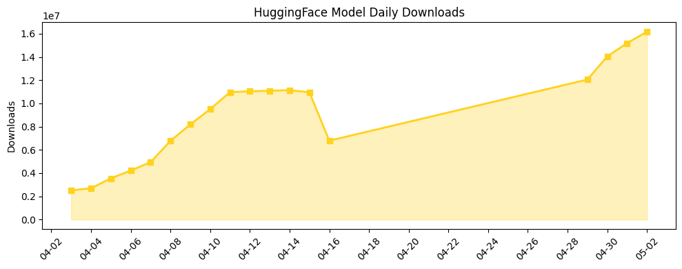

## 今日AI结构性变化
> 今日新增信息显示，AI领域在技术层、应用层和资本层出现了多个结构性变化信号，包括新型LLM系统、数字孪生技术和AI融资动向。
今天最值得注意的结构性变化是新型LLM系统如Web2BigTable和TabPFN的提出，这些技术的出现可能会对AI的技术层和应用层产生重大影响。此外，数字孪生技术的应用也在不断扩大，预计将在医疗和娱乐领域产生重要影响。同时，Replit和Cursor的融资动向也引起了人们的关注，表明了资本层对AI的持续关注。
📈 持续趋势：新型LLM系统、数字孪生技术和AI融资动向。
🆕 新兴方向：数字孪生技术在医疗和娱乐领域的应用。
🔺 突然升温：Replit和Cursor的融资动向。
🔑 新关键词：LLM、数字孪生、AI融资。
📉 消退关键词：Multi-agent Systems、Reasoning、Safety。

## 技术层信号
🔴 重大突破

新型LLM系统如Web2BigTable和TabPFN的提出，标志着AI技术层的重大突破。这些技术的出现可能会对AI的技术层和应用层产生重大影响。同时，数字孪生技术的应用也在不断扩大，预计将在医疗和娱乐领域产生重要影响。例如，[Web2BigTable: A Bi-Level Multi-Agent LLM System for Internet-Scale Information Search and Extraction](https://arxiv.org/abs/2604.27221) 和 [Evaluating TabPFN for Mild Cognitive Impairment to Alzheimer's Disease Conversion in Data Limited Settings](https://arxiv.org/abs/2604.27195)。

## 产业资本信号
🔴 强信号

Replit和Cursor的融资动向引起了人们的关注，表明了资本层对AI的持续关注。同时，[Replit的CEO表示不愿意出售公司](https://techcrunch.com/2026/05/01/replits-amjad-masad-on-the-cursor-deal-fighting-apple-and-why-hed-rather-not-sell/)，这可能会对AI行业的资本流向产生影响。例如，[Replit](https://replit.com/) 和 [Cursor](https://cursor.ai/)。

## 潜在拐点判断
今日的结构性变化信号表明，AI领域可能正在经历一个重要的拐点。新型LLM系统和数字孪生技术的出现可能会对AI的技术层和应用层产生重大影响，而Replit和Cursor的融资动向则可能会对AI行业的资本流向产生影响。因此，需要密切关注这些变化的发展趋势。

## 明日观察点
1. 新型LLM系统的进一步发展。
2. 数字孪生技术在医疗和娱乐领域的应用情况。
3. Replit和Cursor的融资动向及其对AI行业的影响。

## 长期趋势坐标
根据今日的结构性变化信号和趋势对比报告，AI领域的长期趋势坐标可能会发生变化。新型LLM系统和数字孪生技术的出现可能会对AI的技术层和应用层产生重大影响，而Replit和Cursor的融资动向则可能会对AI行业的资本流向产生影响。因此，需要密切关注这些变化的发展趋势，并根据需要调整长期趋势坐标。

## 数据洞察
### arXiv 摘要对比 — 模型能力提升曲线
今日的arXiv摘要对比数据显示，模型能力提升曲线呈现延续趋势，表明AI技术层的持续进步。
### GitHub Star 增速分析
今日的GitHub Star增速分析数据显示，Replit和Cursor的Star数增加较快，表明了资本层对AI的持续关注。
### HuggingFace 模型下载量变化
今日的HuggingFace模型下载量变化数据显示，[google/gemma-4-31B-it](https://huggingface.co/google/gemma-4-31B-it) 和 [Qwen/Qwen3.6-35B-A3B](https://huggingface.co/Qwen/Qwen3.6-35B-A3B) 模型的下载量增加较快，表明了AI应用层的持续扩张。
### 趋势图

## 参考来源
- [Web2BigTable: A Bi-Level Multi-Agent LLM System for Internet-Scale Information Search and Extraction](https://arxiv.org/abs/2604.27221)
- [Evaluating TabPFN for Mild Cognitive Impairment to Alzheimer's Disease Conversion in Data Limited Settings](https://arxiv.org/abs/2604.27195)
- [Replit](https://replit.com/)
- [Cursor](https://cursor.ai/)
- [Replit的CEO表示不愿意出售公司](https://techcrunch.com/2026/05/01/replits-amjad-masad-on-the-cursor-deal-fighting-apple-and-why-hed-rather-not-sell/)