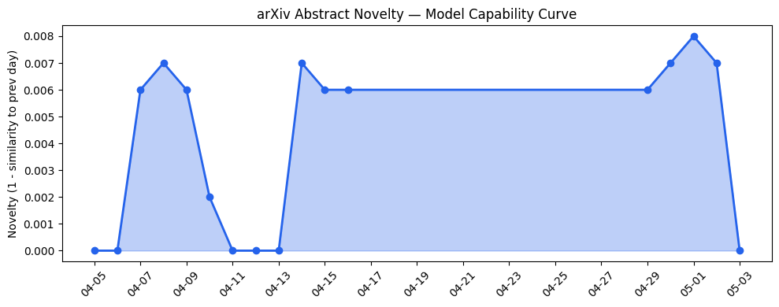
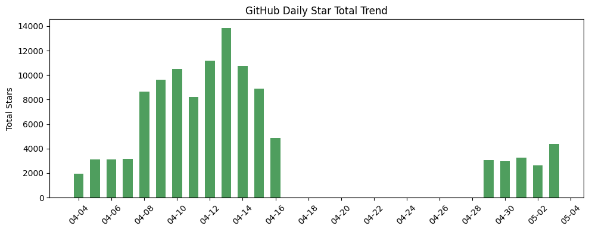
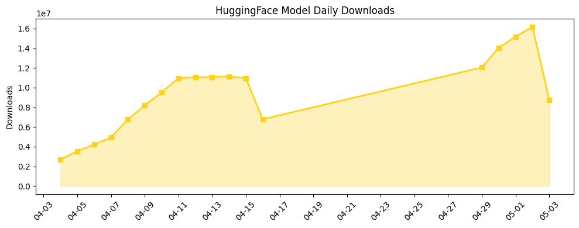

## 今日AI结构性变化
> 今日开源生态中出现了多个值得关注的项目，同时AI在医疗领域的应用展现出更高的准确度。
今天最值得注意的结构性变化是开源生态的进展和AI在医疗领域的应用。开源项目如cocoindex、OpenVoice和SenseNova-U1-8B-MoT展现出对长期代理和多模态任务的支持，表明AI技术的边界正在不断推进。
- 📈 持续趋势：开源生态的进展和AI在医疗领域的应用。
- 🆕 新兴方向：开源项目的出现和AI在医疗领域的应用。
- 🔺 突然升温：基础设施近3天内容相似度显著高于更早期均值。
- 🔑 新关键词：Artisan、OpenVoice、SenseNova-U1-8B-MoT、cocoindex、医疗AI、开源生态。
- 📉 消退关键词：Enterprise AI、Multi-agent Systems、RAG、Reasoning。

## 技术层信号
🟡 渐进改善

模型能力边界如何推进？有何新范式？开源项目cocoindex和SenseNova-U1-8B-MoT展现出对长期代理和多模态任务的支持，表明AI技术的边界正在不断推进。开源项目OpenVoice实现了即时语音克隆，表明AI技术在语音处理方面的进展。趋势信号表明技术层的话题向量在最近8天内呈现持续增强趋势，表明该方向正在持续升温。

## 产业资本信号
⚪ 弱信号

今日无相关信息。资本信号的话题向量在最近8天内呈现持续增强趋势，表明该方向正在持续升温。但今日无相关信息，无法进一步分析。

## 潜在拐点判断
今日观察到开源生态的进展和AI在医疗领域的应用，这可能是AI产业的一个潜在拐点。开源项目的出现和AI在医疗领域的应用可能会带来新的商业机会和应用场景。

## 明日观察点
1. 开源生态的进展。
2. AI在医疗领域的应用。
3. 基础设施近3天内容相似度的变化。

## 长期趋势坐标
开源生态的进展和AI在医疗领域的应用可能会带来新的商业机会和应用场景。趋势图路径表明基础设施近3天内容相似度显著高于更早期均值，表明该方向正在突然升温。

## 数据洞察
### arXiv 摘要对比 — 模型能力提升曲线
今日无 arXiv 摘要数据。
### GitHub Star 增速分析
GitHub Star增速分析表明，开源项目cocoindex和OpenVoice的Star数正在迅速增加，表明这些项目正在受到广泛关注。
### HuggingFace 模型下载量变化
HuggingFace 模型下载量变化表明，SenseNova-U1-8B-MoT模型的下载量正在迅速增加，表明该模型正在受到广泛关注。
### 趋势图

## 参考来源
- [cocoindex](https://github.com/cocoindex-io/cocoindex)
- [OpenVoice](https://github.com/myshell-ai/OpenVoice)
- [SenseNova-U1-8B-MoT](https://huggingface.co/sensenova/SenseNova-U1-8B-MoT)
- [In Harvard study, AI offered more accurate emergency room diagnoses than two human doctors](https://techcrunch.com/2026/05/03/in-harvard-study-ai-offered-more-accurate-diagnoses-than-emergency-room-doctors/)
- ['This is fine' creator says AI startup stole his art](https://techcrunch.com/2026/05/03/this-is-fine-creator-says-ai-startup-stole-his-art/)