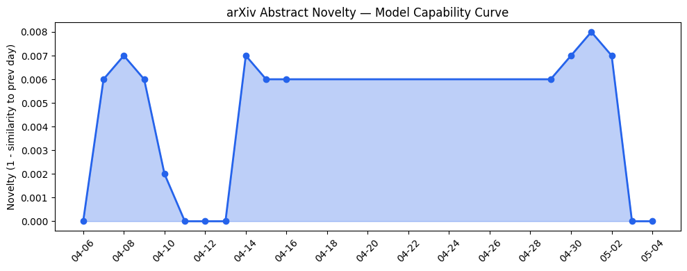
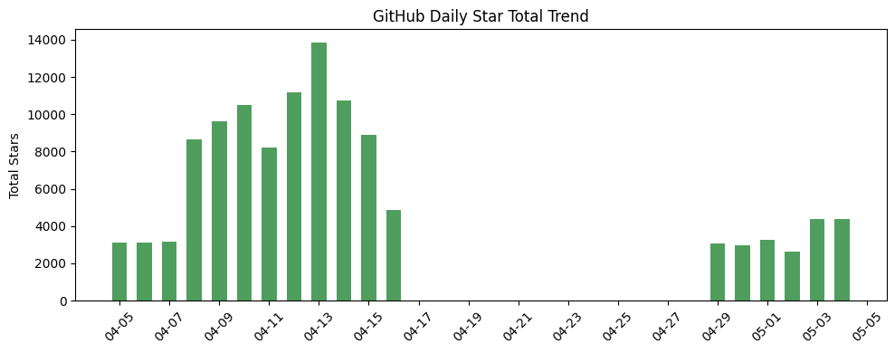
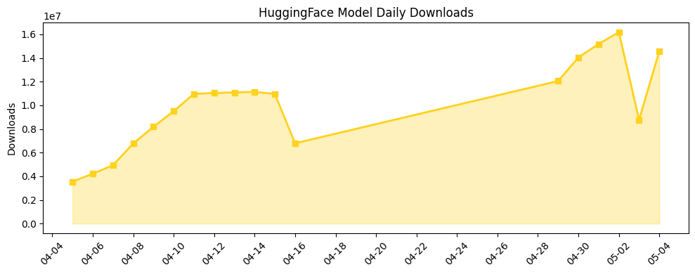

## 今日AI结构性变化
> 今日AI结构性变化的核心判断是：AI技术的进步和应用正在推动产业结构的演变，尤其是在工具增强推理、去中心化代理AI和AI在各个行业的应用方面。
今天最值得注意的结构性变化是AI技术的快速进步和应用，尤其是在工具增强推理、去中心化代理AI和AI在各个行业的应用方面。这些变化表明AI产业正在经历快速的发展和变革。同时，趋势报告中也显示出新兴方向的早期信号，例如技术层、基础设施和风险信号的变化。
- 📈 持续趋势：AI技术的进步和应用正在推动产业结构的演变。
- 🆕 新兴方向：工具增强推理、去中心化代理AI和AI在各个行业的应用。
- 🔺 突然升温：AI的安全性和伦理问题成为关注焦点。

## 技术层信号
🔴 重大突破

模型能力边界如何推进？有何新范式？技术层信号显示，新论文提出TADI、AgentReputation等模型，推进了AI在各个领域的应用边界。工具增强推理和去中心化代理AI成为新的研究热点。例如，[TADI: Tool-Augmented Drilling Intelligence via Agentic LLM Orchestration over Heterogeneous Wellsite Data](https://arxiv.org/abs/2605.00060) 和 [AgentReputation: A Decentralized Agentic AI Reputation Framework](https://arxiv.org/abs/2605.00073)。

## 产业资本信号
🔴 强信号

产业资本信号显示，Anthropic和OpenAI都获得了大量资金，用于开发企业AI服务。Cerebras的估值可能达到260亿美元或以上。Anthropic和OpenAI都与资产管理公司合作，推出企业AI服务。例如，[Sierra raises $950M as the race to own enterprise AI gets serious](https://techcrunch.com/2026/05/04/sierra-raises-950m-as-the-race-to-own-enterprise-ai-gets-serious/) 和 [Anthropic and OpenAI are both launching joint ventures for enterprise AI services](https://techcrunch.com/2026/05/04/anthropic-and-openai-are-both-launching-joint-ventures-for-enterprise-ai-services/)。

## 潜在拐点判断
潜在拐点判断是，AI的安全性和伦理问题成为关注焦点，可能会影响AI的发展和应用。例如，[Elon Musk’s only AI expert witness at the OpenAI trial fears an AGI arms race](https://techcrunch.com/2026/05/04/elon-musks-only-expert-witness-at-the-openai-trial-fears-an-agi-arms-race/)。

## 明日观察点
1. AI技术的进步和应用如何推动产业结构的演变？
2. 工具增强推理和去中心化代理AI如何影响AI的发展和应用？
3. AI的安全性和伦理问题如何影响AI的发展和应用？

## 长期趋势坐标
长期趋势坐标显示，AI技术的进步和应用正在推动产业结构的演变。工具增强推理和去中心化代理AI成为新的研究热点。AI的安全性和伦理问题成为关注焦点。例如，[overall_novelty](https://arxiv.org/abs/2605.00060) 和 [keyword_trends](https://techcrunch.com/2026/05/04/sierra-raises-950m-as-the-race-to-own-enterprise-ai-gets-serious/)。

## 数据洞察
### arXiv 摘要对比 — 模型能力提升曲线
arXiv 摘要对比显示，模型能力边界如何推进？有何新范式？例如，[TADI: Tool-Augmented Drilling Intelligence via Agentic LLM Orchestration over Heterogeneous Wellsite Data](https://arxiv.org/abs/2605.00060) 和 [AgentReputation: A Decentralized Agentic AI Reputation Framework](https://arxiv.org/abs/2605.00073)。
### GitHub Star 增速分析
GitHub Star 增速分析显示，哪些项目正在获得关注？例如，[Lightricks/LTX-2](https://github.com/Lightricks/LTX-2) 和 [AIDC-AI/Pixelle-Video](https://github.com/AIDC-AI/Pixelle-Video)。
### HuggingFace 模型下载量变化
HuggingFace 模型下载量变化显示，哪些模型正在被广泛使用？例如，[google/gemma-4-31B-it](https://huggingface.co/google/gemma-4-31B-it) 和 [Qwen/Qwen3.6-35B-A3B](https://huggingface.co/Qwen/Qwen3.6-35B-A3B)。
### 趋势图

## 参考来源
- [TADI: Tool-Augmented Drilling Intelligence via Agentic LLM Orchestration over Heterogeneous Wellsite Data](https://arxiv.org/abs/2605.00060)
- [AgentReputation: A Decentralized Agentic AI Reputation Framework](https://arxiv.org/abs/2605.00073)
- [Sierra raises $950M as the race to own enterprise AI gets serious](https://techcrunch.com/2026/05/04/sierra-raises-950m-as-the-race-to-own-enterprise-ai-gets-serious/)
- [Anthropic and OpenAI are both launching joint ventures for enterprise AI services](https://techcrunch.com/2026/05/04/anthropic-and-openai-are-both-launching-joint-ventures-for-enterprise-ai-services/)
- [Elon Musk’s only AI expert witness at the OpenAI trial fears an AGI arms race](https://techcrunch.com/2026/05/04/elon-musks-only-expert-witness-at-the-openai-trial-fears-an-agi-arms-race/)